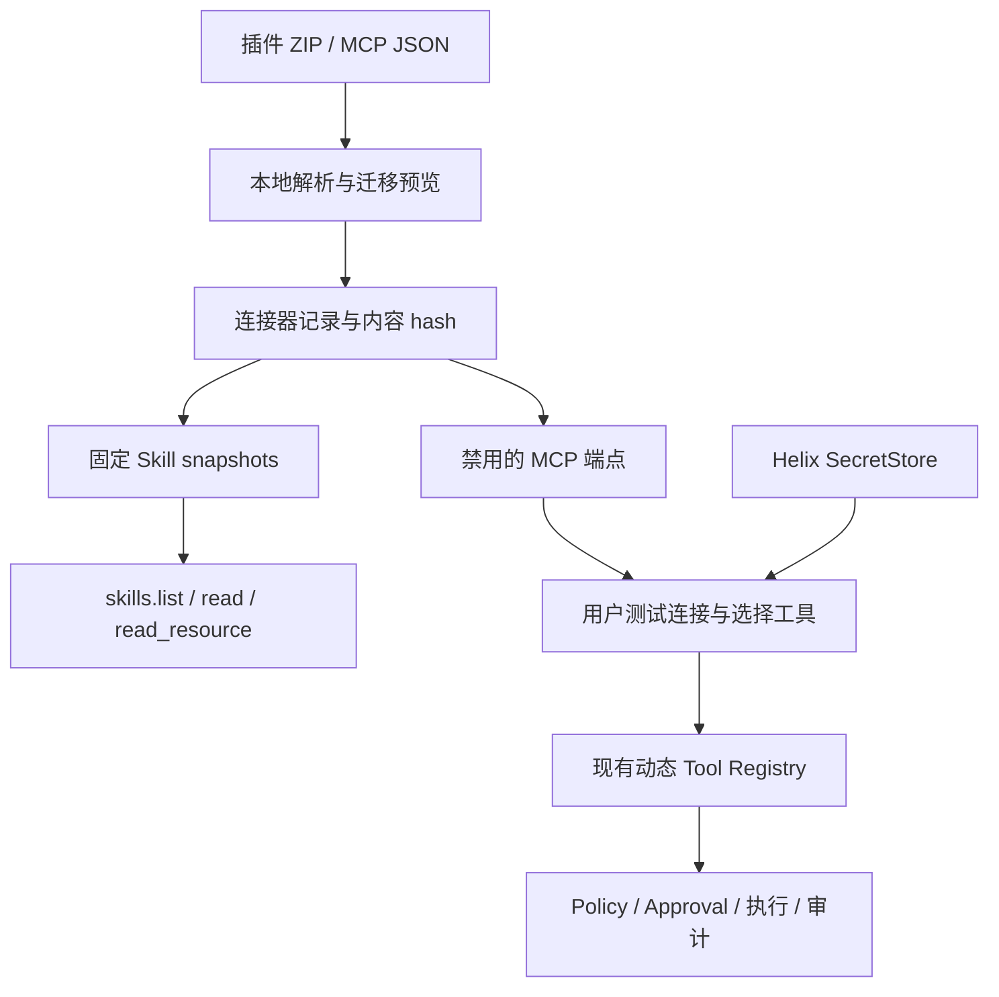

# Connector 能力包与迁移设计

日期：2026-09-05。里程碑：M13。任务：[HXA-124](../development/roadmap.md)。决策：[ADR-0023](../adr/0023-connector-portable-bundles.md)（accepted）。本页区分公开格式、用户调研观察、当前实现与后续产品方向；不把第三方平台登录态、许可证或服务权益当作可导出资产。

## 1. 设计结论

Connector 是用户管理外部能力的产品单元，包中组合多个 MCP endpoint 与多个 Skill；执行仍归既有 MCP/Tool Dispatcher，知识仍归已有 Skill snapshot。Provider 是模型后端，不需要为每个 connector 新建 Provider。Connector 也不是远程 Worker 或 child Agent。



采用“文件格式适配 → Helix 内部数据 → 既有运行时”，避免实现四套 host。兼容承诺必须分开：包能解析、组件能安装、端点能登录、工具能调用、整个 Skill 能完成任务。最后一项还受工具命名、脚本依赖、文件路径、服务权益影响。

## 2. 调研材料中需要修正的结论

- **MCP 不要求全量 schema 永久常驻。** `tools/list` 发现与模型上下文装配是不同接口。可先给 catalog、再搜索和加载工具；把 MCP 全部转成 bash 不是节省上下文的必要条件。当前 Helix 首版沿用用户选择工具后的已有注册方式；大 catalog 的动态 tool search 是独立后续任务。
- **远程 MCP OAuth 不要求平台后端代持。** MCP 授权支持 public client，以及预注册、client metadata 等注册路径。Android 可设计浏览器授权、PKCE 与本机 SecretStore；特定厂商是否接受 Helix client 要逐家验证。当前 HXA-071 明确只实现 bearer，本任务不越过此边界。
- **把 schema 编译成 CLI 不会自动消除 MCP 运行时依赖。** 如果 wrapper 最终仍调用 MCP server，就仍依赖协议与会话。只有重新实现业务 HTTP API 才可能不再走 MCP，那属于新的 adapter。
- **模型能加 `--yes` 时，CLI flag 本身不证明用户批准。** 同样，隐藏工具列表不等于撤销已经排队的调用。宿主必须在执行边界检查当前 enablement；已发出的远端副作用不能靠关开关撤回。
- 环境变量 pop、凭据文件加密、目录 0700 是进程/文件管理措施，不自动隔离同 UID 任意 shell。文档对 QwenWork/WorkBuddy token 位置的观察保留为特定沙箱样本，不能由“没搜到 headers”推导平台绝不会把凭据下发到其他路径。

官方依据：[OpenAI 插件打包](https://developers.openai.com/plugins/build/plugins)、[Claude 插件参考](https://code.claude.com/docs/en/plugins-reference)、[MCP Authorization](https://modelcontextprotocol.io/specification/2025-11-25/basic/authorization)。这些来源支持格式与协议机制；它们不证明用户样本的内部部署方式。

## 3. 可迁移矩阵

| 来源/组件 | HXA-124 的处理 | 不能据此承诺 |
| --- | --- | --- |
| Codex `.codex-plugin/plugin.json` | name、字符串 skills 路径、内联或文件 mcpServers；默认 skills 和 `.mcp.json` | 所有 manifest 扩展字段兼容 |
| Claude `.claude-plugin/plugin.json` | 同一适配入口；默认目录、内联 MCP 与自定义单个配置路径 | hooks、agents、commands、workflow 运行时 |
| MCP JSON | direct server map、`mcpServers`、`mcp_servers`；一个包最多 32 endpoints | `config.toml` 解析；不偷偷按正则解析完整 TOML |
| WorkBuddy/QwenWork 导出 | 用户提供的 `mcp.json` / `qwenwork-mcp.json` + 包内多个 `SKILL.md`；`.codebuddy-plugin/plugin.json` 作为样本格式适配 | 平台私有导出格式、官方市场、付费授权通用兼容 |
| HTTPS Streamable HTTP | 保存端点；用户单独配置 bearer、测试连接、选择工具 | OAuth 自动登录、legacy SSE 自动转换 |
| Skill 正文、references、assets、scripts | 固定原始快照，沿用 Skill validator；脚本仅保存，不能在安装时执行 | macOS/Windows 脚本和 Linux 二进制自动适配 Android |
| Codex `.app.json` / 平台 app ID | 诊断“需新连接” | 用平台 app ID 找到通用服务 URL、复制平台凭据 |
| stdio / CLI | 显式诊断需要 Android Runtime 适配 | 把带网络/凭据的 CLI 放到离线 PRoot；任意 npm 安装 |
| headers、OAuth、env bearer | 不拷贝值，只记录需要配置认证 | 迁移源账号 token、Cookie 或订阅权益 |
| hooks / rules / agents / commands | 报告不支持，不执行、不作为特权指令注入 | 等价复刻源 host 的策略和角色体系 |

WorkBuddy 官方[连接器入口](https://open.workbuddy.cn/docs/connector)的检索结果区分 MCP 与 CLI+Skill；本次页面正文读取失败，因此未据其断言私有配置格式。QwenWork 的[扩展说明](https://docs.qwenwork.ai/features/extensions)说明产品概念，未提供本任务可验证的稳定导出 schema。两者兼容性测试采用用户文档描述的结构化 fixture，不称为官方认证。

## 4. 当前实现契约

设置页提供 ZIP/JSON picker，内容只进本地导入流程，不作为聊天附件发给模型。ZIP 可直接装插件目录内容，也可有单一外层目录。解析不落地任意外来路径；拒绝 traversal、symlink/special Unix entry、重名路径、过深/过大配置与解压炸弹。上限：压缩输入与总内容 16 MiB、单文件 4 MiB、配置 256 KiB、1024 entries、64 Skills、32 MCP endpoints。完整包 hash 包括未执行的文件，更新产生新安装版本，不替换旧快照。

MCP 原始 headers/环境变量不进入持久记录。首版仅迁移无 userinfo/query/fragment/变量占位的 HTTPS URL；不符合的端点给出需配置诊断，用户可修正导出内容后重导。query 经常混有 token，后续可在类型化编辑器明确区分参数与凭据后支持。源 `enabled/disabled` 不授予 Helix 能力；新 Skill 默认禁用，已存在同 hash 的共享 Skill 保持既有用户选择。

安装只产生 package 记录与 Skill snapshot；测试连接时才懒注册 MCP，因此导入不联网、不激活任何服务。相同 package hash 的重复安装返回既有记录。MCP 用每次安装专属 UUID 命名空间，避免与用户已有 server 冲突。模型工具名仍为 `mcp.<serverId>.<toolName>`，不静默改写 Skill 中的源平台工具名；迁移后需要检查真实工具列表，必要时修改源 Skill 并重导。

用户在密码输入框提供自己的 bearer，只写 SecretStore；Room 仅有 alias。认证配置替换使 MCP disabled，再次测试与选择；空输入复用已存凭据。匿名连接同样可后续补配置 bearer。连接测试使用现有 endpoint gate，不绕过 DNS/TLS/egress 检查。开关不是 Tool Approval：所有调用仍进入原有管线。

停用移除动态工具且使旧 executor 引用在调用前拒绝执行。已经送达远端的调用可以完成，不能声称远端撤销；断线不自动重放。App 进程重启后 package 和 Skill 状态保留，MCP 显示未激活，要求重新测试，不在启动时连接第三方。停用、移除本地连接、厂商撤销 consent 是三种不同动作。

移除只删除连接器记录和该连接本地 Secret，保留 disabled MCP 配置行作为既有记录，保留 Skill snapshot。无其他 connector 引用的 Skill 会停用；共用 Skill 保持原状态。更新并行安装，旧版由用户显式移除。安装中断可能留下未启用的 Skill 快照，它不会产生新授权，重复导入按内容 hash 复用；这不是横跨 Room/文件系统的全局原子事务。

## 5. 后续分期

M13 尚未完成；HXA-125 已开始，公开来源与匿名 SDK 验证见[进展记录](../development/hxa-125-progress.md)。以下 HXA-126～130 均为 planned。具体范围见 roadmap §18。

1. **HXA-126 OAuth 登录层**：另立 ADR，定义独立 Android public client、浏览器回调、state/PKCE、issuer/resource 绑定、refresh/revoke、进程死亡恢复；不复制 Codex/Claude/QwenWork/WorkBuddy 凭据。需至少两家真实 MCP server 测试账号。
2. **HXA-127 大 catalog 渐进发现**：catalog/搜索 → 当前轮加载有限 schema → Dispatcher。风险与并发仍由平台计算，defer_loading 仅为提示；tool schema 更新撤销旧批准。
3. **HXA-128 CLI/stdio 可移植运行时 Spike**：区分无网离线工具与需要联网/认证的 CLI；按 HXA-073、M11 实际底座重用独立 Runtime 和生命周期。对每个 CLI 锁定版本、ABI、许可证、依赖与工具拦截，不把安装成功当功能验收。
4. **HXA-129 完整 bundle 生命周期**：connector 级会话 scope、工具/Skill 原子视图、更新 diff 与 rollback、可恢复安装 journal、显式依赖图。先解决共享 Skill 的所有权，避免一个包停用另一个包仍需的组件。
5. **HXA-130 市场设计**：在用户本地导入路径稳定后再加签名索引、固定版本与来源审查。市场可信度不能升级 ToolCall 的权限。

## 6. 使用与导出

手机上打开设置 → 连接器 → 导入连接器，选择插件 ZIP 或 MCP JSON；展开 Skill 查看文件清单和有界正文，再安装可迁移部分。连接端点输入自己的 bearer（匿名服务留空），测试成功后选择工具；Skill 独立勾选。具体工具调用仍会按现有 Policy 请求所需批准。

已有 Codex `config.toml` 可用 Python 3.11+ 的[导出脚本](../../scripts/export-codex-mcp.py)转换，仅导出 MCP 部分并去除认证值、stdio 命令和 env。脚本不读环境变量、不联网、不修改原配置，并拒绝覆盖输出文件：

```bash
python3 scripts/export-codex-mcp.py --config path/to/config.toml --output mcp-export.json
```

插件 ZIP 应保留 `.codex-plugin/plugin.json` 或 `.claude-plugin/plugin.json`、`.mcp.json`、`skills/` 的相对结构；WorkBuddy/QwenWork 可导出同形的 `mcp.json` + Skills。不要打包整个 home 或平台凭据目录。没有独立 endpoint 的专有 app 需要向服务商申请 Helix 可用接入，不靠 token 复制解决。
