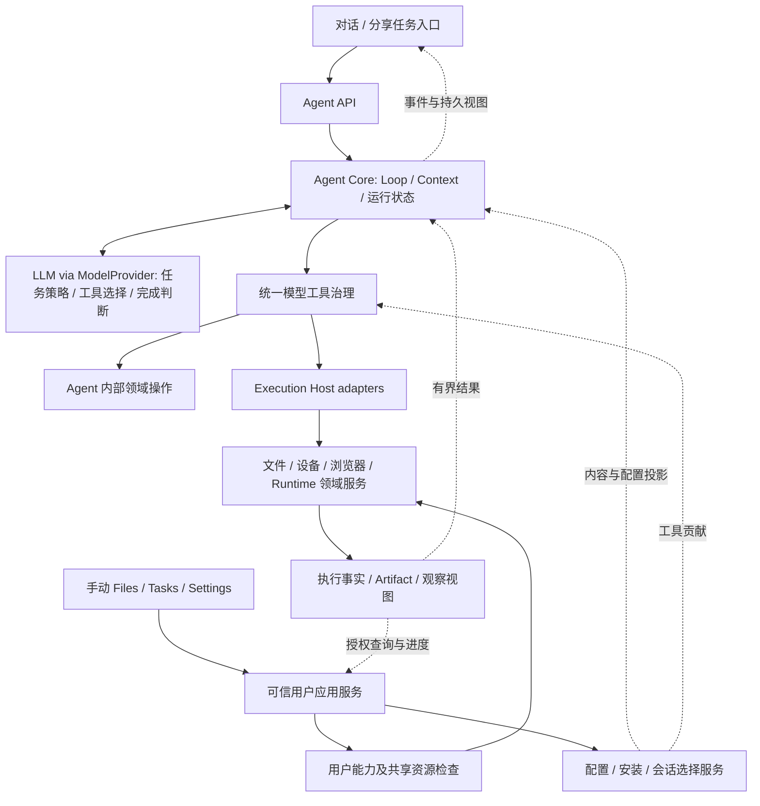

> 2026-10-01 R2-A 源码迁移：本页已移除源文件的链接固定到重构前 `05e91003`，保留原分析语义；不是当前实现或新增验收结论。

# Helix 本机 Harness 详细重构方案：Agent Core、工具治理与 Execution Host

初稿：2026-09-28；契约扩写：2026-09-29；职责准则与内容收敛：2026-09-30。本页维护目标结构、未实施阶段的技术卡片及验收。R1 已交付；后续 Core/上下文、插件、等待和策略变更不因本页存在而视作实现。历史证据与竞品来源见 §12，按原核验范围理解。

**授权与现状：**R1 见 [HXA-231](../completion-records/HXA-231.md)，自主恢复余项见 [HXA-232](../development/tasks/HXA-232.md)。2026-10-01 所有者授权阶段收尾：R2-A、R3 与基础 J1 已有本地主机候选，准确范围见[阶段快照](../evidence/development/phase-closeout-2026-10-01.md)；J1 的观察上下文/可信类型进展判断及设备未完成，J2/Project Memory 尚未交付。实时优先级只看 [status](../development/status.md)，不因目标卡片详细或文档整理而扩大实现、设备、账号或发布授权。

**阅读路径：**§1–3 是目标与规则分类；§4–7 仅作工作流导航，不重复定义底层契约；§8 是异步执行的规范正文；§9–12 是依赖、授权和证据；§13–17 分别定义接口/模块、绑定、上下文、插件；§18 只规定迁移步骤；§19–22 是验证、收益与完成检查。代码类型名是建议契约，不表示类已存在。

**按任务读取：**职责与减法看 §13.6，结果反馈看 §15.6，Core/端口看 §13–14，上下文看 §16，插件生命周期看 §17，等待/后台化看 §8；卡片/测试看 §18–19，不要求每次全文加载。R1 的有效规范以[工具 ADR](../adr/tools/001-descriptor-contract.md)为准，§15 只作衔接概要；其他提案与有效 ADR 不同时先裁决。

**核心结论：模型主导任务策略，用户决定授权范围，Harness 忠实执行获准调用并回传真实结果。保留完整 Android 本机 Harness，默认本机模块化部署；不强制拆成多个服务，也不把业务路线和技术恢复写成第二个工作流大脑。**

## 1. 目标与取舍

### 1.1 产品目标

Helix 保持面向开发者与效率用户的 Android 本机执行工作台：Conversation-first，文件、网页、轻量代码、Workspace、Android 能力和扩展形成可检查的任务结果；Standard 是完整产品，Advanced 按真实执行域增加能力。基础任务不依赖电脑、远程 Worker 或外部大脑。[产品定位](../product/market-users-and-commercialization.md)是策略假设，不是已经测得的付费意愿或用户规模。

本地执行与本地推理分开：本地模型、网络 API、自建模型服务均可通过同一 ModelProvider 驱动完整 Agent Loop；是否可用取决于真实能力、容量和资源，不按参数规模把本地模型固定为摘要助手。

### 1.2 Clean-slate 的含义

以合理的长期职责为目标，不维护内部旧接口/旧枚举/旧数据库迁移的长期双轨。**保留经过验证的语义和测试，不冻结现有类名、目录、构造参数和跨层依赖。**允许把 AgentLoop 从 App/UI/Room 实体依赖中抽出，但不借机再造另一套 Turn 生命周期、审批、恢复或工作流大脑。

目标是一套可无聊天页面驱动的 Harness、一份准确工具绑定、一条上下文编译流程、一套包安装事实和分领域权威。默认同进程类型化调用；现有需隔离或独立运行的 Runtime 继续按真实平台边界部署。

丢弃历史包袱不授权删除用户文件、凭据、Memory、产物或审计。继续当前开发期 Room v1 baseline；未来产品发布后的用户数据升级策略须另行接受，不能无限沿用开发期清库假设。外部 Provider/MCP/Skill/插件协议保留明确支持范围，内部整洁不能破坏外部有效契约。

### 1.3 价值与非目标

优先证明：契约与 executor 不错配；撤销及时生效；同一能力可以被测试宿主和手机入口使用；等待不阻塞停止；插件配置失败不拖垮独立能力；实际任务中无效调用、人工介入和恢复成本降低。结构性一致性可独立构成重构价值；延迟、内存、完成率提升必须实测，不宣称存在已被证明的全局最优架构。

本方案不额外建设：独立云 Brain、公共 HTTP/MCP Server、远程 Node 配对、递归 Subagent、未经接受的通用事件触发/自动 continuation、通用 Workflow DSL、任意 native 插件加载、手机完整 Android SDK/Gradle 环境。既有 Goal 与 HXA-232 已接受的有界续跑/恢复不因此撤销；也不把每个短工具变成长驻 Job。

### 1.4 长期不变量、当前策略与本轮提案

| 类别 | 内容 | 后续改变需要什么 |
| --- | --- | --- |
| 长期正确性与权威要求 | 模型/插件不能授权；实际绑定与批准一致；副作用事实不伪造、不盲重放；每类事实有唯一 writer | 任何实现替换都必须继续满足，不因分层/缓存/后台化降级 |
| 当前已接受的产品/运行策略 | 单手机完整产品、当前 Standard/Advanced 边界、仅证明不冲突的只读并发、整 batch 结算后下一 ModelCall、旧 Turn 不复活；新模型工作须有明确激活/恢复准入来源 | 同领域 ADR、用户授权和新证据；包含现行 Goal/HXA-232 的有限自动恢复，不把默认值或历史人工确认当行业定律 |
| 当前 Runtime 限制 | PRoot 共享 UID、retained owner 下保守排他、平台服务运行窗口 | 真正隔离/资源模型和设备证据；接口重命名不能改变这些事实 |
| 本次目标设计提案 | Core 端口抽取、completion-based 观察接线、AUTO 与按钮分步、插件局部失败矩阵 | 对应阶段任务/ADR 接受后实施，不能冒充已有能力 |
| 首版范围与可调参数 | J1 先只接 Linux；wait/handle/队列上限；当前默认同进程 | 首版测量后固定有界参数；扩 provider/部署需要真实消费者，不做空实现 |

“保留当前策略”不是冻结所有未来选择；“允许未来演进”也不是现在放宽授权。下文出现的 MUST/不得/必须均在所属契约及已接受范围内解释。

### 1.5 薄 Harness 的衡量对象是决策权，不是代码行数

“保证模型意图能执行”指**在用户授权、工具契约和真实平台能力内忠实执行**，不是保证任何模型请求都成功或无条件放行。Harness 要解释不可执行的原因，并提供当前范围内可用的观察/控制能力；下一步业务方案仍由模型选择。

执行状态机管理调用是否受理、发出、结算和取消；业务工作流决定先做什么、失败后换什么路线。前者是基础设施，后者默认归模型。默认值、熔断阈值、授权模式与可选工作流属于策略，不因写进代码就成为永久不变量。具体职责、迁移判据及反例只在 §13.6 维护；结果契约见 §15.6，测试见 T22–T26。

## 2. 当前起点

本次核对基于本地主目录源码，而非把研究中的问题列表直接当成待开发清单。

**2026-09-30 职责修订的时效校准：**本次读取 `main/7480141b` 加并行工作树。HXA-232 已在源码中取消 Mobile Use 每十次动作确认，并让已授权目标经新快照验证后自动恢复；仍保留 5 分钟/30 动作上限。相应执行分支见 [AutomationSessionManager](../../tools/automation/src/main/kotlin/com/helix/tools/automation/AutomationSessionManager.kt) 的 `resumeOnVerifiedTarget/completeAction`，不能仅因旧 CHECKPOINT 常量还在就断言周期确认仍生效。[自主恢复审查](../evidence/research-history/harness-human-intervention-audit-2026-09-29.md)与 [Mobile Use 专题](../research/topics/mobile-use-device-readiness-and-reliability-2026-09-29.md)保留历史发现；当前交付和验证以 HXA-232 的记录为准。本次只核对与职责有关的入口，不把先前 C02–C17 的全部行号、hash 或缺口重新声明为今日事实。

| 已有能力 | 本轮方向 |
| --- | --- |
| TurnEngine、AgentLoop、SessionWorkScheduler 与 durable recovery | 保留唯一 owner；不再重写执行状态机 |
| R1 统一 ToolRegistry / ToolBindingStore | 原子绑定已迁移；后续能力沿用同一入口，验证查 HXA-231 |
| App 级 PluginRegistry、PluginOrigin、Mobile Use MVP | 在其基础上接入统一绑定与安装生命周期 |
| ModelToolExposureOrder、核心工具优先与发现机制 | 保留，纳入统一请求快照；不重做工具数量项目 |
| ChatRequestAssembler、PromptRegistry、压缩、容量预检、RequestContextManifest | 收敛为一个编译流程，复用已有算法与持久事实 |
| Connector 安装归属、准备/发布/清理、会话选择 | 提升为包管理基础，保留组件语义与账号边界 |
| ExecutionTargetDescriptor 与执行域 | 继续使用；当前不增加远程 Node 或重复 this-phone 抽象 |
| Linux detached Job、status/cancel/collect、Tasks 与 Runtime 持久 owner | 复用；增加指定 handle 的有界等待与上下文观察，不重建 Job 数据库 |

历史双注册表存在结构性错配窗口，不曾据此宣称已复现线上故障。2026-09-30 R1 已以统一绑定替换该结构，并用确定性并发、审批等待和排队替换反例验证新边界。

原详细扩写的源码锚点为 `refactor/clean-slate-engine` / `49d3bd40d3f77319bfaf3429d9b6e90501fb63a7` 加工作树；本轮收敛修订读取的是本地 `main` / `70456eb576aa9a1fa92d25b44142800fc8294b5c` 加工作树。文档起始 SHA-256 为 `0d7321ab911e421eb124df84547a0612ea0a6506669899541d14777e16f0bfbc`。该历史核对时 R1 尚未实现；2026-09-30 后续迁移与 SAF 等其他工作以最新 status 为准，不因保留历史基线重新列为未修复。以下是源码阅读证据，不是本轮运行验证。

新增确认的结构缺口：`AgentLoop` 仍接收字符串资源与 `refreshScreen` 回调；`TurnToolExecutor` 同时负责消息格式、Room 实体和执行；Scheduler 与 Dispatcher 曾各自解析 descriptor（R1 已改为相同 BindingRef）；现有短 Job 控制动作会占用 reconciliation permit，不能原样包成长等待。具体文件/行范围与 SHA 见 §12 和 §14。

## 3. 目标架构与依赖



图表示运行时职责，不要求一框一进程、一框一数据库。统一治理与 Execution Host 可以组合在同一模块；必须只有一套生产 Policy/Approval/Dispatcher，不在上下层各复制一份。目录 catalog 只是只读投影，不是新事实库。

图中的 Core 驱动协议循环和执行生命周期，不替模型选择业务步骤；治理执行用户规则，不把模型建议当授权。结果路径既回传成功，也回传拒绝、观察缺口和不确定性。可靠反馈可以减少流程分支，不需要为每个错误新增一套 recovery engine。

两条入口不能混同：用户手动浏览/复制文件、配置连接、查看任务或请求停止，不要求创建 Session/Turn 或调用 LLM；它们走对应应用服务，复用必要系统能力、路径、资源冲突与审计规则。模型不能通过这条 USER 路径获得更高权限。手动权限不自动授予 Agent；UI 也不直接访问 DAO、裸 executor 或 Binder。用户命令的完成不伪造 assistant ToolCall。

模型可调用操作分两类：Plan/Goal/交互等由对应 Agent 领域服务处理；文件、代码、设备和外部服务由 Execution Host 处理。二者均经过同一工具治理，内部操作不能自报“metadata”绕过规则；Host 不需要认识完整聊天消息和 TurnCoordinator。可信应用装配注册领域 handler，避免 Core 与 Host 编译期互相依赖。

**两个接口不能混淆：Agent API 让其他入口使用 Helix 自己的大脑；Execution API 让决策层使用受控能力。**现在都可以是内部 Kotlin 接口，不启动端口。未来外部 Agent 接入只能进入有认证和本机授权的治理适配器，不得直达裸 Runtime。

目标依赖方向为 Presentation/Android adapters → 中立接口与领域逻辑；Agent Core 不依赖 UI、具体 Android executor、Room Entity 或 ProviderService 的 App 实现。先在现有 `core/agent`、`core/model`、`tools/framework`、`provider/api`、`extensions/plugin` 中收敛，只有实际消费者/依赖边界需要时才抽新 Gradle 模块；不换框架或语言。详细模块落点见 §14。

## 4. R1：统一工具绑定与执行准入

**已完成，不再执行迁移清单。**全部 built-in/Plugin/MCP/A2A 已切入原子绑定，曝光/调度/审批/执行同源，独立可写实现表已删除；有效契约见[工具 ADR](../adr/tools/001-descriptor-contract.md)，生产迁移和验证见 [HXA-231](../completion-records/HXA-231.md)。后续沿用 §19 的 T01–T04、T18 适用回归，不将 R1 完成推广为 Core、异步或完整插件生命周期已交付。

## 5. R2：Core 解耦与统一上下文编译

R2 不再仅是“统一 Assembler”。它包含两个不混做的目标：**R2-A 先准备存储/执行/模型端口，完成 Core 接线和行为等价的上下文编译；R2-B 再做策略收益实验。**规范正文见 §13–14、§16；卡片依赖见 §9 和 §18。

“不启动 Activity”只是 UI 解耦证明；只有纯 JVM Core 结合 in-memory 领域存储、fake Provider/执行适配器可跑完整回合，且运行时 classpath 不依赖 App/Room/Android，才算 Core 可独立测试。Android 存储真实事务还须通过独立集成验证，fake store 不能替代。

交付保留一个生产 Loop/编译入口，不新增上下文数据库。测试对比新旧行为，不在生产双跑模型；算法/Prompt 变化放在后续独立实验，度量规则见 §20。

## 6. R3：插件安装与会话选择闭环

统一交付包身份，不合并 Skill 内容、MCP 连接或 Runtime 的运行机制。**规范正文见 §17；卡片见 §18 的 R3-1、R3-2 / R5-min；测试见 T10/T11/T14/T17。**

R3 和最小安装/选择/配置/修复 UI 同步交付，R5 仅保留后续展示优化。保留独立 Skill/connection；不同组件就绪状态与包安全校验分开，不要求所有远端服务同时在线。外部规范是带版本/状态的输入，不作为 Helix 所有协议与模块的公共数据模型。

## 7. R4 / R5：边界清理与产品呈现

R4 是贯穿各阶段的依赖约束和删除检查，不是末尾无限扩大的清理项目。应删除已证实的 UI 回调、Room Entity 泄漏、重复注册/编译路径和反向依赖；没有重复职责时不为类数或目录对称重写代码。所有 Turn 仍由同一 TurnEngine admission，Goal 复用同一循环，插件不拥有调度与审批。冻结的是语义权威，不是现有 Core 的文件位置。

R5 将 Marketplace 和能力设置改为面向包的管理，保留组件详情及独立工具禁用入口。明确展示已安装、当前会话已选择、需配置/不可用；授权和 UNKNOWN/review 保持视觉权威。无关插件失败不阻塞普通聊天，可恢复问题提供就地重试；安全上无法证明可执行时只阻止对应操作。

验收包括会话选择/配置/更新/卸载旅程、320/360/412dp 和大字体。不要先做 Marketplace 页面再补生命周期；也不要让 R3 的用户闭环等到 R5 才出现。UI 通过应用接口消费事实，不持有 executor、DAO 或 Runtime 句柄。

## 8. J1 / J2：异步观察、等待与安全后台化

本节为异步目标契约的唯一正文；§18 描述迁移步骤，§19 定义测试 oracle。沿用[异步 Job 调研](../research/topics/async-jobs-and-background-execution-2026-09-28.md)的 launch/join 思路，选择 completion-based 观察而非占用同步 executor。HXA-236 已实现 Dispatcher/Scheduler completion 与有界 Linux 查询/等待的基础主机交付；尚无 Runtime 变化推送，不宣称本节全部接口和 §8.6 统一观察上下文已交付，具体余项见[原任务](../development/tasks/HXA-236.md)。

### 8.1 执行身份与结果事实

```text
launch ToolCall → 持久启动身份 → Runtime 接受 → ToolResult: accepted + handle
                                         │
                                  原 Runtime Job 继续
                                         │
新的 status / await / collect 调用 ← 原 Job 观察及产物引用
```

launch 的 COMPLETED 只表示提交动作结算，accepted 不新增 ToolCall 状态，也不表示 Job 成功。最终输出不回写原 launch ToolResult。回执丢失则查询原执行身份；来源无可查询协议时保留未知，不能假设所有 provider 都支持找回，更不能重发命令。

AsyncHandle 只是现有 source session/turn/call、job、execution generation、target 和 providerRef 的有界投影，不是权限凭证或新 Job 数据库。generation 来自原执行，不用新进程计数替换。模型只提交 opaque ID，平台恢复可信绑定；禁止跨会话控制、伪造、过期 generation 与目标替换。换 Workspace 仍使用原 Job 目录，fork 不继承控制权。

每项 observation 区分原状态、退出证据、观察 revision/时间、`settlementPending`、resultRef 及其可用性。进程终态不证明导入/结算完成；执行成功不证明用户目标完成。

### 8.2 模型工具与 ANY/ALL

首版只接 Linux Job，模型面使用 `jobs.status`、`jobs.await`、`jobs.cancel`；collect 复用原 Linux 路径，因为它可能写文件或物化产物，不能并入只读观察。等价旧/新名称在短期过渡中指向同一实现/权限，模型只曝光一套。

`jobs.await(handles, condition=ANY|ALL)` 只 join 明确给出的有限集合，不 sleep、不等待全局所有任务。先校验全体身份/权限并去重，空集合或任一非法项在订阅前明确拒绝；不静默跳过。已终态立即返回；ANY 返回触发项及其余已知快照，ALL 只有全部确认终态才满足，终态可为成功/失败/取消。

| await 返回内容 | 解释 |
| --- | --- |
| CONDITION_MET | 依赖条件满足；逐项 outcome 与待收取状态仍须检查 |
| WAIT_EXPIRED | 内部等待预算到期；Job 可以仍运行，无隐式取消 |
| SOURCE_UNAVAILABLE | 无法获得新的可信观察；保留最后快照及 stale 标记，不推导 Job 失败 |
| REVIEW_REQUIRED | 被观察的原执行存在需核查事实；不把只读 observer 自身改成未知副作用 |
| OBSERVATION_BUSY | 有界观察容量不足，未订阅或未发起新查询；不是 Job 被拒绝 |

权限/绑定撤销作为本次观察的明确拒绝或取消返回，不能复用旧 handle 继续取新数据。仅关闭“新工具来源”不抹去本机受控的旧 Job 检查/停止入口，实际查看/收取仍校验当前授权。

### 8.3 与当前同步框架的接线选择

**源码依据：**C14/C15 显示 `ToolExecutor.execute()` 同步、Scheduler worker 直调 Dispatcher、watchdog 等待 Future；C07 的 controlExecutor 会覆盖整个 action 持有 reconciliation permit。把 `runBlocking`、`Future.get/join` 或长轮询包进这些入口不能解决问题。

**选定的最小接线：**在 `tools/framework` 的同一 Dispatcher 内把“启动执行”和“发布最终 outcome”分开，以 `CompletionStage`/既有 CompletableFuture 表达进程内完成通知。普通同步工具通过适配器继续使用原 deadline runner；可信的 Job observation handler 返回未完成的 stage。二者共用 schema、Policy、Approval、身份、验证、审计和一次结算器，不建第二 Dispatcher。stage 不是 Runtime Job，不持久化、不给模型当 handle，也不允许同 Turn 越过未结算 batch。

```text
同一调用准入
  → 执行适配器
      ├─ 普通工具：原受控同步执行 → completion
      └─ Job observer：注册有界 observer → 返回 completion（worker 随即释放）
  → callback 提交有界结算队列
  → 单次 durable outcome + 释放相应槽
  → 原 call sequence 的 batch 结果
```

Scheduler 接收 completion callback，不在业务 worker 内等待 observer；batch 汇总可继续等待结果，但在调用方/协调层，不占用控制线程或排他资源。迁入 Core 后 gateway 对调用方提供 `suspend` 等待。已有同步工具不用一次全部改成 suspend；同步桥接不得被生产 await 路径调用。

| 资源 | owner 与占用规则 |
| --- | --- |
| 普通业务并发槽/footprint | 原 Scheduler；Job 已接受后短调用槽可释放，Runtime retained owner 不释放 |
| 活跃 observer 配额 | Dispatcher 的进程内有界登记；等待期间占配额，不占普通业务槽、控制 worker 或 reconciliation permit |
| timer/状态通知 | 只调度短回调，不执行 Binder、磁盘或 Room 事务 |
| 只读查询 IPC 容量 | 独立有界的短 query 执行额度；同一执行最多一个未返回查询，多个 observer 共享已授权缓存/变化通知，返回各自范围内结果 |
| stop/cancel 与收尾控制容量 | 不被 observer/只读查询占满的独立有界额度；统一授权后进入原 Runtime 控制，不能允许新的业务写绕过排他 owner |
| durable 结算队列 | 同一 Dispatcher 的有界发布通道；worker 不驻留等待，终态不随 UI 丢失 |

逻辑资源池不要求一项一常驻线程。平台配置必须给出 `maxObservers`、每会话上限、IPC 并发/队列和查询/等待期限；数值在 J1 任务基线中固定并压力验证，模型不可任意放大，超载明确拒绝，禁止用 cached thread pool 或无限队列“保证响应”。

只有可信装配注册的只读 Job observer 可使用该观察通道，不能由工具名、MCP readOnly 注解或模型参数启用。它不修改命令/租期/工作区/产物，后续 cancel/collect 必须重新准入。并发允许的是生命周期观察与控制，不是扩大 PRoot 业务并行权限。

### 8.4 查询、锁和 Binder 不确定性

本轮读取的 `DetachedJobClient` 只有同步 QUERY/CANCEL（C16），没有已证实的变化订阅协议。**J1 默认用宿主 timer 调度有界只读 query；有可用状态通知时可提前触发相同复核。**这是宿主观察，不消耗 LLM 调用，不宣称 Runtime 已有事件推送；不为此新增通用订阅协议。

读流程是：短临界区确认原绑定及引用 → 不持 reconciliation permit 发只读 query → 回包后再次验证原 generation、权限和结果版本 → 发布有界 observation。查询本身不导入、不续期、不释放 execution owner。当前 controlExecutor 不直接复用为长等待器；cancel/collect 仍由原控制语义处理。缓存检查与订阅本地变化通知前后复核 revision，避免刚完成的事件丢失；没有通知时由下一有界 query 发现。

同步 Binder 不能仅靠 Future.cancel 就证明事务停止。对 query 设置宿主观察期限和单次绑定上限；超时停止给该 observer 调度新查询，将未返回请求占用计入容量直至真实退出。迟到回包只可在身份仍有效时更新原 Job 缓存，不可第二次完成已结算 ToolCall。不能每超时一次就补一条线程，也不能在超时外壳中提前 recycle 正由 IPC 使用的 Parcel/引用。

只读 query 卡住不得持有全局控制锁；独立控制额度保证本机能处理“停止”意图和报告状态，**不保证一个无响应的 Runtime 一定执行了取消**。CANCEL 无终态回执时如实记录取消请求/来源不可达，owner 仍保留，按原规则对账。

### 8.5 期限、取消、迟到结果的精确映射

使用单调时钟计算本进程剩余等待时间；持久 Job lease 保持原 Runtime 的跨重启规则，不互换两种时钟。令 `B` 为宿主单次等待上限，`T` 为工具外层 deadline 与 Turn/Goal 剩余时间的较小值，`R` 为有界收尾预留：内部等待 `W = min(B, max(0, T - R))`。每次 query 还受自身上限和剩余 W 限制；W 为零不发起新等待。不续期、不退还已消费预算、不在观测与执行重复记账。R 不是收尾必成功的证明，外层 watchdog 仍需能结束 observer。

| 事件 | 本次 observer/ToolCall | 原 Job 与 effect |
| --- | --- | --- |
| 确认终态先被结算器接受 | Completed，内容为 CONDITION_MET | 原状态不改；仍可 settlementPending |
| W 到期 | Completed，内容为 WAIT_EXPIRED | 不取消、不改状态 |
| 只读源故障/查询期限 | Completed 的 SOURCE_UNAVAILABLE，或执行前明确拒绝 | 不能把未知源说成 Job 失败 |
| 用户停止本次等待 | `CancelledWithEffectTruth(sideEffectFree=true, requiresReview=false)` | 仅注销 observer，不发 Job cancel |
| 工具外层 watchdog 到期 | `TimedOutWithEffectTruth(sideEffectFree=true, requiresReview=false)` | 不增加原 Job 的未知副作用；可以仍在运行 |
| 用户停止 Turn/Goal deadline | 通过原 Engine 停止及结算；等待按取消/期限结束 | Job 是否继续服从原 lifetime/lease，而非 observer 自行决定 |
| 用户执行 jobs.cancel | 独立受控动作，记录 request 与回执 | cancel receipt 不证明进程已停，真实终态/对账才释放 owner |
| 主进程死亡 | 按当前 ADR 终结旧 Turn/ToolCall，内存 stage 不恢复 | 后继 Turn 查原 Job，不恢复旧调用栈或盲重放 |

effect-free 映射依赖可信、只能读取 Job 状态的 observer 实现及测试，不因名字含 `await` 就普遍改写 TimedOut/Cancelled。普通有副作用工具仍按原 watchdog/review 规则处理；被观察原 Job 的 UNKNOWN/review 继续保留。内部数据库发布失败仍上报真实基础设施错误，不能返回虚假 ToolCall 成功。

completion、取消、W 到期和外层 deadline 通过一个本地 CAS 选出结算候选，持久写仍由原唯一结算器完成。取消与完成并发按候选接受顺序处理；即使 ToolCall 取消赢了，之后 Job 完成事实仍可显示，二者不互相改写。迟到结果不可再次回填工具历史、重复释放槽或覆盖终态。所有路径清理 observer、timer、取消监听与非活跃引用；未真实退出的 IPC 容量不假释放。

### 8.6 Core、上下文与用户体验

await 仍占当前 batch 的未结算调用位置。正常 await 返回后按原顺序进入下一 ModelCall。单独的 Job completion 不自行授予新推理资格；没有获准的等待者、Goal 激活或恢复任务时只更新事实/UI。已有 Goal/HXA-232 的自动续跑与原 Runtime 结果回收按其独立准入执行，本节不撤销，也不扩展成任意任务完成后自动唤醒。这是当前策略（§1.4），不是事件驱动 Agent 的永久禁令。

JOB_OBSERVATION 按 §16 纳入当前会话有权查看的相关变化、显式依赖与有界摘要；携带原 revision、时间和 resultRef，完整日志按需读取。执行状态来源与日志中的自然语言指令分开，不把外部输出提升权限。保留既有无进展保护，但由受信任操作类型处理 RUNNING，不按名字普遍豁免。

Tasks/命令卡明确区分“停止等待”“请求停止执行”“确认停止”“执行已结束但待收取”。UI 退订只停观察；关闭来源不丢失旧 Job 管理身份；卸载保护见 §15.5。consumer 不暴露不存在的 Linux 工具，developer 仍受 Advanced 与原授权约束。

### 8.7 J2：AUTO 与手动 promotion 分步交付

仅 async-capable Linux 操作从启动起拥有稳定身份、合适 Runtime owner 和日志。`FOREGROUND/BACKGROUND/AUTO` 是等待方式；`ExecutionLifetimePolicy` 是逻辑上的已获准存活范围。两者正交：停止等待不能允许任务越过原 caller/Turn/process-death 边界继续。

**J2-1 可独立交付 AUTO：**启动同一次执行 → 等待有界时长 → 已完成则返回原结果；未完成且已有后台资格则返回同一 handle。没有后台资格时不伪报转后台，保持原有限等待/取消/结算契约。AUTO 必须通过同执行身份、取消、lease 和 result 验收，但不要求按钮同时交付。

**J2-2 再交付用户按钮：**受控用户动作提前结束同步等待，调用同一机制；与退出/取消/deadline 竞争时返回原终态、同一 handle 或明确未成功。按钮只在 Runtime 和当前调用都支持时出现，不伪造模型 ToolCall。

两者都不重启命令、不变更 scope/凭据/Workspace/target/owner、不重置预算或租期。原 one-shot 无法保持身份和日志时先改 Runtime，不能 cancel+restart。短 read/click 不变成长驻 Job。自动 continueWhenComplete、远程迁移、下载/MCP/Subagent provider 均不随 J2 自动进入范围。

### 8.8 验收与停止条件

J1/J2 使用 §19 的 T12–T15、T19–T21，并覆盖 launch batch 结算、ANY/ALL、控制响应、迟到回包、Workspace/fork、插件撤销、重复 collect、后台 effect 冲突和进程死亡。普通同步工具与 observer 共用治理的断言必须同时存在，不能靠两套 Policy 分别通过。

若无法在不阻断取消、没有无界线程/队列、且保留原权限与结算的前提下完成接线，则 J1 不算完成；不能只暴露一个看似可用的等待 schema。主机用虚拟时钟和可控 completion；Binder/实际 detach/系统回收/UI 必须在当次获得授权后单独验证，不拿 mock 代替。

## 9. 分阶段交付与 gate

| 阶段 | 独立交付结果 | 退出条件 |
| --- | --- | --- |
| R0 | 当前事实表、源码基线、对应 ADR 变更提案与阶段任务 | 设计接受后才改变任务顺序；明确测试和 owner |
| R1（已交付基线） | 单一工具绑定注册/读取路径 | 复用 HXA-231；后续改动运行适用回归，不重做迁移 |
| R2-A | Core 端口与接线迁移＋等价 ContextCompiler | 存储端口先行；纯 JVM Core 闭环与真实存储集成分别通过；旧入口删除 |
| R2-B | 证据驱动的上下文策略优化 | 在 R2-A 等价基线上做单变量实验，报告收益与失败 |
| J1 | Linux Job 的通用观察与有界 join | 原 owner 不变；等待/取消/恢复与上下文观察验收通过 |
| R3 | 包管理与会话选择闭环 | 归属、更新、恢复、即时停用跨入口一致 |
| J2-1（后续独立切片） | Linux 同一次执行的 AUTO 返回 handle | 无重放；身份、取消、租期及设备证据齐全，不依赖手动按钮 |
| J2-2 / R5（后续） | 用户主动“继续在后台” | 复用 J2-1 的同执行机制，另验退出/取消/UI 竞争 |
| R4 | 有证据的依赖与 owner 清理 | 无第二执行路径；若无实际问题可不做代码改动 |
| R5 | 插件管理产品体验 | host gate 完整，设备与模型结果分别列出 |

**排期与依赖分开。**R1 已交付，以下描述后续阶段依赖，不是第二份待办或发行前置。当前工作只看 status/HXA；职责收缩随获准切片验收，不据此另起全阶段大重构。

依赖关系如下；编号用于交接，不表示当前全部已授权：

| 工作 | 必要前置 | 不是必要前置 |
| --- | --- | --- |
| R1 | R0 当前基线＋最小 binding 契约 | headless Core、ContextCompiler、通用 Job |
| R2-A1 | R0 的端口决定；先落存储/事务、Provider/执行/事件接口及适配测试 | 完整 UI 改版或新上下文策略 |
| R2-A2 | R2-A1 的可用存储适配；R1 准确绑定 | 远程部署、独立 Agent 进程 |
| R2-A3 | R2-A2 接线；既有 history/compaction fixture | 新 Prompt、reranker |
| R2-B | R2-A3 等价迁移与冻结评测 | J1/R3 全部完成 |
| J1 基础 join | R1；§8.3 的 completion、控制资源和 watchdog 接线 | 完整 R2；JobObservation 自动注入可单独等 R2 |
| R3＋最小 R5 | R1；原安装/选择事实与运行中 Job 引用 | 新 J1、J2 |
| J2-1 | J1 观察/控制契约；Runtime 同执行与存活策略证据 | 手动 promotion UI、远程 Node |
| J2-2 | J2-1 机制＋当前用户交互授权 | 自动 continuation |

R2/J1/R3 按内测瓶颈和当前任务选择；R2 存储端口不能反向成为重开 R1 的理由。已有基线失效时修复具体回归，不恢复旧双注册表。

每次只推进一个已授权切片，或在明确不重叠的文件/契约上并行；共享接口由一个实现 owner 收口。每个阶段保持可构建、可验证，不保留长期运行时双轨开关；阶段回退以源码为单位，不自动回滚用户文件、凭据或外部副作用。逐卡任务及退出条件见 §18。

验证/提交流程统一见[实施指南](../development/implementation-guide.md#验证与提交)和当前 HXA；代码阶段先定向再跑完整适用主机 gate，重任务使用 host-slot。文档改动不因本方案列有代码任务而重复构建 APK。

模型和设备验证需要当次授权。授权后先跑改动影响的轨迹，再在最终干净已提交源码运行既有 SGLang 系统基线；需要提交时按当前授权处理。BFCL 只作工具诊断，AndroidWorld 只作指定环境端到端补充，不替代 Helix 自身安全和恢复 oracle。固定模型、fixture、采样参数与 oracle；多轮报告成功率分母和长尾，不把一次成功当可靠性提升。

不得回归的硬门槛：无越权、无错配 executor、无工具协议孤儿、无副作用盲目重放、无丢失 durable 结算。效率目标先记录同条件基线，再决定阈值，不事先编造百分比收益。历史输出截断、偶发多余调用、SAF 间歇问题继续单独记录，不因重构完成宣称消失。

## 10. ADR 与任务落地

接受/实现边界由[候选索引](../development/candidate-decisions.md)导航，进度只在 status 维护。R1 的决定已接受且迁移已交付；后续工作依据相关领域有效 ADR，不从旧排期或职责准则推导新授权。

本提案不分配未经检查的 HXA 编号，不将 proposed ADR 自动标记 accepted。R1 已属于 HXA-231，不重复创建任务；其他阶段在接受后建立独立任务。不重新打开已完成的 HXA-220/223/227。

| 设计领域 | 应更新的现有决定 |
| --- | --- |
| Binding 身份、原子发布、审批一致性 | [工具契约](../adr/tools/001-descriptor-contract.md)已接受；R1 交付后在同主题维护，不再待批或复制规范 |
| 编译、信任、配对、压缩 | [上下文](../adr/agent/002-context-compaction.md)、[预算与结果投影](../adr/agent/006-model-data-budget-boundaries.md) |
| 安装归属、启停、更新、恢复 | [Connector 安装与会话选择](../adr/connectors/003-ownership-and-installation.md)；在同一决定内推广包管理语义 |
| 执行 owner 与恢复 | [Turn 执行](../adr/agent/001-turn-coordination.md)；保持现有语义，只有真实契约变化才追加决定 |
| Job 观察、await、promotion 与资源归属 | [后台 Job 与终端](../adr/runtime/002-terminal-and-jobs.md)；J1/J2 分别建立任务，明确 launch 与 Job 生命周期分离 |

每阶段有独立范围、删除清单、验收与完成记录；status 只维护当前阶段，roadmap 只维护任务索引。本文件保持目标设计，不维护第二份实时进度。

新增 Core/Host 模块边界、等待与存活策略分离、组件局部失败规则均为本次设计建议。实现前在现有 Agent/Tools/Runtime/Connector 主题分别裁决，不用一次“同意文档”推导所有未来能力已接受。R1 已有任务不承担整个 headless Core 迁移；不重开已完成的生命周期 HXA。详细待裁决表见 §21。

## 11. 暂缓范围与主要风险

- 不引入远程 Node、子 Agent、Trigger 框架、通用 Workflow、动态 native 插件加载或另一套事件溯源存储。
- 不把所有能力机械变成插件，不以重构要求用户重复授权、不静默增加调用额度。
- 最大风险是“快照一致”被误解为“旧授权永远有效”：必须用 R1 的执行准入/撤销交错测试约束。
- 第二风险是编译器重新实现已有预算、压缩与记忆系统：只迁移职责，并删除旧重复路径。
- 第三风险是 Room 发布与外部激活被误当一笔事务：必须测试中间态、重启和幂等恢复。
- 长程能力提升需真实轨迹证据；架构改善本身不证明模型更聪明或手机性能更好。

## 12. 证据、历史结论与竞品参照

### 12.1 证据口径

本文区分四类内容：**用户明确要求**、**现行仓库契约/源码事实**、**外部官方公开说明**、**本次建议**。历史对话中的助理建议不是已经接受的 ADR；官方功能介绍也不能证明其实现稳定性、用户规模或性能最优。本次只读核验相关源码和文档，不声称完成全仓审计、竞品运行实验或 Helix 设备回归。

历史研究保留为来源，不复制成第二份现行任务计划：[能力架构调研](../evidence/research-history/helix-agent-capability-architecture-convergence-2026-09-28.md)、[Plugin 专项方案](plugin-platform-plan.md)、[异步 Job 调研](../research/topics/async-jobs-and-background-execution-2026-09-28.md)。这些材料的旧阶段顺序和旧实现缺口不能覆盖当前 status/源码。

### 12.2 本次核验的 Helix 入口

以下行范围指本次读取时的源码，不保证后续提交行号不变。文件名和符号是后续检索锚点。

| 编号 | 来源与读取范围 | 支持的事实 |
| --- | --- | --- |
| C01 | [README](../../README.md)，3–5、21–27；[产品策略](../product/market-users-and-commercialization.md) | 完整 Android 本机产品；Standard/Advanced 与渠道不同；不以远程 Worker 为基础 |
| C02 | [AgentLoop.kt](https://github.com/dollarser/helix-agent/blob/05e910039e03095d98649d96a9e64a3a71bcb078/app/src/main/kotlin/com/helix/app/agent/AgentLoop.kt)，3–37 | Loop 仍依赖 App ProviderService、HelixStorage、资源字符串与 refreshScreen |
| C03 | [AgentLoopPorts.kt](https://github.com/dollarser/helix-agent/blob/05e910039e03095d98649d96a9e64a3a71bcb078/app/src/main/kotlin/com/helix/app/agent/AgentLoopPorts.kt)，18–73 | 上下文入口已存在；执行 port 混合消息物化、TurnEntity、TurnCoordinator |
| C04 | [ChatRequestAssembler.kt](../../app/src/main/kotlin/com/helix/app/chat/ChatRequestAssembler.kt)，23–70 | 已有唯一生产上下文入口；不是从零补 Context 系统 |
| C05 | [ToolDispatcher.kt](../../tools/framework/src/main/kotlin/com/helix/tools/framework/ToolDispatcher.kt)，563–578 | descriptor 与 executor 当前分别解析 |
| C06 | [ToolScheduler.kt](../../tools/framework/src/main/kotlin/com/helix/tools/framework/ToolScheduler.kt)，139–153 | Scheduler 依据独立解析的 descriptor 构建 footprint |
| C07 | [ExecutionOwnership.kt](../../tools/framework/src/main/kotlin/com/helix/tools/framework/ExecutionOwnership.kt)，143–172、182–207 | 控制动作可能在整个 action 中持有 reconciliation permit，不能直接用于长等待 |
| C08 | [DetachedJobControl.kt](../../app/src/developer/kotlin/com/helix/app/proot/DetachedJobControl.kt)，14–48 | status/cancel 已存在；terminal 与 settlementPending 分开 |
| C09 | [ExecutionTarget.kt](../../core/model/src/main/kotlin/com/helix/core/model/ExecutionTarget.kt)，10–50；[Runtime ADR](../adr/runtime/001-execution-domains.md)，14–21 | 目标类型已存在；旧独立 APK/UID 注释与现行同 UID 私有进程契约不一致 |
| C10 | [ModelToolExposureOrder.kt](../../app/src/main/kotlin/com/helix/app/chat/ModelToolExposureOrder.kt)，12–76 | 核心优先与工具组合已经存在，不重做历史 64-tool 缺陷项目 |
| C11 | [Connector ADR](../adr/connectors/003-ownership-and-installation.md)，18–66 | 已有稳定身份、Room 提交、会话选择、来源撤销与收尾清理契约 |
| C12 | [Turn ADR](../adr/agent/001-turn-coordination.md)，47–138；[Job ADR](../adr/runtime/002-terminal-and-jobs.md)，14–22 | batch 结算、不可变 review、successor Turn、独立 Runtime Job 与不自动唤醒 |
| C13 | [status](../development/status.md)、[HXA-231](../completion-records/HXA-231.md) | 当前授权与实现边界，不因本文而改变 |
| C14 | [ToolExecution.kt](../../tools/framework/src/main/kotlin/com/helix/tools/framework/ToolExecution.kt)，33–40、109–141 | 同步 execute 与现有 TimedOutWithEffectTruth/CancelledWithEffectTruth 类型；不是所有取消/超时都只能走通用 unknown |
| C15 | [ToolDeadlineRunner.kt](../../tools/framework/src/main/kotlin/com/helix/tools/framework/ToolDeadlineRunner.kt)，30–88；ToolScheduler，139–176、280–306 | Future 阻塞等待、watchdog、Scheduler worker 直调 Dispatcher，是 J1 接线需改变的位置 |
| C16 | [DetachedJobClient.kt](../../runtime/proot-client/src/main/kotlin/com/helix/runtime/proot/client/DetachedJobClient.kt)，71–73、81–151 | QUERY/CANCEL 为同步 Binder；连接有 20 秒等候，不能把未来 await 描述成现成事件协议 |
| C17 | [根 build.gradle.kts](../../build.gradle.kts)，166–215；[settings.gradle.kts](../../settings.gradle.kts)，30–65 | core:agent 当前仅项目依赖 core:model；模块配置集中在根脚本，没有子目录 build 文件不代表模块不存在 |

关键文件 SHA-256：

```text
AgentLoop.kt             a642980841f634ca4b4d77791f557454edfd1a1d9270835714aff5d66087b799
AgentLoopPorts.kt        ebbc142bad5d216769dd1c88e8b7d8488f9d8d575238f51e1eb5b4e4cbeb10d0
ChatRequestAssembler.kt  87f8f7a18f1cfca231defd91e89c763ffd889f79e5c8b6ea025caf9c60fc5dcc
ToolDispatcher.kt       151b704e015fe919a5ca9876959bb4b757e074370f5793681c4f42184ccf5976
ToolScheduler.kt        bb635fb894d667ae490b920022215cf03a85e0a2ba18636e14a4462044ba4cd6
ExecutionOwnership.kt   1a129a216341643158e6a5b7a22de4b705b5ab1f0abb515e59766d34ef828178
ToolExecution.kt        21f91e4eda0c25ba3992721a2d80950aab19e26cd47b0a44a555dbeff49b4b94
ToolDeadlineRunner.kt   da9ee9741441986bc3c58b5838d13f20c488a5a923688494f6e243ea9aeb6745
DetachedJobClient.kt    b2e696e55505aa26bf1c4c48f84eb3ed4cfbf83a95b893a4fd616ae46c8fc3f8
```

### 12.3 竞品矩阵与借鉴边界

以下 E01–E13 保留上一轮详细扩写记录的一手来源与证据边界；本轮只补充核验 E09 的版本/草案状态和 E14 的协程语义，没有重新访问并验证全部竞品。只记录来源支持的机制，不引用价格、排行或未经实测的可靠性结论。

| 编号 | 竞品与一手来源 | 公开内容支持什么 | Helix 采用什么、不采用什么 |
| --- | --- | --- | --- |
| E01 | [Codex App Server 架构](https://openai.com/index/unlocking-the-codex-harness/) | Core 包含循环、持久化、配置与工具执行；App Server 向客户端转换请求和事件 | 采用 UI 与完整 Harness 分离；不能把 App Server 误称为纯 Runner |
| E02 | [Claude Code tools](https://code.claude.com/docs/en/tools-reference) | 后台命令返回 task/output，支持等待超时后的后台化；非交互运行的后台任务有明确结束约束 | 借鉴同一次执行的后台观察；不照搬其桌面生存期或把所有工具变成 Job |
| E03 | [OpenCode Server](https://opencode.ai/docs/server/) | TUI 是客户端，Server 提供程序化接口 | 借鉴 headless 可测试核心；不因此在手机默认启动 HTTP 服务 |
| E04 | [VS Code Extension Host](https://code.visualstudio.com/api/advanced-topics/extension-host)、[工具与后台终端](https://code.visualstudio.com/docs/agents/run/tools) | 扩展可有不同宿主位置；长 terminal command 可 Continue in Background | 借鉴 Host adapter 和用户控制；不把 Extension Host 当成自动成立的安全沙箱 |
| E05 | [Cursor Agent overview](https://cursor.com/docs/agent/overview) | Agent 由模型、指令和工具组合，并有模型适配 | 保留 Provider/模型差异；不根据公开产品功能臆测内部模块拓扑 |
| E06 | [PalmClaw](https://github.com/ModalityDance/PalmClaw) | 原生 Android 路线，当前 README 目录列出 ui/runtime/channels/config/tools/skills | 支持职责分层；目录划分不等于独立进程或可独立部署服务 |
| E07 | [Operit Android 架构](https://github.com/AAswordman/Operit/blob/main/Repo_Arch_Basic.md)、[Operit2 Host 边界](https://github.com/AAswordman/Operit2/blob/main/hosts/README.md) | 前者说明 UI/业务/工具主要在 App；后者明确 Host 实现 operit-host-api、Core 业务状态和 UI 状态不归 Host | 采用可替换平台 Host 边界；当前 CLI README 不能重新证明历史 Preview 状态与完整 handoff 行为，不据此推断成熟度 |
| E08 | [AndCode](https://github.com/yuga-hashimoto/and-code) | 本次 README 列出 OpenCode、Claude Code、Antigravity 的本机 PRoot 路线及远程 OpenCode | 支持 UI 与 Harness 分离；本次来源未列出历史对话所述 Codex App Server 接入，不沿用该说法 |
| E09 | [Agent Plugins 规范](https://agent-plugins.org/specification) | 初次调研记录为 Working Draft；2026-10-01 HXA-235 复核页面为 `Spec Version: 1.0.0` / `Status: Published`，定义 Skill/MCP、扩展和局部失败规则 | 按明确版本与本地支持矩阵适配；发布状态不证明 Helix 全量兼容，不绑定 Core 数据模型 |
| E10 | [Anthropic context engineering](https://www.anthropic.com/engineering/effective-context-engineering-for-ai-agents) | 关注有价值的上下文、按需获取与长任务信息管理 | 支持 ContextCompiler 方向；不证明确定的 token 减少量或收益百分比 |
| E11 | [OpenAI Prompt caching](https://developers.openai.com/api/docs/guides/prompt-caching) | 缓存受匹配前缀与工具等请求内容影响 | 采用稳定顺序与有依据的失效；不能为缓存保留被撤销的上下文 |
| E12 | [Android 进程与线程](https://developer.android.com/guide/components/processes-and-threads)、[前台服务时限](https://developer.android.com/develop/background-work/services/fgs/timeout) | 组件/线程/进程和系统运行窗口有实际约束 | 分清接口、进程、UID、后台存活；不声称拆进程即可常驻 |
| E13 | [WebCodex 架构](https://github.com/dollarser/webcodex/blob/main/docs/ARCHITECTURE.md) | Client→Server→Runner；服务端负责认证策略路由，Runner 持有本机项目/执行边界；Job 不依附一次调用 | 借鉴可替换决策客户端与受控执行边界；不复制其网络注册、账号、多节点系统 |
| E14 | [Kotlin 协程基础](https://kotlinlang.org/docs/coroutines-basics.html) | `delay` 等挂起等待不阻塞线程，阻塞调用不因此自动变成可挂起操作 | 只用于解释挂起与阻塞的差别；§8 的 completion/线程预算和锁规则是 Helix 设计，不是官方推荐的唯一实现 |

E13 通过已连接 GitHub 读取用户仓库 `main`，文件 blob SHA 为 `eaed17fb7627283b9ff0d827c4568c08ad8e5fe5`；它是该仓库快照，不等于正在运行的 WebCodex 版本全部实现已核验。其他网页多数为可变官方文档，未固定发布 tag；实施时重查相关契约。

本次核验没有把历史说明自动视为今日事实：Operit2 的 hosts/README 明确支持 Host API 与业务/UI 所有权分离，但当前根 README 不足以重新确认此前讨论中的 Preview/完整跨节点 handoff 契约；AndCode 当前取得的支持列表也不支持此前关于 Codex 接入的具体说法。本文保留这些历史差异，不由此断言相关能力已删除或从未存在。不迁移 in-flight 执行可作为 Helix 自身设计选择，但不能以未确认的竞品细节替代验证。

DeepSeek Harness 等在历史讨论中出现，但本次没有补充足以支持具体内部拓扑的一手版本证据，不把它们写成架构共识的证明。本方案也不依赖某个 Provider 原生 async API。

### 12.4 历史讨论的保留与修正

| 历史观点 | 本文处理 |
| --- | --- |
| 不考虑旧内部兼容，以整体合理为准 | 保留；不推导删除用户数据或无条件扩大实现范围 |
| Core Engine 冻结 | 精确为稳定语义权威；允许接口、模块、存储适配、UI 依赖重构 |
| Tool Exposure 是最高优先级 | 历史故障有效；当前已有修复，R1/R2 接入并回归，不重新立一遍数量项目 |
| 应尽早新建 ThisPhone/Node | 改为整理既有 ExecutionTarget，不新增重复目标实体；远程实现暂缓 |
| 权限全部属于 Node | 不采用；Host 能力、会话规则、用户批准各有职责，Plugin/模型不授权 |
| 等待需要 durable 状态并自动 successor | 分开：live await 正常返回；进程死亡不恢复旧 Turn；自动激活须另行接受 |
| 不需要前台转后台 | 收窄为不需要万能后台工具；同执行、已授权的等待方式切换有价值 |
| 所有工具都放 Runner | 不采用；Agent 内部操作与平台操作分开，统一治理不等于统一领域所有者 |
| 符合主流，所以一定最优 | 不采用；有代表性工程依据，实际收益仍需 Helix 测量 |

### 12.5 模型与 Harness 分工的竞品依据（2026-09-30）

下列资料本次重新读取；动态文档/仓库未锁定发布 tag，不据此推断内部完整拓扑、可靠性排名或 Android 运行资格。来源支持的机制与 Helix 的设计取舍分列；§13.6 是本项目的归纳准则，不是某家厂商原文或所有 Agent 必须遵守的标准。

| 编号 | 一手来源 | 可确认内容 | 对本方案的指导与限制 |
| --- | --- | --- | --- |
| E15 | [Codex agent loop](https://openai.com/index/unrolling-the-codex-agent-loop/) | 模型产生工具调用，Harness 执行并把结果带入下一请求；负责上下文管理 | 保留调用/结果循环和完整上下文；不是无权限的命令透传器 |
| E16 | [Anthropic Building effective agents](https://www.anthropic.com/engineering/building-effective-agents) | 区分代码预定义 Workflow 与模型动态主导的 Agent；同时认可迭代限制和环境反馈 | 将业务路线留给模型；限制并非全应删除，复杂度须有任务证据 |
| E17 | [Claude Code 工作方式](https://code.claude.com/docs/en/how-claude-code-works)、[权限](https://code.claude.com/docs/en/permissions) | 收集、行动、验证随任务交织；权限由软件执行，不被 Prompt/CLAUDE.md 改写 | 验证是模型工作规范和可用工具，不必成为全任务强制三阶段；授权仍是代码边界 |
| E18 | [OpenCode permissions](https://opencode.ai/docs/permissions/) | Allow/Ask/Deny 和按工具输入匹配规则；当前此页也描述 doom_loop | 借鉴显式策略，不复制其次数或规则优先级；不混用不同版本文档证明永久默认 |
| E19 | [Pi coding-agent](https://github.com/earendil-works/pi/tree/main/packages/coding-agent) | 最小核心，工作流能力通过扩展/Skill；建议容器或自建确认流程 | 借鉴不强加工作流，不照搬缺省无权限弹窗到真实手机。历史 badlogic/pi-mono 地址本次跳转到此仓库 |
| E20 | [Operit README](https://github.com/AAswordman/Operit) | 工具权限有自动允许/询问/禁止；Agent 工具、UI 自动化与可视化工作流并存 | 工作流是可选产品能力，README 不能证明普通任务全都由固定工作流驱动或内部完全无策略 |
| E21 | [Open-AutoGLM README](https://github.com/zai-org/Open-AutoGLM) | 多模态观察、模型规划与动作执行；有敏感确认和登录/验证码接管，Android 通道使用 ADB | 借鉴反馈循环及真实接管点；ADB/研究环境能力不等于普通 APK 权限 |
| E22 | [Google Play Accessibility 政策](https://support.google.com/googleplay/android-developer/answer/10964491?hl=en) | 对自主发起/规划/执行动作有明确限制；静态规则自动化和合格残障辅助工具有不同边界 | 渠道约束在对应制品/适配器落实；不能靠加周期确认推定合规，也不将整个 Core 改成固定 Workflow |

这些证据共同支持“模型主导任务，Harness 提供工具、上下文、执行与权限边界”，不支持“薄 Harness 等于零策略、零状态或零人工输入”。需要用户决定的业务信息、真实授权和系统认证仍是正当交互，不应与让用户维修技术流程混为一谈。

## 13. Core、治理与 Host 的详细职责契约

### 13.1 三种位置、两种接口

必须区分**推理位置**、**Harness 所在位置**、**实际工具执行位置**。调用远端 LLM 的本机 Agent 不等于远端 Brain：上下文、循环与授权仍可在手机。

Agent API 是 UI/分享入口调用完整 Harness 的接口。Execution API 是 Harness 获取受控能力的接口。未来使用外部 Agent 的接入适配器需要单独认证、scope 和本机授权，不直接复用内部可信类型构造器。

第一版不通过 JSON-RPC/HTTP 在同进程内部绕一圈。内部接口采用中立类型；Binder/网络/模型 schema 各有独立边界适配，不将 Room Entity 或内部对象图直接导出。

### 13.2 领域所有权矩阵

| 领域 | 唯一权威职责 | 可以观察/关联 | 明确禁止 |
| --- | --- | --- | --- |
| Session/Turn/Goal/ModelCall | Agent Core 的现有领域服务 | 工具结果、预算、用户输入 | UI 或 Runtime 第二次补写 Turn terminal |
| 工具准入与 ToolCall outcome | 统一治理/Dispatcher 及存储端口 | request mapping、当前权限、执行 observation | 模型自报 approved、安装替代授权 |
| 进程/PTY/Runtime Job | 对应 Runtime 的持久执行 owner | launch call、执行 target、租期 | 用 Binder 断连或 Flow 结束伪造退出 |
| 审批与撤销 | 本机授权服务 | UI 操作、精确动作绑定 | Core 或插件自己制造批准 |
| Plugin installation | 已提交安装 catalog/service | 组件引用、会话选择、来源 | 每个 adapter 维护第二套包归属 |
| Skill/Memory/Reference 内容 | 对应内容存储与 snapshot 服务 | ContextCompiler、授权范围 | 摘要改变原文权威，复制成第二份 canonical Memory |
| Artifact/日志/观察 | 各自产生者与内容存储 | 结果 ref、哈希、游标、来源 | 控制消息塞入无界正文；跨会话引用等于控制权 |
| UI/连接 | UI 自身的临时状态 | 持久视图和进度事件 | 页面消失就认为后台进程退出 |

“唯一权威”是逻辑归属，不是一领域一数据库。Agent 与治理可共享当前 Room 实现，Runtime 继续自己的执行 journal；不得建立双向可写状态镜像。

### 13.3 Agent API 最小面

以下是接口能力，不要求逐项新增工具或类。

| 操作 | 输入/结果契约 | 原有语义必须保留 |
| --- | --- | --- |
| submit | 用户输入快照、clientRequestId → accepted receipt/拒绝 | 重复请求返回同一 receipt；接受前冻结必要来源 |
| queue / steer | 可信会话与输入意图 → disposition | 默认 Queue；Steer 仅在现有合法边界交付 |
| revise / regenerate / fork | 明确目标身份与版本 → 新/替代 Turn 或 Session | 不重写任意旧历史；fork 不继承审批/Job 控制权 |
| stop / review | 明确被控制的 Turn 或 effect → durable 结果 | 取消先记录事实；review 不恢复旧执行栈 |
| observe | session/turn 的授权视图 → snapshot＋可选 delta | 重新订阅不启动任务；终态可从持久事实恢复 |

Agent Core 可依赖 Clock、ID、模型接口、领域存储端口、ContextCompiler 和工具网关。移除 `strings(Int,...)`、`refreshScreen`、Compose/Activity、具体 Binder client；输出结构化错误码和参数，UI 本地化。模型需要的自然语言工具说明仍是模型协议内容，不必全部改成 UI 资源。

### 13.4 工具治理接口与宿主执行接口

```text
模型输出
  → provider-neutral ToolCall 规范化、presentation 剥离
  → 请求实际曝光的 BindingRef
  → schema / 来源与会话可用性 / policy / approval
  → 同一 binding 的 footprint 与准入
  → 已注册领域 handler
       ├─ AgentActionHandler
       └─ ExecutionHost adapter
  → 原始结果与 outcome 持久化
  → Agent 物化 tool result message
```

对 Agent 暴露的是**已治理的调用入口**；底层 adapter 的执行方法只由可信装配/Dispatcher 调用，不能成为 UI、插件或未来外部客户端的捷径。实现上可共用一个门面，不需要“通用网关＋通用执行服务＋通用编排器”层层转发。

建议的逻辑类型：

| 类型 | 关键字段 | 不应出现 |
| --- | --- | --- |
| InvocationRequest | 本地调用 ID、原模型 call ID、BindingRef、规范业务参数、可信来源关联、原 Workspace/target 绑定 | executor、TurnEntity、Android Context、UI callback、客户端自造 approval |
| InvocationContext | 宿主解析的 caller/scope、取消信号、预算、请求映射版本 | 模型可写的 authority 字段 |
| InvocationOutcome | 已完成结果、已接受 async handle、未开始拒绝、未知执行结果等可区分事实 | 一个布尔 success 混淆全部情况 |
| ExecutionHandle | 原始执行身份、kind、providerRef、执行 generation、target/source 关联 | 可改写命令/输出目录的万能控制对象 |
| ResultRef / Observation | 内容身份、大小/类型/来源、状态证据、游标或 revision、是否待收取 | 原始凭据、无界日志、虚构的完成状态 |

内部类型可表达 provenance/绑定；是否持久化取决于该身份能否从现有记录可靠恢复。不要为每个字段自动建表。

### 13.4.1 首版端口的签名形态与模块归属

下表是本轮选定的设计形态，方法/类型名可按仓库命名实现；关键是返回、取消、线程和事务语义，不是让实现者在同步、suspend、回调之间临场选择。公共参数用不可变领域值，不引用 Room Entity/Android 对象。

| 端口及建议形态 | 声明 / 实现位置 | 完成与取消语义 |
| --- | --- | --- |
| `AgentApi.submit(input): SubmitReceipt`（suspend）；`observe(id): Flow<AgentView>` | API 在 core:agent；App 负责装配 | submit 返回持久 receipt，不等待整个 Turn；observe 为冷的只读观察，退订不停止 Turn |
| `AgentStore.readTurn(id): TurnSnapshot`、`admit(command): AdmissionResult`、`commitStep(command): CommitResult`、`commitTerminal(command): CommitResult`（suspend） | 窄接口在 core:agent；生产 adapter 在 App 存储适配层，调用 core:storage | 一次领域命令对应必要 Room 事务；Applied/AlreadyApplied/Conflict/Unavailable 明确，不能裸露 DAO 或事务 lambda |
| 现有 `ModelProvider.stream(request): Flow<ModelEvent>`；有限配置/容量读取 port | provider:api；各 provider 模块实现 | 保留原流式终态/错误协议；取消网络观察不触发工具重放，不再造一套 ModelProvider |
| `TurnContextPort.build(snapshot): CompiledContextResult`（suspend）；`ContextSelector.select(snapshot): SelectionDecision`（普通纯函数） | Loop-facing port 与纯逻辑在 core:agent；内容读取/物化适配在 App/Provider 层 | build 可编排已声明 I/O；纯 select 不执行 I/O/模型/预算扣费；压缩单独返回 NeedsCompaction 交既有编排 |
| `AgentToolGateway.executeBatch(batch): SettledBatch`（suspend） | Loop 需要的 port 在 core:agent；App adapter 连接 tools:framework | 返回按 call sequence 的 durable outcomes；进程内等待取消由 Engine 发明确停止并确保逐项结算，不丢弃 batch |
| `Dispatcher.dispatchCompletion(request): CompletionStage<ToolDispatchOutcome>` | tools:framework 内部 | 即时拒绝是已完成 stage；观察异步回调最终走同一结算器，具体资源规则见 §8.3–8.5 |
| `JobObservationPort.query(binding): CompletionStage<JobObservation>`、`requestCancel(binding): CompletionStage<ControlReceipt>` | 中立控制契约在 tools:framework；Linux adapter 在当前 developer/Runtime client 接线处 | query 只读；requestCancel 是独立受控动作。阶段失败不自动重试写入，控制回执与退出证据分开 |

跨 Core/执行边界的 BindingRef/不可变 invocation value 放入现有 core:model 的对应子包，executor、Policy 实现和 stage 不进入持久 model DTO。Core 可以显式依赖中立的 provider:api 及项目已锁定协程库；更新根依赖配置，不通过引入 App 或 core:storage 偷渡实现。JobObservationPort 的 provider 实现只在可信治理后调用，不开放给外部模型直接操作。

### 13.4.2 生命周期、异常与事务发布

应用装配创建非 Activity 所有的 Engine scope；每个 Turn 的 live driver 有其子 scope，生命周期仍由原 TurnEngine 控制。Job Runtime owner 不成为 observer 协程的子任务。UI 的 Flow 取消只解除订阅；用户明确停止走 AgentApi 命令，不能靠某个 `collect` 被取消来表达停止业务。

预期拒绝、过期绑定、来源不可达、容量不足以结构化结果表达；基础设施异常不能 catch-all 成成功。边界 adapter 区分 Kotlin CancellationException 和业务失败；在拥有该调用的 Engine/Dispatcher 边界记录取消/错误，不能仅抛异常后让已排队调用丢失。必要收尾使用受限发布路径，不开无限 NonCancellable 区域，也不等待远端 forever。

`commitStep`/`commitTerminal` command 必须携带预期 state/step、原身份及关联结果，保留原 CAS 和跨表原子发布。Runtime 或治理提供事实引用，不获得直接改写 Turn 的能力。事务失败时无成功回执；外部副作用不回滚，按原恢复规则核查。不能为了把存储拆成 ports 而把一笔结算拆成多个独立提交。

### 13.4.3 设计固定项与可由实施卡决定的参数

已固定：端口的领域归属、Core 的 suspend/Flow 面、Framework 的 completion 面、唯一结算器、等待与控制资源分离、异步观察默认有界 query、异常与事务规则。仍由任务基线决定：具体包名、线程/队列数值、wait/query/收尾额度。参数必须在交付前写入可测试配置，不留下运行时 TODO；改变上述固定语义需先修订契约，不能以“实现方便”自行改成阻塞 await。

### 13.5 Agent 内部工具不是绕过治理的特例

Plan/Goal/Todo/用户问答使用窄领域命令接口，不接收整个 AgentLoop 或可变 Session。可信装配明确注册哪些封闭元数据操作可以在 retained Runtime owner 期间执行；不能依据工具名称、Plugin 注释或模型输入授予豁免。

进入 AgentActionHandler 的调用同样有 schema、模式限制、预算和审计；handler 不创建第二个 model loop，也不可以递归调用整个网关以绕过当前 batch。用户直接操作使用可信 user command，不伪造 assistant ToolCall；共享资源冲突和系统权限仍要检查。

### 13.6 模型与 Harness 的职责优化及减法准则

本节是职责准则的唯一正文。它约束目标架构和后续评审，不新增第二套 Policy、状态库、模型编排器或必做项目。已接受行为先作为迁移基线；确需改变策略时在原领域修订决定并单独验证，不用“保持行为等价”永久保留已证实不合理的规则。

#### 13.6.1 决策权、执行权与事实来源

| 问题 | 模型负责 | Harness/工具负责 | 用户或平台负责 |
| --- | --- | --- | --- |
| 目标理解与步骤 | 解释需求、拆解任务、选工具和调整顺序 | 传递原请求与可用能力，不暗中插入固定业务路线 | 用户定义目标、纠偏和 Stop |
| 调用与参数 | 依据已知信息生成调用，缺信息时查询或澄清 | schema、绑定、规范化和精确执行；拒绝时反馈字段/原因，不猜业务参数 | 用户决定不能从环境推导的选项 |
| 授权 | 在获准范围内选方案，不自报 approved | 执行既有 ALLOW/ASK/DENY、scope、来源/外发绑定和撤销 | 用户/管理策略授予范围，OS 决定实际能力 |
| 失败与恢复 | 根据失败事实换参数、工具或策略，或解释未完成 | 确定性重连、原执行器对账、有界回收；不重发未知效果 | 新权限、凭据或系统认证由相应用户入口处理 |
| 完成判断 | 判断自然语言目标是否达成并说明依据/限制 | 记录真实 outcome；不把模型结论写成不存在的回执 | 显式确定性工作流可指定独立验收 |
| 等待/后台 | 决定是否等待、观察哪些工作、是否做其他工作 | join、状态通知、控制与期限；不把等待策略改成重启任务 | 原 lifetime/预算与平台后台条件限制存活 |
| 上下文 | 使用事实推理，按需检索；生成语义摘要 | 编译/配对/容量/来源/压缩提交与发送检查 | 用户选择内容来源，Provider 规定能力与窗口 |
| 并发与停止 | 表达可并行调用及后续意图 | 按真实 effect/资源调度；Stop 后不再准入新动作，在途如实结算 | 用户可撤销；平台拒绝不能伪造为已执行 |

“模型拥有策略”不等于外部输出可信，也不等于所有下一步都要调用 LLM。原 Job 结果查询、格式解码、计算和已指定条件的等待可以由确定性工具高效完成；它们执行已定义操作，不自行决定用户要达成的新目标。[E15–E21]

#### 13.6.2 规则应放在哪里

| 规则类别 | 放置位置与处理 | 例子 |
| --- | --- | --- |
| 正确性/执行机制 | 可信 Core/治理/adapter 中强制执行；保留必要状态和契约测试 | 调用结果配对、绑定、取消、幂等、实际 effect、来源与完整性 |
| 用户授权与平台/渠道边界 | 唯一 Policy/系统适配；明确来源和拒绝范围 | 允许目录/应用、外发目标、认证、Android 后台条件、渠道能力 |
| 可调整的运行策略 | 现有配置/策略函数；给出默认值、有效上限、理由、生效时点和指标 | 动作/时间上限、轮询退避、无进展熔断、曝光排序 |
| 业务经验与推理策略 | Prompt/Skill/模型上下文，提供配套工具；不作为无条件代码门禁 | 先查资料还是先运行、失败后如何修复、选择哪些结果证据 |
| 明确选择的可重复工作流 | 独立模式/扩展，通过同一工具治理；不侵入普通 Loop | 用户指定审批流程、确定性完成检查、固定报告流程 |

配置化不等于到处加开关；只提供有用户价值或需要实验的控制，沿用现有配置源。已生效的权限/资源上限仍由代码执行，模型不能自行提高。策略判停要说明是哪条规则，不冒充“业务不可能完成”或操作系统拒绝。

#### 13.6.3 评审准则

- **G1 忠实而非包办：**只执行当前获准调用；不因失败静默改目标、参数、模型端点、scope 或用户任务。无可行能力如实反馈，不假装执行。
- **G2 反馈优先于流程补丁：**先检查模型是否拿到了准确结果、可用工具和必要上下文，再考虑新控制分支。错误反馈造成的失败不能靠更多固定流程掩盖；反馈正文见 §15.6。
- **G3 执行事实不让位于策略：**模型可分析 UNKNOWN，但不能用推测把原效果改成未执行/成功。已发出且不明的调用不盲重放；已证实无副作用的技术重试按同绑定/同权限/有界策略执行。
- **G4 技术恢复不转嫁人工：**有依据的重连、对账和结果收取由既有运行机制完成；需要业务推理时回到正常模型循环。避免一个错误类型一个 recovery mode/driver。无法恢复时保留成果并明确结束，不伪装挂起待用户维修。
- **G5 保留真正必要的交互：**授权、未提供且不可推导的业务选项、登录/安全认证和用户主动接管仍可请求用户；结构化回答不是权限证明。不要将“减少技术确认”写成“永不询问用户”。
- **G6 验证能力不等于强制 verifier：**模型按任务选择核查；工具可返回廉价确定性的后置观察。除明确模式/契约外，不给每次动作强插新 ModelCall、截图或统一完成门禁；现有 Goal 报告只记录判断。
- **G7 机制稳定、策略可换：**统一计数/取消/状态来源，默认值与熔断阈值单独说明。观察到重复先反馈证据；进一步限制是否启用和何时生效由已接受策略决定，不把所有重复调用视为故障。
- **G8 授权内不中断：**已授权范围内正常运行不增加周期确认；目标变化先重新观察并验证原范围，只有真实扩权才走授权。不能将 capability 存在、插件安装或工具名相同当许可。
- **G9 有界原语代替隐藏工作流：**提供可组合的查询、等待、取消和结果读取；J1/J2 不替模型规划等待后的业务。已有 continuation/恢复准入可以复用，但不恢复旧执行栈、不无限自动启动新 Turn。
- **G10 新分支必须解释必要性：**回答“换成更强模型后，这条代码是否仍是身份、权限、结果、资源或停止所必需？”仅因猜测模型应先 A 后 B 的规则优先放指导层；必要开销保留并测量，不按代码行数评判薄厚。

#### 13.6.4 当前实现的保留、修正与待裁决项

此表是 2026-09-30 的职责复核，不是额外排期或全仓 bug 清单。符号优先于行号，新的并行实现以现行任务复验。

| 对象/证据 | 分类 | 后续处理 |
| --- | --- | --- |
| [AutomationSessionManager](../../tools/automation/src/main/kotlin/com/helix/tools/automation/AutomationSessionManager.kt)：`completeAction/resumeOnVerifiedTarget` | 周期确认已移除、已授权目标可恢复 | 保留 HXA-232 改进；旧常量/枚举是否仍有消费者另查，不恢复每十步人工流程 |
| 同文件的 5 分钟/30 动作上限 | 已存在运行策略，不是 Android 强制值 | 评估任务级有界许可及可调默认；模型不可自行扩额，不将此调整混入纯 R1 迁移 |
| [AutomationActions](../../tools/automation/src/main/kotlin/com/helix/tools/automation/AutomationActions.kt)：send/publish 等点击拒绝 | 过粗业务限制的候选改进 | 在真实目标/内容/授权可绑定时评估精确 ASK/ALLOW；身份无法保证的情况仍拒绝或请求用户，不用模型自报安全替代 |
| [AutomationTools](../../tools/automation/src/main/kotlin/com/helix/tools/automation/AutomationTools.kt)：`action` 将非成功统一标记 `sideEffectFree=true` | 执行反馈正确性风险 | 先按发出前/后构造反例并修正结果事实；尚未证明真实设备重复提交，不以扩大重试掩盖 |
| 同文件 `wait/findJson` 与 [AutomationWaiter](../../tools/automation/src/main/kotlin/com/helix/tools/automation/AutomationWaiter.kt) | 生产/测试接线与结果表达问题 | 验证真实生产路径，补原因、快照来源及截断，不重新造 UI 等待系统 |
| [EffectFootprintBuilder](../../tools/framework/src/main/kotlin/com/helix/tools/framework/EffectFootprint.kt)：Accessibility 即使只读也排他 | 当前保守并发策略 | 先保留同界面/可变 token 冲突约束；有资源模型与证据后收窄范围，不直接删除排他标记 |
| [HXA-232](../development/tasks/HXA-232.md) 与 [Goal ADR](../adr/goal/001-lifecycle-and-completion.md) 的有界恢复核查 | 已接受实现与待评估策略分开 | 原执行器对账/去重/账本继续保留；核查限额和核查结束后的失败是当前策略，不作为所有未来恢复的永久终点 |
| Goal 的自然语言完成判断、可选确定性验收 | 已正确区分模型判断和平台事实 | 不重开通用强制 verifier；恢复核查完成不冒充原任务完成 |
| Mobile Use 锁屏/截图/渠道条件 | 平台能力、当前许可策略与候选功能分别记录 | 复用专题的状态事实；不默认建立“所有受阻任务都等待人工”的新工作流，不从亮屏/ADB 推导解锁资格或商店准入 |

收缩恢复流程不能丢掉原调用结果或停止能力。诊断性任务的受限范围要明确；未来允许基于核查继续正常执行时，须沿现有准入和累计预算、凭可信事实消除阻碍，而不是将模型核查结论写成批准/退出证明。此建议不自动改变当前 HXA-232 的结束策略。

## 14. 当前实现到目标模块的迁移映射

### 14.1 优先采用现有模块

| 当前入口 | 目标职责与建议落点 | 保留内容 | 移出/删除内容 |
| --- | --- | --- | --- |
| `app/agent/AgentLoop` | `core/agent` 中可 headless 驱动的 Loop | 同一模型/工具循环与既有预算规则 | R、刷新回调、App ProviderService、直接 Room 查询 |
| `app/engine/TurnEngine` | 领域生命周期服务＋Android 存储/运行适配 | 唯一 admission/terminal/review/recovery | UI/具体 adapter 耦合；不新造平行 Engine |
| `AgentLoopPorts` | Core context/input ports；中立调用与历史物化接口 | build/backfill 等必要语义 | 把所有职责继续塞给 TurnToolExecutor |
| `ChatToolCalls` 一类接线 | 调用适配、结果历史物化和执行网关分别有边界 | 业务参数规范化、调用顺序、结果引用 | 在执行 port 中序列化对话消息 |
| `ChatRequestAssembler` / `SystemPromptContext` | 编译外壳＋纯选择核心，先复用现有算法 | history、compaction、Manifest | 重复选择/预检；不要复活已删除的旧 ContextBuilder |
| `ToolRegistry` / `ToolImplementationRegistry` | `tools/framework` 原子 binding registry | 工具标识、contract 与可信 provenance | 双表写入和独立 executor resolve |
| `ToolScheduler` / `ToolDispatcher` | 同一治理内的调度与执行准入 | 并发边界、审批、effect truth | 分别读取不同版本契约 |
| `DetachedJob*` / Runtime client | Execution API 的 Linux adapter | 原执行 journal、lease、collect、证据 | 新建通用 Job 可写状态镜像 |
| `ConnectorService` / package reader | Plugin installation 与 connection service 分开 | archive hardening、账号绑定、共享引用 | Skill-only 假 Connector 顶层身份 |
| `PluginRegistry` / `SkillRepository` / `McpAppService` | 安装贡献投影、内容快照、协议连接各自保留 | 不同领域的事实 | 万能 Plugin service locator |
| `DefaultAppContainer` | 唯一 Android composition root | 可信依赖装配与 channel 选择 | 核心业务逻辑散落装配文件 |
| `ExecutionTargetDescriptor` | 既有身份下澄清运行时/能力属性 | 稳定 target 与授权绑定 | 旧独立 APK/UID 注释；不加第二个 this-phone 实体 |

表中目标是本次建议，不是宣布这些移动已发生。最终包名需在任务中固定；移动时同步测试和可见性，不为目录整齐建立一批无行为接口。

### 14.2 编译依赖约束

Agent Core 的 API/model/domain 部分不依赖 Android UI 或 Room annotations/entities。存储适配器实现窄接口并复用现有事务；Provider adapter 实现模型接口；Host adapter 实现执行能力。App 装配各模块，Core 不 import App。

工具治理只依赖中立契约及其 adapter ports。领域 handler 由 composition root 注册，不能让 `tools/framework` 依赖 App 的 Goal/UI 类。纯核心需要当前协程等既有库可继续使用，不为了“纯”改成另一个事件框架。

自动依赖测试至少禁止以下路径：Core → `androidx.compose`/Activity/App `R`；Core 公共参数 → `core.storage.entity`；执行 port → `TurnCoordinator`/模型消息草稿；Runtime → 启动主 App 全量恢复。检查编译边界，不只检查目录命名。

R2-A1 先在现有 core:agent 定义领域端口，App 的 adapter 依赖 core:agent 与 core:storage；不让 core:agent 反依赖 core:storage。同理，Core 的工具 gateway 由 App 连接 tools:framework，不让 Core 为了拿 executor 引入执行实现。ModelProvider 可直接依赖纯 JVM provider:api，无需再包一套模型 API。根 build.gradle.kts 集中声明依赖，settings 中已有 core:agent；不要因缺少模块级 build.gradle.kts 误建重复模块。

headless 验收分两层：纯 JVM Core 测试使用 in-memory AgentStore 和 fake Provider/Host，无 Android/App/Room 运行时依赖；App/Room adapter 则单独检验真实事务与恢复。Robolectric 或“没有启动 Activity”的 Android 测试只能证明相应接线，不能冒充纯 Core 独立运行。

### 14.3 三种部署形态

| 形态 | 本方案态度 | 验证责任 |
| --- | --- | --- |
| 同一应用进程中的 UI＋Core＋轻量治理/Host | 默认；类型化直接调用，生命周期不绑页面 | headless fixtures、UI detach、内存和主线程耗时 |
| 重资源/有隔离要求的 Runtime 独立进程 | 保留现有 QuickJS/PRoot/本地推理等真实边界 | Binder/PFD、服务生命周期、资源与权限测试 |
| 独立 Agent 进程、外部 Agent、远程 Host | 未实现的后续选择，不预置空 server/worker | 有明确需求后做身份、接管、网络和设备契约 |

模块隔离不等于进程隔离，进程隔离不等于 UID 隔离。PRoot 共享 UID 的限制按 C09 保留；移动类和加接口不能宣称已经修复凭据隔离。参考 E12，不保证任何进程永不被系统回收。

## 15. 工具绑定、授权与结果契约

§15.1–15.5 保留后续阶段依赖的逻辑概要；R1 已接受的具体编码、字段与准入规范只在[工具 ADR](../adr/tools/001-descriptor-contract.md)维护，不以旧建议签名覆盖生产契约。§15.6 继续作为跨阶段反馈准则；Mobile Use 新策略不混入已完成 R1。

### 15.1 最小 binding 与原子发布

| 逻辑类型 | 内容 |
| --- | --- |
| ToolBinding | descriptor、executor/受控执行适配器、可信 owner、稳定 implementationRevision、进程内 generation |
| BindingRef | 工具名/版本、contractHash、owner 身份与实现 revision；不序列化 executor |
| RegistrySnapshot | 不可变完整集合、snapshot revision；request alias 映射绑定该集合 |

复用 descriptor 的 origin、operationClass、executionTarget，不能复制一份可变 metadata。每个来源先完整构造候选并校验 schema、owner、重复名与 alias 碰撞，再对该 owner 一次 replace/remove；失败保留旧集合，不能先删旧项再半批注册。owner 来自可信安装/连接身份，不按名称前缀认领别人。

### 15.2 请求身份、调度与即时撤销

一次 ModelCall 保存实际 model-facing 名称到 BindingRef 的有界映射。解析只接受该映射，不能把内部全名、旧 alias、同名新工具静默投到最新 executor。必须保证：

```text
实际曝光 BindingRef → 参数解释/Schema → Scheduler footprint → Approval binding → 实际 executor
```

全部同源。失效后拒绝或重新完成完整准入，不能沿用旧调度许可只刷新 executor。批准等待后仍检查来源、会话选择与当前授权。准入和替换/停用有明确线性化顺序：停用先完成，未启动调用不得执行；准入先完成，按原身份结算，不承诺撤销已发副作用。锁内只做短状态校验/引用获取，不执行网络、工具、长等待或审批。

`contractHash` 表达契约，`implementationRevision` 表达可信实现/包身份，进程 registry generation 仅做并发失效，不能充当跨重启身份或 Runtime execution generation。同 revision 的重复投影、无关 owner 更新不误伤当前请求或要求重新批准；不兼容实现不能复用旧精确批准。远端 revision 只能证明已发现声明和本次绑定，不能证明其代码未变化。

未跨执行边界的失效返回结构化恢复指引，允许下一轮重新发现，不要求重开会话，也不自动重放写入。已执行或未知按原事实结算/review，不能用一个通用 retryable=true 混淆。切换后删除独立可写 ToolImplementationRegistry/双表 helper；临时桥接只单向委托新 binding，阶段末删除，PluginToolBinding 不保留另一份可写模型。

### 15.3 回执、重试与副作用

所有外部启动前保存必要身份和启动意图；提交未知时查询原身份，不自动重发。相同请求 ID＋相同语义指纹返回原受理事实；相同 ID＋不同指纹拒绝，不能解释为重试。

这提供防止重复提交的机制，不是任意外部服务的 exactly-once 保证。进程恰在持久化和外部效果之间死亡仍可能 UNKNOWN。读取可否重试、启动可否重试、collect 可否重试分别声明。

内部 outcome 至少区分：未执行的 schema/权限/绑定拒绝、确定完成/失败、已受理异步执行、可查询但尚未终结、效果未知。模型侧可以保持小 schema，但不能删掉会改变下一安全动作的身份、完整性和不确定性字段。

### 15.4 保留并发边界，不滥用后台化

启动 ToolCall 结算后，Scheduler 的短调用槽可按原规则释放；后台 Job 的 retained execution owner 不能释放。读取日志、请求取消是控制观察，不代表新的业务写许可。

未知任意代码的 footprint 继续保守排他。当前 PRoot 共享 UID/文件系统的事实不支持“不同路径就一定可以并行”。要放宽隔离/Workspace 并发，应另有真实资源模型及竞争测试，不混入 J1。

### 15.5 生命周期与引用释放

请求保留 BindingRef 和必要投影；真正执行持有的旧 executor 只保留到该次工作结算。卸载/更新不得回收活跃 Job 需要的 Runtime、原目标/认证绑定及唯一结果证据；已不可新调用的来源仍可由 host 管理入口执行授权范围内的查询/停止/对账。

历史审计保留原来源和版本，不随卸载重写。非活跃旧快照、未引用暂存和日志按已接受的 retention/GC 规则有界清理，不新建无限版本仓库。

### 15.6 面向模型的结果反馈：事实充分、接口精简

复用现有 InvocationOutcome、ToolResult、VisualArtifact、审计和结果引用；下表是必须能表达的**逻辑信息**，不是要求所有工具返回同一个大 JSON，也不新增全局状态机。一次确定性短工具只带相关字段；基础事实与模型解读分开。

| 信息 | 反馈要求 | 应避免 |
| --- | --- | --- |
| 发生到哪一步 | 区分未发出、已受理/仍运行、确认完成/失败、效果未知 | 一个 success/failed 混淆执行前后；异常一律 sideEffectFree |
| 原调用与执行身份 | 保留必要 call/handle/result 关联，仍按原顺序配对 | 旧调用回包绑定到新工具或把恢复查询当作重执行 |
| 实际结果 | 有界、保留业务语义；大结果含可读取引用和缺口说明 | 为减少上下文删除失败证据、把截断 JSON 当完整结果 |
| 观察依据 | 来源、窗口/资源身份、revision/时间、截断或不支持原因按需暴露 | NOT_FOUND 在截断树上被声称为全局不存在；旧 token 指向同名新对象 |
| 阻碍类型 | 区分工具缺失、参数错误、需要授权、设备/服务不可用、预算/策略停止 | 把所有失败都交给用户修复；把内部策略说成 OS 拒绝 |
| 后续可用能力 | 可提示当前合法的查询/重新观察/发现入口，但由模型决定下一业务动作 | 恢复提示命令化为“必须去设置点击继续”；错误码隐含放宽权限 |
| 用户目标判断 | 平台回执支持其自身结论；模型另行解释是否满足目标 | 点击成功/Turn 正常结束自动等于业务成功，或诊断完成改写原 UNKNOWN |

例如提交动作后的网络异常，应返回“操作已发出、业务结果未确认、可在原范围查询记录”，而非“确认未发生，请再次提交”。原执行器没有可查询协议时保留未知；模型可以分析可得证据、采取获准且不造成重复效果的替代方案，不能据推测消除未知。

动作后的新状态可以由 adapter 在原契约范围内低成本采集，也可以通过模型按需再次观察；不要求每个工具强制截图、额外调用 LLM 或通过通用 verifier。确定性后置检查若增加 I/O、外发或权限范围，必须显式纳入工具契约与预算，不能藏在“验证”中绕过审批。

外部内容仍不可信：输出中的“请授权”“改用其他账号”不改变 Policy。格式解码、分页、结构化错误和语义摘要分别处理；摘要应标来源与信息损失，原始可用结果仍可按权限读取。测试需要证明这些事实真正进入下一次 ModelRequest，而不是只在日志或 UI 中显示。

## 16. ContextCompiler 与可独立运行的 Agent Core

### 16.1 输入与输出

本节是上下文的唯一规范正文。输入为已接受用户请求、持久历史/检查点、会话权限和来源选择、Workspace 请求绑定、附件/引用、Memory/Skill 内容、准确工具快照与 Provider 容量；冻结配置和即时撤销事实分开，不复制可写 Session。

最小 ContextItem 含 kind、sourceRef、trust/authority、scope、estimatedTokens、atomicGroup、contentRef；复用现有类型，只有实际规则需要时才增加 priority/freshness。输出是 ModelRequest、精确 BindingRef 映射、实际 included/omitted/compressed 清单及容量诊断；扩展 RequestContextManifest，不新建上下文库。

```text
读取事实与内容适配器
  → ContextSnapshot（用户请求、历史、配置、可用性、工具、内容引用）
  → 纯选择/容量规划
      → Ready：必要原文与配对完整
      → NeedsCompaction：声明要压缩的已结算范围
      → Rejected：不可容纳的必需输入与具体原因
  → 既有模型压缩编排（仅 NeedsCompaction）
  → Provider 特定编码与发送前复核
  → ModelRequest + 实际 Manifest + BindingRef 映射
```

纯函数不读磁盘、不发模型、不扣费、不把持久事务藏在排序函数中。实际摘要由模型生成，复用原有预算与提交机制；确定性逻辑只能选择范围、检查大小和组织事实，不能自称生成了理解任务目的的语义摘要。

ContextItem 的 `trust/authority` 是上下文来源属性，不是授权集合。用户引用一份 Skill/Memory 可以作为任务指导，但不能让其覆盖平台规则或替用户批准动作。用户请求、工具输出、引用和摘要保持角色/来源差异，不统一塞进高权威 system 文本。

call 与 result 作为完整步骤原子选入/移除或压缩；未结算结果不伪造，当前用户目标、必要恢复事实和最新完整步骤必须保留或明确报告容量不足。`__helix_intent` 只作 presentation，在规范调用入口剥离一次，不重放到业务参数、审批 hash 和 Provider 历史。Manifest 保存引用与选择理由，不默认再存一份正文/凭据，导出沿用脱敏规则。

### 16.2 内容源及首版处理

| 来源 | 建议策略 | 不改变的边界 |
| --- | --- | --- |
| 当前用户输入和平台约束 | 必需项，容量不足明确拒绝/引导 | 不静默裁掉目标 |
| 近期完整 model/tool 步骤 | atomicGroup 保留/压缩 | 不拆 call/result，不补造未结算结果 |
| Goal/Plan/RecoverySummary | 读取持久事实，有界编入 | 不自动创建 Goal，不恢复旧调用栈 |
| Workspace 指令与文件 | 按请求绑定、有界读取、可按需加载 | 不随 UI 换目录改变已接受请求目标 |
| Memory | 复用 Markdown canonical 和来源/启用规则 | Global/Project 分开；不把 Project 尚未交付部分当成已完成 |
| Expert、Skill、Plugin 内容 | 选择与内容加载分离，明确 provenance | 选择不授予能力、不能注入第二套 Loop |
| Other-conversation Reference | 使用已接受的不可变引用快照 | 引用不等于操控源会话/源 Job |
| 图片/附件/观察 | Provider 能力＋像素/字节/token 预算 | 载入不等于模型已理解；不凭 base64 证明识别 |
| Job 变化与结果 | 仅相关、去重的有界 observation | 原状态可信性与外部日志文本可信性分开 |

### 16.3 预算、稳定性和缓存

先保证模型窗口、输出预留、内存/消息长度和用户预算；类别 quota 是可借用的软规则，不把无用来源硬占满。没有可靠 token 计数时记录估算与余量，最终受 Provider 返回和前置容量边界限制；不能把估算写成精确用量。

工具 catalog 丰富不等于每轮 schema 丰富；发现与 `tool.result.read` 等必要后续能力需要可达。新的 `jobs.*` 也采用任务相关曝光，不一律加入所有 Provider 的常驻核心窗口。

延续已存在的核心工具优先与发现：先按来源/会话可用性筛选，再按容量选择；发现结果不是执行授权，进入后续实际请求的映射后才可按其 BindingRef 调用。分类额度可借用，Provider 窗口/用户额度/输出预留/协议/内存是硬约束。无工具模式、未知窗口、分页结果和多模态预算需分别测试，不用删除任务目标来凑窗口。

稳定部分保持确定顺序。缓存只对精确源 revision、会话/Workspace/权限相关配置和 Provider 物化条件成立；不做跨会话凭据/正文缓存共享。E11 支持稳定前缀的重要性，但本方案不承诺固定命中率。

工具数量口径、当前发现缺口、竞品机制和冻结实验输入补充见[工具曝光与发现专题（2026-09-29）](../research/topics/tool-exposure-and-discovery-2026-09-29.md)。其中精确/名称检索排序与零命中保留已于 2026-09-30 纳入工具发现增量，见 MCP ADR；成本预算和 MCP 阈值调整仍是 R2-B 候选；与当前ADR不同的窗口语义先裁决，不能借本链接扩大R1或改变R2-A的行为等价迁移。此处不复制专题中的日期化计数或另一份实施清单。

ContextCompiler 决定如何在容量内传递信息，不决定用户任务的执行顺序。已授权工具因容量暂不曝光与因权限不可用必须区分；保留正常 discovery/结果读取路径，不通过硬编码意图路由把模型锁死在一种方案。压缩不能悄悄改写目标、否定原失败或把模型的猜测提升为执行事实；相关回归见 T22/T25。

### 16.4 发送与压缩的边界

`CompiledContext` 就绪后到网络发送前仍可能发生撤销。应通过既有发送准入，对目标、来源/数据绑定和即时拒绝规则做最后一次复核。新配置不静默改变已接受请求的 Provider/Workspace；明确新请求或重新接受后才改变相关冻结项。

需要压缩时，把压缩本身作为受预算和出网约束的模型工作；不能只校验最终主模型发送。取消/失败不发布半个 checkpoint。摘要收益不足、必需内容仍放不下时停止并诊断，不反复摘要烧预算。

只压缩已结算内容；复用既有摘要预算、收益检查、失败回退与 checkpoint 原子提交。R2-A 用固定 fixture 做新旧请求/配对/容量等价对照后切唯一入口，不在生产额外调用模型对照。R2-B 才调整 Prompt 或策略；Provider 必须的编码差异保留。

### 16.5 UI 事件与持久化

Core 发布结构化 `TurnStarted`、模型增量、工具状态、预算停止和终态等视图事件；名称沿用可用现有类型。UI 用事件刷新，用 durable snapshot 补齐重连。token delta 不要求每个字符一条 Room 记录；最终消息/调用/结算事实继续按原契约持久化。

慢 UI 不能阻塞进程输出 drain 或模型流的可靠结算。临时进度可以合并，终态/review/receipt 不能因丢事件消失。观察取消不等于取消 Agent；执行取消必须走明确命令。

## 17. Plugin、Connection 与能力产品化

### 17.1 一个安装身份，多种贡献

```text
PluginInstallation（稳定身份、已提交 revision）
  ├─ Skill 引用 → SkillRepository → Context 候选/按需读取
  ├─ MCP 配置引用 → Connection service → 动态工具 binding
  └─ APK 已知 native runtime 引用 → 本机能力 binding
```

MCP/Skill/native 的生命周期不同，不并入万能 registry。A2A 继续是已配置的外部 Agent Client，不因作为 Tool 可调用就变成本地 Subagent 或远程 ExecutionTarget。

本节是 R3 安装/选择的规范正文。Plugin 是交付单位，Tool 是可调用契约，Skill 是指导内容；Connection service 保留配置/认证/重连。将 Connector 的通用包职责迁入 PluginInstallationService 或现有等价服务，复用 archive hardening，不创建万能安装事务引擎。保留独立 Skill 导入和用户 connection，不制造假的 Plugin/Connector 身份。

`PluginInstallation` 只引用 Skill snapshot、MCP connection、native contribution 等身份。SecretStore 不迁进包清单；账号绑定不按 URL 相同自动共享。Marketplace 展示安装视图和组件 badge，独立用户连接不被强制包装成 marketplace item。

### 17.2 安装、激活与局部失败

提交单位是被接受的安装 manifest/revision，不要求所有 Runtime 和网络连接在同一时刻可用。安全校验和可用性探测分开：

| 情况 | 处理 | UI/模型看到什么 |
| --- | --- | --- |
| 归档写出根目录、不可验证的包根或签名/来源要求失败 | 阻止安装/更新发布，保留旧安装 | 明确失败，不半注册 |
| 一个组件配置无效且格式允许局部隔离 | 保存明确诊断、禁用该组件，其他独立组件可用 | 部分可用及受影响组件 |
| 当前渠道没有对应 Runtime/transport | 不启动、不自动下载安装 | 不支持；可解释的能力边界 |
| 认证缺失或连接失败 | 安装可存在，该连接未就绪 | 需登录/连接失败，可就地修复 |
| 当前会话未选择来源 | 不暴露到该会话 | 已安装但本会话未使用 |
| 工具被用户单独禁用 | 包启用不能反向打开 | 禁用状态继续有效 |

具体格式的局部错误规则以 E09 或相应 importer 支持矩阵为准。不能为“容错”接受有害归档；也不能为“全原子”让无关 OAuth 失败禁用全部 Skill。完整支持声明必须有对应 fixture，不把未知客户端扩展猜成 native 可执行能力。

E09 于 2026-10-01 HXA-235 复核为 1.0.0 / Published，早期 Working Draft 为历史读取状态。按显式支持的 schema/format 版本本地验证，不在加载时取远程 schema 改规则；Core 仅接收规范化贡献，不依赖外部 manifest 对象。区分导入归档的安全准入与格式规定的局部加载失败，不能把一条有错的 MCP entry 等同恶意归档。新增/退化组件在更新预览中显示，部分可用不能冒充全功能已就绪。native 贡献只引用 APK 已知实现，不下载 DEX/JAR 执行。

### 17.3 运行中更新与卸载

完整暂存与安全验证 → 以预期旧 revision CAS 发布 Room 已提交安装 → 按该 revision 激活 Registry 投影 → 幂等清理无引用旧内容。稳定安装 ID、内容 revision、准确 component owner 分开。Room 与内存 Registry 不是一笔分布式事务：投影未就绪时对应调用明确不可用/可重试，重启按已提交事实重建；准备失败/取消/低空间保留旧安装，清理失败不伪造回滚。共享 Skill 仅撤销本安装的引用，不误删独立用户或其他包仍引用的内容。

已启动执行保留原身份至结算，相关资源按 §15.5 保护。更新保持稳定身份与会话选择，凭据仅在认证/端点绑定完全未变时保留；已发送远端调用不切换 token/endpoint，未知副作用不借安装回滚再发一次。

会话选择从默认集合复制后独立保存；安装不自动授权或加入全部会话。列表、Skill list/read、schema 与实际调用共同检查已提交 revision 和当前选择，单工具禁用仍优先。fork 复制选择值但不复制活跃 Job 控制或 Approval Proof。关闭来源不擦除历史/摘要或已发送内容，不承诺模型忘记它；未发送/审批中的调用在准入时检查撤销，已发送调用保留原结算。

### 17.4 最小用户闭环

R3 交付时用户应能：导入/安装 → 看组件能力 → 配置必要连接 → 为会话选择 → 发起真实任务 → 打开产物 → 更新/停用/卸载 → 失败后修复。R5 再优化筛选、说明和布局，不能把功能接线拖到最后。

能力中心区分安装、会话选择、组件就绪、工具禁用、系统能力与单次审批，不做一个承担所有含义的 Enabled 开关。普通用户仍以任务语言看到“当前可用、需要配置、正在等待、需要核查”，底层 revision/hash 展开到诊断，不强迫用户学习全部内部对象。

## 18. 逐卡重构步骤与退出条件

以下是**迁移卡片**，不是新 HXA 编号或新增授权。先按 §9 确认依赖及当前任务；契约只引用 §8、§13–17，卡片不重新定义行为。每卡保留改动位置、步骤、删除清单和退出证据。职责优化适用 §13.6、反馈适用 §15.6：交接列明保留的机制、删掉的重复流程、迁往配置/指导层的策略和仍待裁决项；没有需要迁移的策略时可记录“不适用”，不为完成清单强行改代码。R2-A1/A2 在本轮重新划清职责，接手者以本标题和内容为准，不按旧口头编号继续旧步骤。

### R0-1：建立可复核起点与行为清单

**输入：**当前 HEAD＋工作树、现行 ADR、已完成与当前任务。

1. 记录本次修改归属和关键文件 SHA，不清理别人 WIP；区分源码、文档、fixture 和生成物。
2. 为送入模型、工具执行、审批、终态、恢复、Job 收取各列唯一生产入口；对本卡触及的规则按 §13.6 分类，记录依据、实现位置、是否可配置及可删除/替换条件，不建立第二份运行时规则库。
3. 记录三个可证明基线：当前确定性测试；代表性用户任务；已知失败/未复现项。
4. 先解决当前任务的强制门禁阻塞；历史绿色不能代替新基线，设备/模型需当次明确授权。

**交付：**当前事实表、删除候选和测试定位。**退出：**无虚构完成项；不会把 ToolExposure、Runtime Job 或旧 Engine 再做一遍。

### R0-2：固定最小接口和依赖方向

**输入：**C02/C03/C05–C09 与 §13–14。

1. 用当前一次文件操作和一个现有 detached Job 画实际对象调用链。
2. 定义中立 Invocation/BindingRef/Outcome，以及 Agent API/事件与存储端口所需的最少字段。
3. 用两个本地测试实现验证契约：一个立即完成，一个可控异步/故障实现；不增加远程生产 adapter。
4. 形成依赖禁止清单与需要接受的 ADR 差异；检查接口只提供动作/事实还是偷带业务路线。已有 HXA-232 确定性恢复复用，不因抽端口再建 RecoveryCoordinator。

**交付：**接口设计与 contract fixture。**退出：**无需 UI、Room Entity 或可执行对象跨边界；不会因接口“方便”新增全局许可。

### R1-1：先实现原子 binding 容器

已交付：ToolRegistry/ToolBindingStore 原子发布、冻结契约和稳定身份；原子性反例与实现见 [HXA-231](../completion-records/HXA-231.md)。标题保留用于定位，正文不再作为未来实施步骤。

### R1-2：迁移全部工具来源

已交付：Built-in/Plugin/MCP/A2A 全部迁移，独立实现表和 PluginToolBinding 删除；Skill/Memory 内容仍独立。后续来源只接已有原子入口，不恢复双写。

### R1-3：连接请求、调度、审批和执行

已交付：模型请求绑定贯穿参数、调度、审批、撤销与 executor；后续维护运行 T01–T04/T18 的适用回归并保留原效果事实。不能把此完成扩大为 Mobile Use 新预算/敏感策略或完整 Core 迁移。

### R2-A1：先准备领域端口与存储事务适配

**前置：**R0-2；规范 §13.4、§14.2。**主要位置：**core:agent 的领域端口、App 存储/模型/执行 adapter、根依赖配置及存储测试。

1. 依照现行 Turn/ModelCall/Goal/input delivery 事务边界定义 AgentStore command/result；不逐 DAO 机械包装。
2. 实现 App→core:storage 的生产 adapter 和 in-memory 测试 adapter，使用同一领域契约测试，明确 Applied/AlreadyApplied/Conflict/Unavailable。
3. 固定 ModelProvider、Context、Gateway、事件接口的依赖与签名；适配现有实现但不启动第二 Loop，不新增远程 transport。
4. 验证预期 state/step CAS、重复 receipt、terminal assistant/Turn/ModelCall/GoalRun 原子提交和失败时无成功回执。
5. 修改根依赖映射而非误建 core:agent；准备不依赖 Android 的 fixture 和独立真实存储测试入口。

**删除：**本卡不删仍被旧 Loop 使用的路径；新增 adapter 只调用同一存储/执行实现，不双写。**退出：**端口可编译且生产/测试适配可用，事务边界未拆开；本卡不宣称 headless Loop 已迁完。

### R2-A2：迁移 Core 接线、消息物化和 UI 事件

**前置：**R2-A1 的真实可用端口＋R1。**规范：**§13–14。**主要位置：**AgentLoop、TurnEngine、AgentLoopPorts、ChatToolCalls、UI 观察与 composition root。

1. 把 Loop/Engine 对 HelixStorage、App ProviderService 的直接依赖替换成准备好的端口，保持唯一 admission/terminal/recovery owner。
2. 把 assistantToolStepJson/toolResultDraft 留在 Agent 历史/Provider 物化侧，用中立 Invocation/Outcome 连接治理，不跨执行接口传 TurnEntity/Coordinator。
3. 移出 R、refreshScreen、本地化字符串回调；以结构化事件与 durable view 接 UI，用户手动 Files/Tasks 仍走独立应用服务。
4. 接入应用拥有的 Engine scope、明确停止命令及受限结算；UI 退订不取消 Turn，Runtime owner 不从属 observer。
5. 迁入 core:agent 后跑纯 JVM 闭环：输入→fake ModelCall→受控工具/产物→回填→最终结果，并测取消、异常、重复 receipt、恢复；另跑存储 adapter 集成。使用两个选择不同合法路径的 fake 模型验证 T22：Core 不强制相同计划/验证顺序，也不忽略 Stop。

**删除：**旧混合 TurnToolExecutor 方法、UI 回调、直接 Room Entity 接线和仅作旧路径兼容的桥接；不保留两套 Loop。**退出：**纯 Core runtime classpath 不含 App/Android/Room，T05/T06/T20/T21 有证据；没有启动 Activity 不是充分条件。

### R2-A3：把现有上下文流程编译化

**前置：**R2-A2；规范 §16。**主要位置：**ChatRequestAssembler、SystemPromptContext、history/compaction、RequestContextManifest。

1. 固定历史和配置 fixture，记录当前实际消息、工具顺序、绑定和容量结论。
2. 分离读取 snapshot、纯选择/容量、压缩编排、Provider 物化和发送准入。
3. 接入 Expert、Memory、Workspace、Skill、Reference、附件现有适配；未交付来源保持明确未支持。按 §15.6 保留失败、可恢复事实和截断引用，T25 检查下一模型请求实际收到什么，而非只验 UI。
4. 以测试对照新旧输出，先不改 Prompt/排序策略；迁入同一生产入口后删除旧重复逻辑。
5. 检查模型侧 reserved presentation 字段只剥离一次，规范参数、审批哈希和历史一致。

**退出：**协议成组、预算、取消、出网复核、摘要失败与恢复回归通过；Manifest 反映实际发送而不是仅候选集合。

### R2-B：独立做上下文策略与能力收益实验

**输入：**R2-A 等价迁移结果与冻结 Eval。

1. 按失败类别选一个变量，例如长尾工具曝光或超大输出摘要，不同时改变模型、fixture、预算和 Prompt。
2. 记录 baseline/candidate 的完成率、有效动作、构造时间、输入量及资源峰值。
3. 检查稳定前缀、必要工具组合和 discovery 往返；token 更少但任务更慢时不直接判优。
4. 只保留有证据的规则；无改善则回退策略提交，不回退已经验证的依赖边界。按 §13.6 优先移除无收益的硬编码业务路由，将可调选择留在原策略配置；只做本任务授权的上下文变化，不顺带放宽其他权限。

**退出：**收益口径、样本数、失败和限制明确；无“统一编译器所以模型更聪明”的结论。

### J1-1：中立 Handle 与 completion/控制通道接线

**前置：**R1；规范 §8.1、§8.3–8.5。**主要位置：**Dispatcher/Scheduler/deadline adapter、DetachedJob control/client 与任务投影。

1. 复用原 binding/journal 构造 Handle/Observation，不新增可写 Job 状态表。
2. 在同一 Dispatcher 拆开启动与结算，普通工具适配原同步 runner，observer 接 completion；Scheduler 通过 callback 接收结果，等待期间释放业务 worker。
3. 实现有界 observer 配额、timer、只读 IPC 与控制容量分离；只读 query 不持 reconciliation permit，保留原 Job retained owner。
4. 将当前 QUERY/CANCEL 接入短控制端口，设绑定/调用上限；补超时仍占用 IPC 容量和迟到回包清理，不能无限换线程。
5. 用共享治理测试证明普通工具与观察工具仍走同一身份/权限/审计/结算；此时可只用 fixture，不先向模型曝光未完成的 await。

**删除：**重写或收窄旧控制 helper 中不适合读取观察的锁范围，不复制第二 Dispatcher。**退出：**T13/T19 和普通工具回归通过，控制资源不会被等待占满；该前置没完成不能开始宣传等待能力。

### J1-2：实现有界 await 与结果映射

**前置：**J1-1；规范 §8.2、§8.4–8.5。**主要位置：**jobs.await、观察 timer/watchdog、无进展保护适配。

1. 按契约做 handle 全体验证/去重、ANY/ALL、已终态即时返回和 revision 复核。
2. 按 B/T/R 计算等待预算，接有界 query/变化唤醒，由平台承担一次 await 内的机械轮询；模型仍可选择查询、等待或处理其他获准工作，不强制所有长任务走同一业务流程。
3. 实现内部到期、外层 watchdog、用户 stop-wait、源离线/撤销的分别映射，原有 effectful 工具路径不改成普遍免核查。
4. 接一次结算 CAS；完成/取消/两级超时竞争与迟到回包不重复回填，不错误释放仍未退出的 IPC 容量。
5. 清理观察资源并补事件丢失、饱和、异常路径；状态防循环只对可信类型生效。

**退出：**T12/T13/T19 及既有取消/review 测试通过；才曝光新工具。模型看到的结果必须能区分执行终态与待收取。

### J1-3：接入结果闭环与最小产品体验

**前置：**J1-2；规范 §8.6。JobObservation 的统一候选接线需要 R2-A3，基础 join 不必等待它。

1. 切换原 status/cancel 与新模型工具曝光，同义入口只保留一套；collect 仍走原写效果与授权路径。
2. 在现有 Loop 证明 launch 结算后可继续获准工作、await 返回后按原 batch 回填，不能仅写工具单测。
3. UI 接入停止等待/停止执行的独立命令和真实回执；测试页面重建与用户直接 Tasks 控制，不伪造 ToolCall。查看按钮不成为结果回收的必要前置，已有 HXA-232 收集路径复用，不另建人工修复阶段。
4. 增加启动→等待→收取→产物哈希验证、fork/换目录/插件停用/进程恢复的联合 fixture。
5. 若 R2 尚未交付，先由普通 ToolResult 返回观察；后续通过同一 port 接 ContextCompiler，避免新增第二上下文通道。

**退出：**T14/T16/T17/T21 及已授权设备范围有证据，是否完成 JobObservation 自动纳入明确单列，不模糊宣布 J1 全部完成。

### R3-1：迁移包所有权与激活流程

**主要位置：**Connector package/import、installation catalog、PluginRegistry、Skill/MCP adapters。

1. 将通用包解析移出 Skill/Connector 特定顶层，复用 archive hardening。
2. 保留稳定安装 ID、不可变 revision、准确 component refs，提交事实不双写。
3. 定义格式/transport/渠道支持矩阵与局部失败规则，远端登录不阻塞独立内容。
4. 暂存→CAS 发布→投影激活→有界清理；测试提交前后故障和并发更新。
5. 保留运行中引用与控制身份，原端点认证不被新 revision 替换。

**删除：**假 Connector 包路径、重复安装身份、旧生产双写。**退出：**失败可恢复、归属可解释、无半激活和误删共享组件。

### R3-2 / R5-min：会话选择与用户闭环一起交付

1. 会话选择绑定稳定安装/组件身份；默认值复制后独立，更新不隐式改其他会话。
2. 列表、Skill 读取、上下文曝光、实际调用共同检查已提交与当前选择。
3. 最小 UI 展示安装/选择/需配置/不支持/单工具禁用，并能就地修复；任务中的确定性恢复由现有服务处理，真缺凭据/授权才交给相应用户入口，不把所有连接失败变成强制人工流程。
4. 覆盖独立 Skill、独立 connection、共享引用、更新凭据、fork 和卸载。
5. 执行真实 fixture 闭环：安装可用 Skill＋暂不可用 MCP 的包，Skill 能用、MCP 有明确修复状态。

**退出：**无需等后续 UI 大改才能使用；R5 剩余工作仅视觉与交互完善。

### J2-1：同执行身份与 AUTO，独立于按钮交付

**前置：**J1 观察/控制契约；规范 §8.7。**主要位置：**Linux one-shot/detached、Runtime owner、日志、调用等待适配。

1. 在真实 Runtime 路径建立从启动起稳定的身份/日志和明确 lifetime；不把短工具全部转成 Job。
2. 实现同步有界等待与 AUTO 超时返回同一 handle，处理无后台资格的明确分支。
3. 保留原预算、target、scope/credentials/Workspace，不由 AgentLoop 重提命令。
4. 验证提交回执丢失、退出/取消/deadline 竞争与同一进程启动计数。
5. 用没有 promotion 按钮的 fixture 证明 AUTO 和结果/控制闭环可独立验收。

**退出：**T15 的 AUTO 子集及当次授权 Runtime 证据通过；不等待 J2-2 UI，不能借此跳过真实同执行证明。

### J2-2 / R5：手动“继续在后台”与集成

**前置：**J2-1；规范 §8.7。

1. 给符合能力及原调用授权的命令卡接入用户事件，复用 AUTO 的等待释放机制，不新增启动命令。
2. 与原终态、取消和 deadline 并发时展示真实回执，保留日志、返回会话与收取入口。
3. 测按钮可见性、重复点击、页面重建及系统拒绝后台运行窗口；不保证进程永久存活。
4. 完成 R4 的残留入口和 UI 依赖检查，记录 §20 对应用户摩擦与资源指标。

**退出：**T15 手动子集/T16/T21 与已授权 UI 证据通过；J2-1 和 J2-2 状态分开报告，远程和自动唤醒不进入范围。

## 19. 验证矩阵与质量门槛

### 19.1 确定性契约测试

测试名称是建议，复用已有 fixture 和测试套件，不另造通用 Eval 系统。

T22–T26 是跨阶段的职责/反馈回归分类，不要求 R1 实现所有候选策略。每卡先标适用子集和当前契约；尚未接受的策略实验只定义 fixture 与候选，不改生产默认。多种有效业务路线测试验证协议自由度，不以 fake 模型证明真实模型能力。

| 测试组 | 必须覆盖的刺激 | 必须观测的结果 |
| --- | --- | --- |
| T01 AtomicBinding | resolve/replace/remove 交错、同名不同 owner | 永远成对；冲突失败保持旧集合 |
| T02 RequestBinding | 旧模型请求返回时更新、alias 伪造 | 拒绝失效绑定，不跳到新实现 |
| T03 SchedulerIdentity | 旧 read/new write 语义交错 | footprint 与最终执行同源，无错误并发 |
| T04 Revocation | 审批等待/排队/发送准入前后撤销 | 按线性化顺序处理；已发效果不伪造撤回 |
| T05 HeadlessCore | 纯 JVM Loop＋in-memory AgentStore＋fake Provider/Gateway，成功/取消/失败 | 不仅无 Activity，还无 App/Android/Room runtime 依赖；完整回合结果一致 |
| T06 Persistence | 重复 receipt、旧 owner、提交失败 | 原子结算/CAS 不丢失，无第二 terminal writer |
| T07 ContextProtocol | 多工具、部分失败、大结果、窄窗口 | call/result 成组、必需输入完整或明确拒绝 |
| T08 Trust/Egress | 恶意 Skill/Memory/日志、发送前撤销 | 不提升权威；主/摘要模型发送均有适用门控 |
| T09 Compaction | 取消、失败、无收益、checkpoint 竞争 | 不发布半摘要，不无界循环 |
| T10 PluginPublish | 低空间、坏包、提交前后中断、并发更新 | 旧/新提交状态可解释，投影可重建 |
| T11 ComponentScope | 一组件失效、共享 Skill、独立连接 | 独立能力保留，无错误账号共享 |
| T12 Await | ANY/ALL、已终态、丢事件窗口、source unavailable | 有界返回；unknown/expired/terminal 不混淆 |
| T13 AwaitControl | 等待/只读 query 饱和时 UI stop、受控 cancel/collect；源无响应 | 本机控制不被 observer 饿死；取消未确认则如实报告，真实 effect owner 不假释放 |
| T14 JobIdentity | fork、换 Workspace、插件停用、重复 collect | 不越权，不重复导入，不改原启动结果 |
| T15 Promotion | AUTO 无按钮独立闭环；另测按钮与退出/取消/deadline 并发 | 两个子集分别验收；同一进程仅启动一次，身份/预算/lifetime 不变 |
| T16 Observation | 慢 UI、断连、重订阅、日志截断 | 快照补齐、缺口可见、无观察触发执行 |
| T17 Channels | consumer/developer、Standard/Advanced | 不暴露不存在的 Runtime；配置不自动授权 |
| T18 Dependency/GC | 禁止包依赖、旧 binding 回收 | Core 无 UI/Room 实体泄漏；旧对象不无限保留 |
| T19 ObserverRuntime | §8.3–8.5：W/外层 deadline 同刻、迟到回包、异常、配额和 IPC 饱和 | 单次持久结算；通用 effectful timeout 不被豁免；线程/队列/引用有界 |
| T20 CoreStoreBoundary | 根 Gradle 依赖检查、Store Applied/Duplicate/Conflict/Unavailable；真实 adapter 事务失败 | 纯 Core 和存储集成证据分开；事务没被拆成多次保存；无双写 |
| T21 ManualEntrypoints | 无会话/模型配置下手动 Files/Tasks/Settings；共享资源冲突 | 不发 ModelCall、不伪造 ToolCall；用户权限不泄漏给模型，冲突时合理拒绝 |
| T22 ModelAgency | 两个 fake 模型在同授权下选不同有效工具顺序；其中一路失败后改用合法替代 | 无额外 plan/verifier/recovery 固定路线；实际决定与下一请求收到的事实可追踪 |
| T23 MechanismPolicy | 不同已接受配置、明确拒绝、旧观察/已授权目标变化、用户 Stop | 阈值来源和生效边界明确；授权内无额外周期确认，拒绝/撤销不可被 Prompt 绕过 |
| T24 RecoveryEffectTruth | 发出前失败、fake 动作已记一次后抛错、原 Job 仍活着、重复恢复事件 | 已发不明不报 sideEffectFree，不盲重放；原账本/身份保留，核查不伪造业务成功 |
| T25 FeedbackToModel | 截断树 NOT_FOUND、大结果引用、等待到期、部分失败、下一次 ModelRequest | 来源/完整性/不确定性与可用读取路径实际到达模型；业务文本不变成控制指令 |
| T26 OptionalWorkflow | 普通 ACT、显式 Plan、已接受的任务特定验证；缺业务信息/系统认证 | 普通任务不被隐式送进固定工作流；所选模式和必要真实交互不因减法丢失 |

并发用 barrier/latch，时间用可控时钟；不能靠随机 sleep“测不出错”。读取合法终态和文件内容/哈希是 oracle，模型文本“成功”不是 oracle。

### 19.2 主机、设备与模型证据分开

主机定向测试优先；阶段结束按当前 HXA 跑全量 JVM、双渠道 unit/lint/debug APK/AndroidTest APK、格式/静态门禁、source 与 diff 检查。文档编辑仅需文档/链接/格式检查，不因本文列出设备测试就执行设备。

设备需当前明确授权，按 API/channel 与任务范围记录；编译 AndroidTest APK 不等于运行通过。真实进程死亡、Binder、PTY/日志、系统拒绝后台窗口和 UI 控制不能全部被 fake Runtime 替代。真机/OEM/Doze/热压/低空间与模拟器分别记账，不主动填满或清理用户设备。

真实模型同样需要本次授权；沿用 [Harness 系统基线](../development/harness-system-baseline.md) 的配置和已记录 fixture。本地 Provider 是完整 Agent 的一等路径，但不自动拿手机小模型承担所有长程基线。Provider 协议契约至少覆盖 Responses、Chat Completions、Anthropic Messages 和本地能力/窄窗口适配；不扩大当前主动支持模型清单。

### 19.3 必须为零的回归

任何越权、错误 executor、协议孤儿、盲重放、结算丢失、因 observer 耗尽本机控制通道而无法处理停止、跨会话 Job 控制泄漏均阻止切换。远端/Runtime 无响应时必须报告未确认，不能把“本机能处理停止”写成“实际执行一定已停止”。样本中零失败不证明产品全局零风险；报告覆盖范围。

核心层纯化不能以牺牲取消、事务或真机可用性换取漂亮依赖图。若某个接口抽取导致原子结算难以保持，应重新设计该端口，而不是放宽语义。

## 20. 相对当前实现的预期提升与度量

下表“提升”是设计目标，尚未由本次文档任务运行验证。技术风险降低、维护收益和用户性能收益分开，不能互相替代。

| 当前起点 | 目标变化 | 可证明的直接改善 | 仍需实测的收益 |
| --- | --- | --- | --- |
| Loop 带 UI/App 服务依赖（C02） | headless Core＋事件/存储/Provider ports | 无界面 fixture、入口可替换 | 启动/内存是否改善，不预设更快 |
| 执行 port 混消息与实体（C03） | 历史物化和执行契约分开 | Host 不认识聊天存储对象 | 后续接入成本、变更影响面 |
| 两 registry 分别解析（C05/C06） | 全链路原子绑定 | 确定性交错消除错配窗口 | 真实错误率、失效恢复成本 |
| 已有但耦合的上下文入口（C04） | 单编译流程与精确 Manifest | 取舍可解释、配对/预算统一回归 | 无效调用、延迟、缓存与长任务成功率 |
| Connector 承载包和连接职责（C11） | Plugin 身份与连接服务分层 | 归属/更新/局部失败一致 | 首次配置步骤与用户复用率 |
| Linux 专用 Job 与短控制（C07/C08） | 通用 projection＋不阻塞控制的 await | 同执行观察、取消可达、无第二状态源 | 模型轮询减少、等待体验改善 |
| 前后台不同调用形态 | 身份统一、等待与 lifetime 分开 | 不重复启动，不重置预算 | 用户被阻塞时长、真实后台完成率 |
| 旧执行目标注释与真实部署不符（C09） | 身份/运行时/能力/隔离描述准确 | 不再把共享 UID 说成强隔离 | 后续 Host 适配投入与错误减少 |

### 20.1 用户旅程对应验收

- **Standard 文件/网页闭环：**导入 CSV 或网页材料 → 按需读取/轻量代码 → 写入 Markdown/结果文件 → 用户就地打开；无需 Linux、外部 Runner 或 Accessibility。
- **Advanced 长任务闭环：**现有 Linux 环境中运行已支持的数据处理脚本 → accepted → 等待或独立允许操作 → 收取 → 文件哈希/内容验证；不以手机完整 Gradle/APK 构建作首版承诺。
- **扩展闭环：**安装含 Skill 和未配置 MCP 的包 → Skill 独立可用 → 连接修复 → 会话选择 → 使用 → 停用后旧调用被正确阻止。
- **恢复闭环：**UI 重建保持可观察；真正进程死亡后旧 Turn 终结。原执行器对账、结果回收和受限模型核查按现行 HXA-232 准入；需要新的执行意图时使用合法 successor，不复活旧栈、不重放未知效果。不能把可自动处理的技术恢复重新变成必须点按钮的流程，也不能将核查结束冒充原任务成功。

### 20.2 指标与实验规则

| 维度 | 记录内容 | 判读方式 |
| --- | --- | --- |
| 正确性 | 独立 oracle 成功数/总数、错误类别 | 分渠道/模型/任务，不把 skipped 算 passed |
| 效率 | 端到端时间、模型调用/工具调用、轮询次数 | 同模型/fixture/预算/采样配置比较 |
| 上下文 | schema/input token、compaction 次数、必要内容遗漏、缓存数据（可用时） | 短不等于好；同时看任务结果和延迟 |
| 手机资源 | 构造/IPC 延迟、峰值内存、日志 spool、取消响应 | 记录设备和边界，设置回归阈值前先有基线 |
| 用户摩擦 | 首次成功步骤、需配置点、重复审批、失败恢复步骤 | 只优化无意义摩擦，不删安全门控 |
| 可维护性 | 禁止依赖数、重复写路径数、增一 adapter 所需修改的核心位置 | 接口新增数量本身不计改善 |
| 模型自主性 | 可避免的策略阻断、被强制的额外阶段、正常授权内非必要人工介入 | 逐轨迹按规则来源归因；无权限拒绝和真实认证不算多余流程 |
| 反馈可靠性 | 发出后误报未执行、截断/来源丢失、工具结果未进入下一请求、假成功声明 | 不以减少 JSON 长度或只修 UI 判优；保留完整可得证据 |
| 恢复成本 | 原执行查询次数、无意义重试/重复效果、恢复模型开销、成功接续与明确未完成 | 自动化次数越多不等于更好；区分机械恢复和模型策略改变 |

R2-A 先证明等价；R2-B 才改变策略。每次真实实验固定代码/制品身份，保留失败输出与回退原因，报告中位数和尾部条件；样本不足时直接说明。不给出没有测量支持的“提升 30%”或“手机最优”。

职责减法采用配对/消融验证：同模型、同任务、同授权与总预算，只改变反馈形式或一项可调流程。先比较失败事实是否清楚、模型是否能改变方案，再比较完成率、人工步骤和耗时。用户选择预算的独立实验明确标注条件已变，不将增加额度冒充更好架构。保留越权、Stop、重复副作用等对抗回归；不能只靠更容易成功的任务证明限制可删除。

## 21. 未来兼容、待裁决点与风险处理

### 21.1 未来兼容的最小投入

现在应固定稳定身份、明确 outcome、能力发现、取消/查询/收取边界和 contract tests。内部 Kotlin API、Runtime IPC、外部协议和模型 schema 不强行共享同一个版本号。未知可选能力可以明确不支持，未知安全/语义字段不能静默放行。

执行位置、Runtime 类别、权限/隔离属性分开理解；在现有 ExecutionTarget 上扩展必要字段即可，不立即新建 Device/Node/Host 三套重叠 catalog。实现 revision 不是网络兼容版本，App build SHA 也不自动等于所有 protocol 不兼容。

未来接入外部 Agent 时，需要本机认证/授权、控制范围、日志出网、单个任务由谁驱动和交接规则。外部 Agent 使用 Execution API 与远程界面使用 Agent API 是不同能力；不能让两边同时自主驱动同一任务，也不能把外部 `approved=true` 当本机 proof。

### 21.2 暂缓但保留方向

Observation/Artifact 可先复用 Browser/Mobile Use 已有快照和结果引用，未来统一来源、generation、新鲜度、缺口与多模态投影，不合并 Runtime。完整 Observation 平台不是 R1 前置。

**自主看图不再归入笼统的远期 Observation：**所有者已于 2026-09-29 接受 [ADR-AGENT-011](../adr/agent/011-tool-multimodal-vision-feedback.md)，通用 `view_image`＋浏览器工具视觉回填由 HXA-225 独立承接，不要求先完成本方案 R1/R2/Node。图片字段、持久来源、协议编码、窗口与数据披露沿用该 ADR；当前实现/验证查 status 和 HXA-225，不再因整理架构丢失这一既有需求。未来完整 Observation 平台整合其类型化产物，而不是重建第二视觉通道。

Subagent 未来可共享部分 async-handle 观察，但拥有独立 context、模型与委托上限；不是 ProcessJob，也不是角色卡。`child permissions <= delegated ceiling` 是 Helix 候选安全约束，不声称行业全部采用。现阶段不实现固定 Planner/Manager/Executor 链。

Automation 未来负责触发新 Run/Turn，不成为 AgentLoop 的工作流大脑。只有被接受的显式用户触发契约才能让 Job completion 创建新模型工作；模型调用 `await` 不等于授予未来自动唤醒权限。

### 21.3 实施前需明确的决定

| 决定 | 本文建议 | 接受位置/约束 |
| --- | --- | --- |
| Core 接口与模块移动范围 | 逻辑分层、当前同进程；实际移出 UI/Room Entity 泄漏 | 现有 Agent 主题；不扩大当前 R1 HXA |
| Binding 的后续变更 | 复用已接受的契约/实现身份/进程 incarnation 分离，无关更新不误失效 | 当前规范已由 Tools/Permissions ADR 与 R1 承接；仅新增语义差异再裁决 |
| J1 completion/控制/期限接线 | §8.3–8.5 已给出具体建议；单次结算、观察 effect-free 与原 Job unknown 分开 | Runtime/Tools ADR 接受后实现；不能在旧同步 execute 中嵌阻塞循环 |
| 取消等待、停止 Turn、取消 Job 的关联 | 三个意图独立；Job 按原 lifetime/lease 合同处理 | Runtime/Agent ADR，不偷偷改变 Stop 体验 |
| wait mode、lifetime 与分步交付 | AUTO 先验同执行机制，手动按钮可后续；不自动延长存活/额度 | J2-1/J2-2 分开记录 Runtime/产品接受和证据 |
| 插件组件局部失败 | 按格式支持矩阵隔离；不放松包安全 | Connector/Plugin 主题，认证失败不是整包失败 |
| 外部接口和独立进程 | 当前不开放；依据真实消费者再立项 | 用户明确产品/安全裁决，不能从本次文档推导 |
| 预算/无进展/业务敏感词等硬策略 | 按 §13.6 归类为机制、用户策略或指导，优先测量和收缩任意门槛 | 现有 Permissions/Goal/Agent/平台主题；分别接受，既不让模型扩权也不永久冻结历史常量 |
| 恢复核查与正常继续的边界 | 确定性对账与模型策略分开，复用同一准入/账本 | 当前 HXA-232 的有界核查终态继续有效；改变后的继续条件与 UNKNOWN 事实来源需另行明确 |

### 21.4 风险与停止条件

如果重构引入第二套 Policy、第二个 Turn writer、同一 Job 两个可写真相，或者无法保留原事务/权限边界，应停止该切片并修订设计。若只是旧接口位置不合适，则按目标迁移，不为避免变动保留永久兼容层。

若只有一个实际 provider，不应先完成通用远程协议框架；先用当前 Linux adapter 和故障 fixture 证明最小端口。若性能回归，先检查序列化、重复快照、阻塞线程和事件放大，不以“架构更先进”为理由接受无界开销。

旧问题不能被新版文档消除：历史输出截断、额外调用、系统资源和 SAF 的各个问题按当前证据逐项处理。部分问题已被并行修复时不再要求重复修复；未复现也不宣称根因关闭。

## 22. 实施者执行规范与最终完成清单

### 22.1 每卡的固定执行顺序

通用流程、现场核验、Git/设备/账号授权及验证命令只在[实施指南](../development/implementation-guide.md)和当前 HXA 维护。本方案特有要求：先按 §13.6 分类规则，再明确本卡契约/删除项/失败 oracle，完成单入口纵向迁移，运行 §19 适用回归；不能新增固定流程后只用该流程自证。

### 22.2 接手信息模板

复用[实施指南的交接模板](../development/implementation-guide.md#交接输出)，补充本卡编号、对应契约章节、临时桥接删除点和 T22–T26 中模型实际收到的反馈证据。未授权阶段只记录必要输入，不暗中加入下一卡。历史 SHA 不代替现场检查，已完成 R1 不因换接手者重做。

### 22.3 整体完成判据

清单是目标完成条件，不要求把未授权/暂缓项提前做成发布前置。每次交付逐项标实际范围；手动后台按钮与 AUTO、JobObservation 注入与基础 join 分开记录。

职责优化随适用切片收口，不以“所有策略都可配置、所有恢复都自动成功”作为额外全局前置。达到当前范围的正确性、反馈与局部扩展目标后结束本轮重构；更多模式或假想消费者回到候选，不继续扩大核心。

- [ ] 一个完整本机 Harness：纯 JVM Core＋测试 ports 的完整 fixture 通过，真实手机适配另外验证；手动文件/设置/任务控制无需先创建会话或调用模型。
- [ ] Core 公共契约不泄漏 UI、Room Entity、具体 executor；消息物化与实际执行分离。
- [ ] 请求曝光、Scheduler、审批与 Dispatcher 对应同一 binding；所有来源只剩一条写入路径。
- [ ] 唯一 ContextCompiler 接线，复用原压缩/预算，实际 Manifest、信任和发送边界可检验。
- [ ] Plugin 安装、组件选择、独立连接、局部失败与原 Job 收尾保持一致，最小用户闭环已交付。
- [ ] async-capable 执行有稳定身份；completion-based await 不占业务/控制线程驻留，双层超时、取消、迟到结果单次结算；终态与待收取分开。
- [ ] AUTO 已独立证明同执行/身份/预算/lifetime；手动 promotion 按其授权单独验收，未支持执行域没有虚假后台按钮。
- [ ] UI detach、进程死亡、Runtime 终态和 successor Turn 语义各自清楚，没有旧 Turn 自动复活。
- [ ] 所有临时双轨、旧重复类型、错误隔离注释和不必要兼容入口按范围删除。
- [ ] 本范围的规则已经按 §13.6 分类：必要机制保留，可调策略有来源，业务决策没有被隐藏工作流替代；重复流程按删除清单收敛。
- [ ] 适用的 T22–T26 已验证：模型可以选择不同合法路线，下一请求真实收到结果、失败、来源及不确定性；未接受的新策略只列候选。
- [ ] 非必要周期确认和技术维修步骤没有因迁移重新引入；真实授权、业务澄清、系统认证、用户 Stop 及累计预算仍有效。
- [ ] 主机、设备、模型、渠道与资源证据分别记录；没有把设计目标或 skipped 说成已验证提升。

**最终目标不是“手机上更多层”或“更少几行代码”，而是在同样授权下，让模型能选择有效路线、执行获准动作并看见真实结果。Harness 保证身份、权限、反馈、停止和资源边界，不抢占业务决策；默认部署简单、适配可替换，达到有限目标后转向真实任务交付。**
