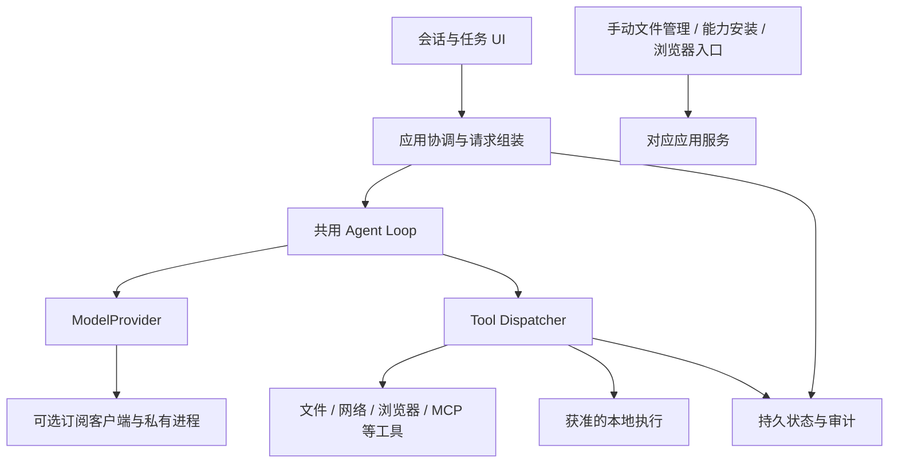

# Helix 总体架构

本文说明当前职责与已接受的演进边界；实际交付以[实施状态](../development/status.md)和[完成记录](../completion-records/index.md)为准。接受设计不代表对应功能已上线。

## 职责与调用路径

| 层 | 所有权 | 不承担的职责 |
| --- | --- | --- |
| UI / feature | 用户意图、导航、展示、人工操作入口 | 直接访问 DAO、网络客户端或执行器 |
| 应用协调 | submit / cancel / observe、会话与 Turn 绑定、请求组装、恢复 | 重新定义工具策略或 Runtime 退出事实 |
| Agent / Goal | 共用模型循环、工具结果回填、目标生命周期与预算 | 凭模型内容创建用户授权 |
| Tool Dispatcher | schema、效果归一、策略、授权解析、执行边界复检、持久结算 | 把 Provider 请求当工具执行 |
| 数据与 Runtime | Room 状态、文件 scope、执行与结果对账 | 因重连而自动重放未知副作用 |

手动文件管理、组件安装和浏览器拥有独立服务路径，不必先建立 Agent Turn。核心模块不依赖 UI 或具体 Android 基础设施；feature 通过应用接口提交动作。

## 运行、上下文与恢复

Chat、Plan、Act、Goal 共用执行循环，差异由工具曝光与 Policy 决定。生产请求组装保留持久历史、摘要、附件恢复、工具调用配对与图片绑定；整理上下文不能用旧测试 Builder 替换这些语义。MCP 已有按需发现和会话曝光，内置工具预算是独立优化。

恢复依次区分历史展示、原 Job 结果对账、用户继续和未知副作用待核查。停止使排队与等待审批的调用同样持久结算；进程死亡不等于任务成功，也不授予新的运行激活。

## 专项契约

- [执行引擎详解与对比研究](../research/execution-engine-comparison.md)：当前生产调用链、Codex/DSH/Claude Code 参照与端侧补足建议；研究不新增实现授权。
- [Provider](providers.md)：模型协议、连接检测与订阅通路。
- [Agent 模式与 Goal](agent-modes.md)：运行准入、完成与上下文。
- [执行域](local-code-execution.md)：同 UID 私有进程与 isolated UID 的真实边界。
- [扩展](extensions.md)：MCP、Skills、Connector、A2A。
- [终端与后台任务](terminal.md)：已接受但分切片交付的设计。
- [安全与发布](../security/testing-and-release.md)：授权、审计与验收。
- [用户操作链](../product/task-experience.md)：工作区、输出、变更和恢复之间的导航。

HXA-194～199 终端链与 proposed Workspace binding 不能仅凭本图声明已实现；HXA-209 会话授权已按[完成记录](../completion-records/HXA-209.md)交付。入口与剩余验收在[路线](../development/roadmap.md)。
