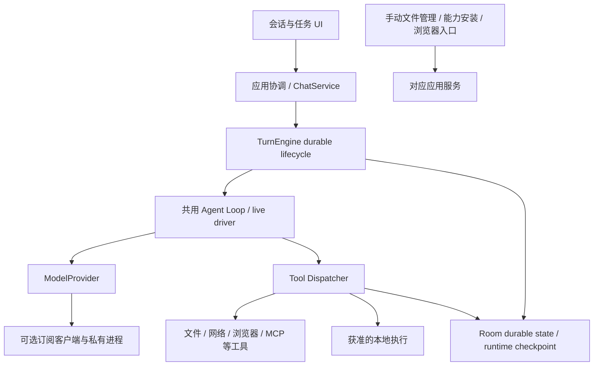

# Helix 总体架构

本文说明当前职责与已接受的演进边界；实际交付以[实施状态](../development/status.md)和[完成记录](../completion-records/index.md)为准。接受设计不代表对应功能已上线。

## 职责与调用路径

| 层 | 所有权 | 不承担的职责 |
| --- | --- | --- |
| UI / feature | 用户意图、导航、展示、人工操作入口 | 直接访问 DAO、网络客户端或执行器 |
| TurnEngine | durable admission/cancel/review/terminal/recovery、session blocker、runtime snapshot/checkpoint、live AgentLoop driver/observation | UI 投影、重新定义工具策略或 Runtime 退出事实 |
| 应用协调 / ChatService | 用户提交/确认、composer 与 UI-facing projection、请求接线 | 持有第二个 worker/startGate 或改写 Turn terminal/review |
| Agent / Goal | 共用模型循环、工具结果回填、Goal 生命周期与预算 | 凭模型内容创建用户授权 |
| Tool Dispatcher | schema、效果归一、策略、授权解析、执行边界复检、持久结算 | 把 Provider 请求当工具执行 |
| 数据与 Runtime | Room 状态、文件 scope、执行与结果对账 | 因重连而自动重放未知副作用 |

```mermaid
flowchart TD
  UI[会话与任务 UI] --> Coordinator[应用协调 / ChatService]
  Coordinator --> Engine[TurnEngine durable lifecycle]
  Engine --> Loop[共用 Agent Loop / live driver]
  Engine --> State[Room durable state / runtime checkpoint]
  Loop --> Provider[ModelProvider]
  Loop --> Dispatcher[Tool Dispatcher]
  Dispatcher --> Tools[文件 / 网络 / 浏览器 / MCP 等工具]
  Dispatcher --> Runtime[获准的本地执行]
  Manual[手动文件管理 / 能力安装 / 浏览器入口] --> Services[对应应用服务]
  Dispatcher --> State
  Provider --> Subscription[可选订阅客户端与私有进程]
```

手动文件管理、组件安装和浏览器拥有独立服务路径，不必先建立 Agent Turn。feature 通过应用接口提交动作。[ADR-AGENT-001](../adr/agent/001-turn-coordination.md)已将 live driver/observation 与 durable lifecycle 同归 TurnEngine；HXA-220/223 的交付不能继续画成 ChatService 持有 live worker 的迁移期结构。

这不表示所有 Core/UI/Room 依赖已完全拆净。现存 App 层接线与后续 headless Core/Execution Host 目标分别解释，后者见[Harness 重构方案](harness-refactor-plan.md)，不在当前架构图中冒充已经实现。

## 运行、上下文与恢复

Chat、Plan、Act、Goal 共用执行循环，差异由工具曝光与 Policy 决定。生产请求组装保留持久历史、摘要、附件恢复、工具调用配对与图片绑定；整理上下文不能用旧测试 Builder 替换这些语义。MCP 已有按需发现和会话曝光，内置工具预算是独立优化。

恢复依次区分历史展示、原 Job 结果对账、用户继续和未知副作用待核查。停止使排队与等待审批的调用同样持久结算；进程死亡不等于任务成功，也不授予新的运行激活。

## 专项契约

- [执行引擎详解与对比研究](../research/modules/01-architecture-and-execution-engine.md)：当前生产调用链、Codex/DSH/Claude Code 参照与端侧补足建议；研究不新增实现授权。
- [Provider](providers.md)：模型协议、连接检测与订阅通路。
- [Agent 模式与 Goal](agent-modes.md)：运行准入、完成与上下文。
- [执行域](local-code-execution.md)：同 UID 私有进程与 isolated UID 的真实边界。
- [扩展](extensions.md)：MCP、Skills、Connector、A2A。
- [终端与后台任务](terminal.md)：已有 Linux Job/手动 PTY 及各自执行、控制和验证边界。
- [安全与发布](../security/testing-and-release.md)：授权、审计与验收。
- [用户操作链](../product/task-experience.md)：工作区、输出、变更和恢复之间的导航。

本图只描述当前职责与已接受演进边界；具体功能是否已交付、仍有哪些收尾/发行任务，以[实施状态](../development/status.md)、[任务索引](../development/roadmap.md)和[完成记录](../completion-records/index.md)为准。
