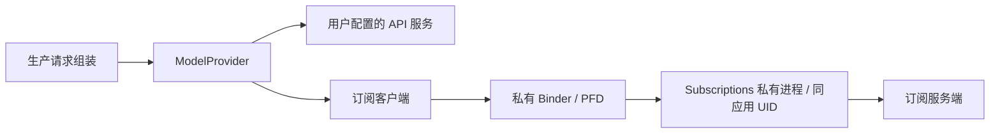

# 模型 Provider 与订阅通路

规范依据：[模型与连接](../adr/provider/001-models-and-connection.md)、[订阅适配器](../adr/provider/002-subscription-adapters.md)。

## 所有权

ModelProvider 负责模型请求、流事件、能力和错误归一。请求组装负责历史、摘要、附件和工具 schema；UI 展示连接结果，不自行创建协议请求。API 模型调用不经过 Tool Dispatcher；模型随后请求的工具仍逐个经过 Dispatcher。

## 协议与检测

按模型实际能力组装工具、图像、推理和 token 参数，不从显示名称猜测能力。流式消费区分可见文本、推理内容、工具调用、结束与错误；连接检测不得仅因没有 TextDelta 就否定有效 thinking 响应，也不能把空流或错误流判成功。连接检测、模型能力验证、真实工具任务分别记账。

取消、超时和流中断保留可解释错误，不返回伪成功。真实账号 smoke 采用显式 profile；未配置时 skip 不是已验证。[公共验收规则](../development/verification-matrix.md)规定默认门禁与外部证据边界。

## 订阅凭据与产品边界

developer 打包订阅模块，consumer 排除相应依赖和制品。凭据由订阅模块持有，正常 API 不返回 token；同 UID 不是凭据隔离安全边界。登录/刷新只使用自身授权，不提取其他应用 Cookie 或凭据。第三方协议适配器须如实标识，不冒充官方 CLI。

冷绑定由用户登录、验证、修复或获准工作触发，被动刷新不启动运行。身份、固定客户端标识及供应商限制以 Provider ADR 为唯一规范，不能为绕过限制随意替换。进程断开应对账请求状态，不盲目重发可能产生计费或副作用的工作。
