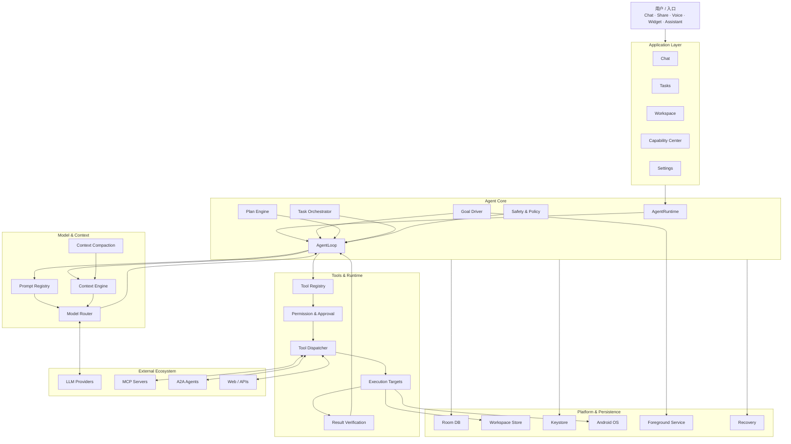
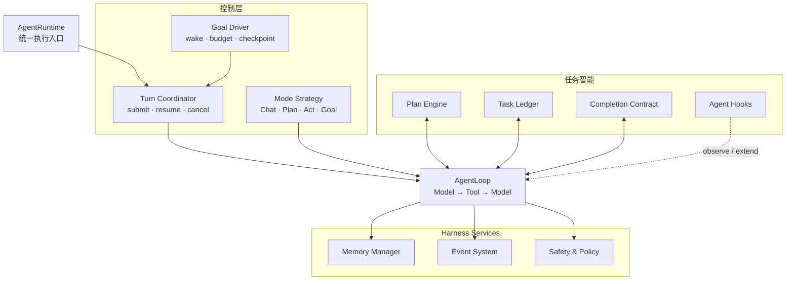
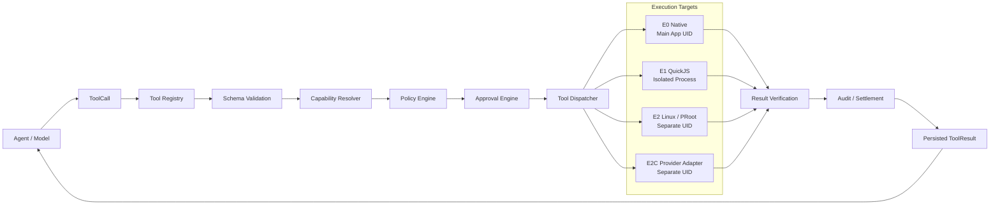
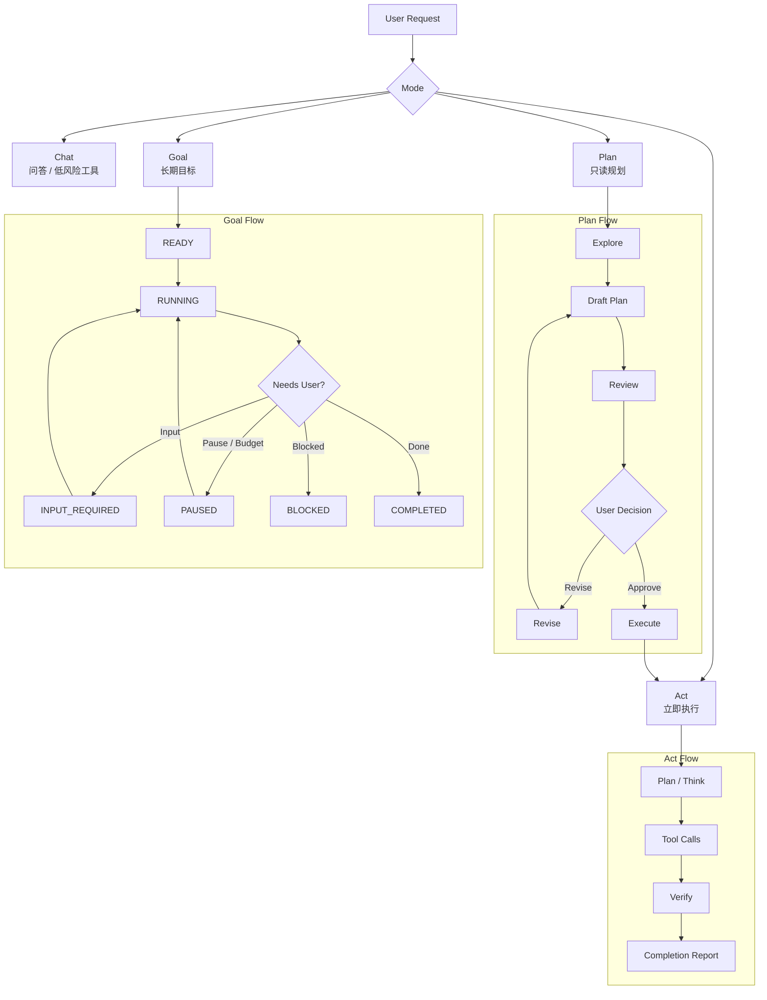
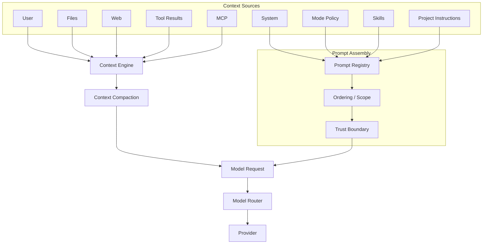
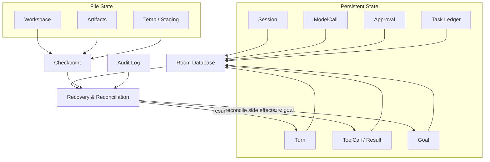
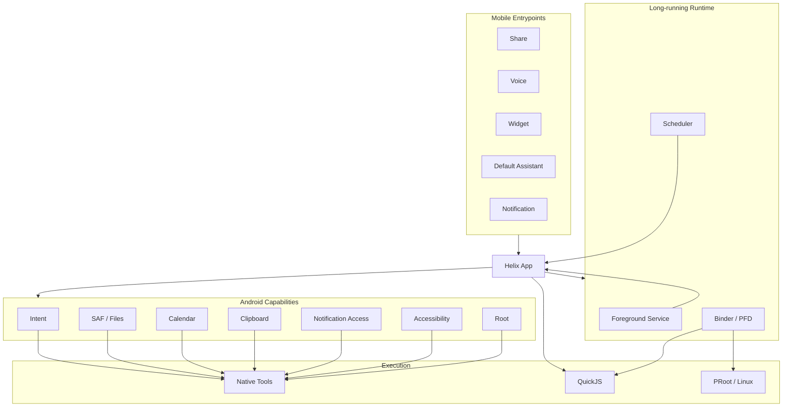

# Helix Agent Mermaid Architecture Diagrams

> 适合直接放入 GitHub Markdown / Mermaid Live Editor / Obsidian / Typora 等支持 Mermaid 的工具中编辑。

---

# 1. 总体架构图

```mermaid
flowchart TB

%% =========================================================
%% Helix Agent — High-Level Architecture
%% =========================================================

classDef entry fill:#EAF4FF,stroke:#4A90E2,color:#12344D,stroke-width:1px
classDef app fill:#ECFDF3,stroke:#38A169,color:#173B2A,stroke-width:1px
classDef core fill:#F3EEFF,stroke:#805AD5,color:#2D1B69,stroke-width:1px
classDef intel fill:#FFF8E6,stroke:#D69E2E,color:#5F4300,stroke-width:1px
classDef tool fill:#EDF8FF,stroke:#3182CE,color:#163A5F,stroke-width:1px
classDef data fill:#F7FAFC,stroke:#718096,color:#263238,stroke-width:1px
classDef ext fill:#FFF0F6,stroke:#D53F8C,color:#5A183B,stroke-width:1px


%% =========================================================
%% 1. USER & ENTRY
%% =========================================================

USER["👤 User<br/>Developer · Power User · Productivity User"]:::entry

subgraph ENTRY["1. User & Entry"]
direction LR
CHAT["Chat"]:::entry
TASKS["Tasks"]:::entry
WORKSPACE["Workspace"]:::entry
SHARE["Share / Voice"]:::entry
ASSIST["Widget / Assistant"]:::entry
end

USER --> ENTRY


%% =========================================================
%% 2. APPLICATION
%% =========================================================

subgraph APP["2. Application Layer"]
direction LR
CHATAPP["Chat App"]:::app
TASKAPP["Task Manager"]:::app
WSAPP["Workspace App"]:::app
CAPAPP["Capability Center"]:::app
ARTIFACT["Artifact Center"]:::app
end

CHAT --> CHATAPP
TASKS --> TASKAPP
WORKSPACE --> WSAPP
SHARE --> CHATAPP
ASSIST --> TASKAPP


%% =========================================================
%% 3. AGENT CORE
%% =========================================================

subgraph CORE["3. Agent Core"]
direction TB

RUNTIME["AgentRuntime<br/>Unified Entry"]:::core

subgraph CORECTRL["Execution Control"]
direction LR
TURN["Turn Coordinator"]:::core
GOAL["Goal Driver"]:::core
PLAN["Plan Engine"]:::core
ORCH["Task Orchestrator"]:::core
POLICY["Safety & Policy"]:::core
end

LOOP["Agent Loop<br/><b>Model → Tool → Model</b>"]:::core

RUNTIME --> TURN
GOAL --> TURN
PLAN --> LOOP
ORCH --> LOOP
POLICY --> LOOP
TURN --> LOOP

end

CHATAPP --> RUNTIME
TASKAPP --> RUNTIME
WSAPP --> RUNTIME
CAPAPP --> RUNTIME


%% =========================================================
%% 4. MODEL & CONTEXT
%% =========================================================

subgraph INTEL["4. Model & Context"]
direction LR
PROMPT["Prompt Registry"]:::intel
CONTEXT["Context Engine"]:::intel
COMPACT["Context Compaction"]:::intel
MODEL["Model Router"]:::intel
end

LOOP --> PROMPT
LOOP --> CONTEXT
COMPACT --> CONTEXT
PROMPT --> MODEL
CONTEXT --> MODEL
MODEL --> LOOP


%% =========================================================
%% 5. TOOL & EXECUTION
%% =========================================================

subgraph TOOLING["5. Tool & Execution"]
direction TB

PIPELINE["Tool Runtime<br/>Registry → Capability → Policy → Approval → Dispatch → Verify"]:::tool

subgraph CAP["Capabilities"]
direction LR
FILES["Files"]:::tool
BROWSER["Browser"]:::tool
ANDROID["Android"]:::tool
DEV["Developer"]:::tool
SKILLS["Skills / MCP / A2A"]:::tool
end

subgraph EXEC["Execution Targets"]
direction LR
E0["E0 Native"]:::tool
E1["E1 QuickJS"]:::tool
E2["E2 PRoot / Linux"]:::tool
end

PIPELINE --> FILES
PIPELINE --> BROWSER
PIPELINE --> ANDROID
PIPELINE --> DEV
PIPELINE --> SKILLS

FILES --> E0
BROWSER --> E0
ANDROID --> E0
DEV --> E2
DEV --> E1

end

LOOP --> PIPELINE


%% =========================================================
%% DATA & PLATFORM
%% =========================================================

subgraph FOUNDATION["Foundation"]
direction LR
DB["State Store<br/>Session · Turn · Goal · Approval"]:::data
STORE["Workspace Store<br/>Files · Artifacts"]:::data
KEY["Keystore"]:::data
RECOVERY["Recovery & Audit"]:::data
ANDROIDOS["Android Platform<br/>OS · WebView · Accessibility · FGS"]:::data
end

CORE --> DB
TOOLING --> STORE
CORE --> RECOVERY
TOOLING --> ANDROIDOS
MODEL --> KEY


%% =========================================================
%% EXTERNAL ECOSYSTEM
%% =========================================================

subgraph EXTERNAL["External Ecosystem"]
direction LR
LLM["LLM Providers"]:::ext
MCP["MCP Servers"]:::ext
A2A["A2A Agents"]:::ext
WEB["Web / APIs"]:::ext
end

MODEL <--> LLM
SKILLS <--> MCP
SKILLS <--> A2A
BROWSER <--> WEB


%% =========================================================
%% RESULT FLOW
%% =========================================================

LOOP --> ARTIFACT
ARTIFACT --> TASKAPP
ARTIFACT --> WSAPP
```







---

# 2. Agent Harness 核心架构



---

# 3. Tool Call 与安全执行架构



---

# 4. Plan / Act / Goal 产品与状态架构



---

# 5. Prompt / Context / Model 架构



---

# 6. 数据持久化与恢复架构



---

# 7. Android 平台集成架构



---

# 推荐文档组织

```text
docs/architecture/
├── overview.md
│   └── 图 1：总体架构
├── agent-harness.md
│   └── 图 2：Agent Harness
├── tool-runtime.md
│   └── 图 3：Tool 与安全执行
├── task-model.md
│   └── 图 4：Plan / Act / Goal
├── context-and-prompt.md
│   └── 图 5：Prompt / Context / Model
├── persistence-and-recovery.md
│   └── 图 6：数据与恢复
└── android-platform.md
    └── 图 7：Android 平台集成
```
