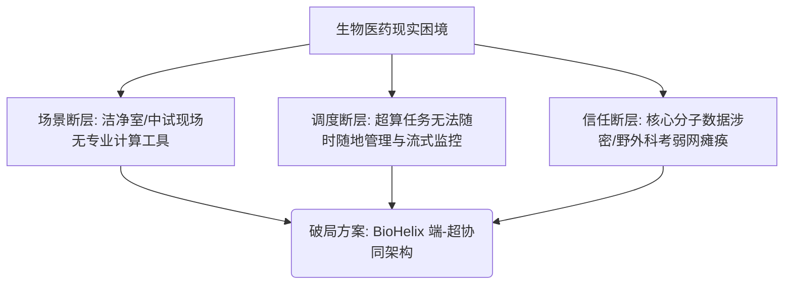
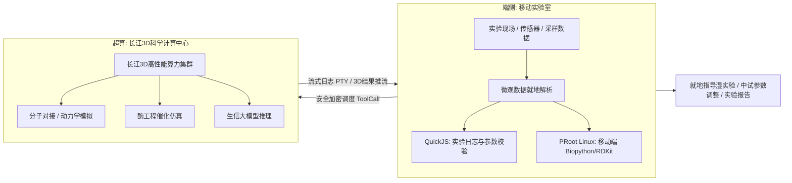
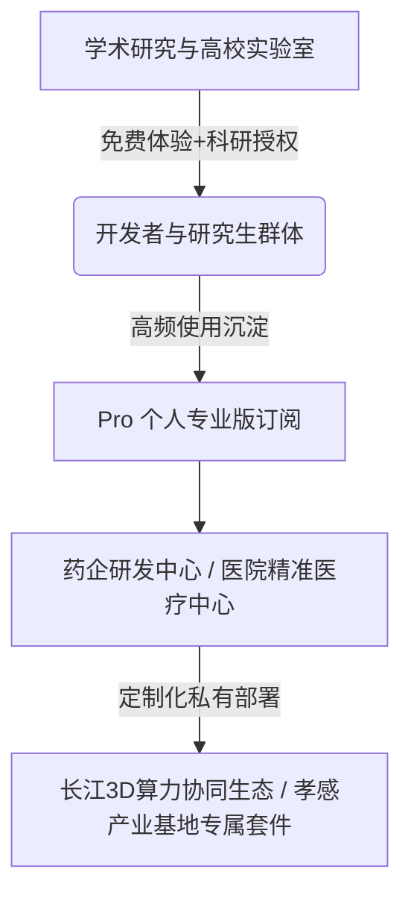

# BioHelix 移动端生命科学 AI 执行工作台 —— 商业计划书（大赛路演版）

> 💡 **演示文稿文件 (PPTX)** 已自动生成并保存至当前 worktree 项目文档中：  
> 🔗 **PPT 文件路径**：[`docs/product/BioHelix_商业计划书_路演版.pptx`](file:///Users/dollars/Helix-biohelix/docs/product/BioHelix_商业计划书_路演版.pptx)  
> （针对**“长江3D科学计算中心”**算力与**孝感生物制造/医药产业落地**深度定制，16:9 高清宽屏，包含 11 页全景路演幻灯片）

---

## Executive Summary | 项目概述（282 字）

> **BioHelix 是一款面向生命科技与生物医药的端-超协同移动 AI 执行工作台。** 项目针对实验台、洁净室及野外采样等现场“无电脑可用、涉密数据难出网、离线计算受限”的痛点，依托 Android 本机多执行域沙箱（QuickJS 与 PRoot Linux 容器），在移动端实现分子数据（PDB/FASTA/SDF）就地清洗、微量生信计算与实验流程自动化。  
> 平台深度对接**长江3D科学计算中心**，构筑“端侧微观数据预处理 $\rightarrow$ 超算宏观高通量仿真（虚拟筛选、分子动力学与酶催化推演） $\rightarrow$ 移动端流式对账与实验指导”的完整闭环。产品直接赋能创新药物研发、中药野外科考与**孝感合成生物基地中试现场**巡检，构建生命科学计算基础设施的掌上新质生产力底座。

---

## 1. 参赛领域与大赛契合度分析

### 1.1 主申报赛道
* **申报领域**：**【领域三】AI前沿交叉生命科技与算力基础开发应用**
* **对应大赛命题**：
  > “聚焦AI与生命科学交叉的前沿颠覆性技术，依托长江3D科学计算中心的高性能算力与算法优势，聚焦生命科学底层规律探索与计算基础设施构建，实现从‘微观机制解析’到‘宏观算力支撑’的闭环。”
* **项目破题点**：
  * 传统生信科研受制于“办公桌固定终端”，实验现场（P2/P3洁净室、生物反应器旁、野外采样地）与后台超算中心严重割裂。
  * **BioHelix 构建了生命科学领域的“端-超协同计算基础设施”**：以手机/平板为前端交互与微观数据执行节点，以长江3D科学计算中心为宏观算力后盾，打通生命科技计算落地的“最后一公里”。

### 1.2 兼顾与延伸赛道
* **【领域一：创新药物研发（含中医药）】**：赋能野外中药道地药材离线鉴定与有效成分计算反演，联动 3D 科算中心加速候选化合物筛选。
* **【领域二：AI生物制造】**：赋能孝感合成生物基地中试发酵车间，巡检工程师手持终端即时调用酶动力学大模型指导工艺调控。
* **【领域四：智能医疗器械与精准医疗】**：赋能床旁便携检测（POCT），提供端侧数据初筛与中心大模型协同诊断。

---

## 2. 行业痛点与市场机遇 (Problem & Opportunity)

### 2.1 生物医药与生命计算的三大断层
1. **“重计算在云端，真实验在现场”的断层**：
   * 蛋白质折叠、分子动力学、酶催化仿真需要巨大的算力，但生命科学研究者大量时间处于实验台、细胞间、洁净车间或外业基地。笨重的台式机无法进入高洁净区，传统移动端又缺乏专业生信计算工具。
2. **超算中心算力调度门槛高、实时反馈弱**：
   * 长江3D科学计算中心拥有顶尖算力，但实验人员无法随时随地按需唤醒算力、调整参数与实时追踪作业日志。任务排队受阻或报错不能第一时间处置。
3. **涉密实验数据与弱网外业的信任困境**：
   * 核心分子结构、新药靶点与菌株基因数据具有极高商业机密性，绝对禁止上传公有云第三方平台；而在野外中草药勘探、远洋科考等无网场景下，云端计算完全瘫痪。

---

## 3. 产品定位与核心解决方案 (Solution & Architecture)

### 3.1 核心定位
> **面向生物医药、合成生物与中医药科研人员的“端-超协同移动 AI 执行工作台” —— 长江3D科学计算中心的掌上智能调度中枢。**

### 3.2 核心能力矩阵
1. **移动端微观数据本地闭环**：
   * 内置 Biopython、RDKit 等微量计算组件，在手机端即可直接解析 PDB/FASTA/SDF/MOL2 文件，进行分子量、亲疏水性、拓扑参数就地计算与格式清洗。
2. **长江3D科算中心的一键式智能调用**：
   * 自研 Tool Dispatcher 内置 HPC 适配器，科研人员在移动端输入自然语言（例如：“对该配体在 3D 科算中心运行分子动力学模拟并评估结合能”），自动生成超算作业脚本并下发执行。
3. **长命令实时流式终端 (PTY Stream)**：
   * 即使离开电脑，科研人员在手机端仍能实时滚动查看超算模拟的日志输出（RMSD收敛曲线、结合能得分），异常即时打断与调整。
4. **100% 离线隐私保护与安全审计**：
   * 端侧数据保留在应用私有沙箱中；每次超算调用经用户明确审批，操作记录具备全链路 Room 数据库持久化审计，保障涉密新药资产安全。

---

## 4. 科算应用与落地场景 (Applications in Bio-Pharma)

### 4.1 场景一：创新药物研发与中医药野外采样（赛道一）
* **痛点**：中药道地药材野外考察、濒危药用植物调查往往在深山无网区，传统方法只能带回标本再做实验室分析，耗时数月。
* **BioHelix 应用**：
  * 移动端搭载轻量生信视觉模型，端侧离线识别药用植物种属与性状特征；
  * 本地运行轻量化学信息学计算，对便携光谱仪读取的成分数据完成就地初筛；
  * 连网后一键向长江3D科算中心推送靶点对接任务，反向预测中药有效活性分子。

### 4.2 场景二：孝感合成生物基地中试发酵车间掌上巡检（赛道二）
* **痛点**：发酵罐与生物反应器中试是合成生物量产的关键瓶颈。车间现场温度、pH、溶氧波动频繁，传统工程师只能依赖固定中控室，无法即时排障。
* **BioHelix 应用**：
  * 巡检人员手持终端通过蓝牙/工业内网直连发酵传感器，本地沙箱即时处理时序代谢数据；
  * 自然语言向长江3D科算中心调用“酶催化与代谢流动力学模型”，秒级生成补料调节方案；
  * 直接对接孝感合成生物基地中试生产线，显著降低中试染菌与批次失败风险。

### 4.3 场景三：P2/P3 洁净室现场生信实验协同（赛道三）
* **痛点**：高等级生物安全实验室防护严密，笔记本电脑难以消毒且进出限制严格，实验科学家在操作台前难以及时对比文献与计算参数。
* **BioHelix 应用**：
  * 移动终端（可装防水防尘防护套）成为洁净室唯一需要的数字化助手；
  * 语音或触控直接记录实验数据，本地校验移液与配比逻辑；
  * 随时随地唤醒 3D 科算中心调取比对数据，真正实现“实验台边做实验，边看超算推演”。

---

## 5. 商业模式与产业化落地 (Business Model & Industrialization)

1. **科研/学术免费版 (Academic Free Tier)**：
   * 开放端侧基础文件处理、多模型 API 连接、本地微量生信计算与标准生信模板，快速渗透全国生物医药高校与研究院所。
2. **Pro 个人专业版 (Pro Bio License)**：
   * 面向药物研发工程师与生信分析师，提供长期稳定的容器化 Linux Runtime 维护、长江3D科算中心高速作业通道、多工作区与无限历史审计。
3. **孝感基地与行业专属套件 (Enterprise & Industrial Solutions)**：
   * **孝感合成生物基地定制版**：针对发酵反应器与分离纯化设备定制驱动插件，提供端-边-超算全流程数字化解决方案；
   * **涉密药企/院所私有化部署**：支持接入用户局域网自建生物大模型与本地私有超算，提供合规级安全审计支持。

---

## 6. 落地规划与长江3D科算中心协同里程碑 (Roadmap)

| 阶段 | 周期 | 核心战略目标 | 关键成果与交付物 |
| :--- | :--- | :--- | :--- |
| **Phase 1: 端侧生信沙箱构建** | 已就绪 | 跑通 Android 端侧多执行域与生信基础库运行 | 完成 QuickJS 独立沙箱、PRoot 容器化 Linux，成功跑通 Biopython/RDKit 移动端运行，完成端侧文件闭环。 |
| **Phase 2: 长江3D科算中心对接** | 阶段目标 (1-3月) | 深度适配长江3D科学计算中心 API | 开发 HPC 专属调度适配器，跑通手机端任务提交、参数调优、流式日志 (PTY) 回传与三维结构轻量渲染。 |
| **Phase 3: 孝感基地中试产业试点** | 规划期 (4-8月) | 落地孝感合成生物中试基地示范项目 | 与孝感合成生物基地达成试点合作，部署发酵巡检工作台；联合中医药研究机构开展野外采样实测。 |
| **Phase 4: 全行业规模化应用** | 规划期 (9-18月) | 打造全国生物医药移动算力中枢标准 | 接入 100+ 常用生信分析与药物计算标准工具链；在全国生物医药产业园推广 1000+ 企业与科研院所席位。 |

---

## 7. 团队优势与核心壁垒 (Team & Competency)

### 7.1 跨界复合团队
* **操作系统与容器底层专家**：深耕 Linux 容器化、Android 内核、Binder 多进程通信与安全沙箱，攻克非 Root 下移动端跑生信环境的全球级难题。
* **计算生物学与 AI 制药专家**：具备知名药企与计算生物实验室背景，精通分子对接、分子动力学模拟算法与超算集群调度架构。
* **产业化与外业工程专家**：拥有生物化工中试车间与重大科研科考项目实施经验，深谙实验现场与生产车间的核心痛点。

### 7.2 核心护城河
1. **全球首创的端-超协同移动生信架构**：打破传统超算只连电脑的局限，让超级算力第一次以极低门槛直达湿实验第一线。
2. **端侧工业级多执行域技术壁垒**：不依赖手机 Root 权限，安全、稳定、低功耗运行专业 Linux 生信工具，兼顾安全合规与极限性能。
3. **“长江3D科算中心 + 孝感基地”的在地化产业壁垒**：从源头深度绑定区域顶尖算力基础设施与产业化基地，构建不可替代的协同生态。

---

## 8. 融资与资源支持需求 (Financing & Resources)

* **融资诉求**：寻求天使轮 / 种子轮股权融资，诚邀生命科技与算力产业基金深度参与。
* **大赛支持需求**：
  * **算力资源支持**：申请对接长江3D科学计算中心的算力测试节点与生信算法专属通道；
  * **中试场景对接**：申请进驻孝感合成生物制造基地开展实地发酵巡检中试验证。
* **资金规划**：
  * **55% 研发与端-超协同协议优化**：优化端侧超算长连接、3D分子移动端低功耗流式渲染；
  * **25% 孝感中试与行业模板套件开发**：开发针对合成生物与中医药的 50+ 款高频移动分析模板；
  * **20% 市场推广与学术合作**：拓展高校科研课题组与标杆医药企业试点。
