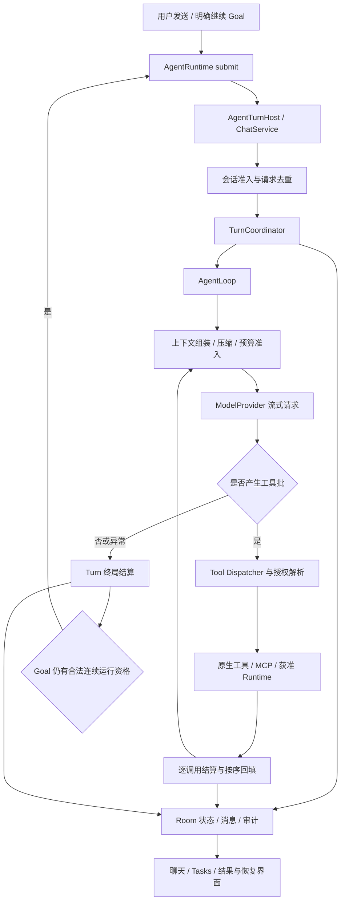

# Helix 执行引擎详解与 Codex、DSH、Claude Code 对比

核验日期：2026-09-17。性质：当前实现解释、外部机制研究与端侧演进建议；不是新增 ADR、HXA 排期或功能验收。本页的“建议补足”不表示已授权实施。当前交付、优先级与有效决定分别以[实施状态](../development/status.md)、[路线](../development/roadmap.md)、[ADR](../adr/README.md)为准。

## 1. 结论与阅读范围

Helix 已具备完整的单 Agent 模型—工具循环、逐调用持久结算、会话授权、Goal 连续运行、预算与上下文压缩基础。主要差距是运行中的用户干预、输入排队、恢复时的可理解操作，以及命令实时输出。命令详情和产物交付已由194/203交付，仍保留回归。不能把这些差距归因于“Android 必须使用重状态机”，也不能用增加 Step 表、重写事件引擎或开放任意插件来代替产品闭环。

建议先完成已排期的恢复/准备/实时输出/扩展闭环，再评审持久输入队列与同 Turn 转向；有界只读委托按真实收益决定是否启用。保留 Android 生命周期、Room 事实源和统一工具授权，不以桌面功能数量作为目标。

对比对象和证据边界：

| 对象 | 本页研究范围 | 不据此推断 |
| --- | --- | --- |
| Helix | 当前工作树生产入口、循环、协调器、恢复与授权代码，以及有效 ADR/完成记录 | 文档通过等于真机通过；已接受设计等于已交付 |
| Codex | 官方 App Server 的 Thread/Turn/Item、steer/interrupt/resume、审批与子 Agent 文档 | 某个 API 在所有客户端和版本都可用；桌面接口证明 Android 可原样部署 |
| DSH | DeepSeek Harness 官方仓库的 Agent、默认 Loop、Session 与 subagent 契约 | 任意 Profile 都装有持久化/委托插件；插件存在等于当前部署启用 |
| Claude Code（CC） | 官方说明的循环、历史、运行中输入、checkpoint、权限、subagents 与 hooks | 未公开的内部数据库/状态机；任意工具副作用可回滚 |

Helix 初次源码核验基准 HEAD 为 `73e574f6895d8d47516f84120106e7615f394bd8`，同时读取了工作树。收尾时对照 `cd3f744e` 的状态与完成记录更新交付边界：194/203已交付，模型结果投影、预算诊断及明确继续见 [ADR-AGENT-006](../adr/agent/006-model-data-budget-boundaries.md) 与[修复证据](../bug-fixes/2026-09-17-context-budget-tool-projection.md)。此更新不声称重新进行全量源码或外部机制核验。DSH 引用固定在官方 `master` 快照 `0d1f50007f9bca3f52b06e1c3074fa14d5fb0720`，不是 npm 稳定版本保证。Codex/CC 为核验日的官方在线文档，后续可能变化。本轮没有四产品同机性能横评或真实账号端到端比较。

## 2. 先分清执行引擎中的对象

执行引擎负责把用户意图变成连续的模型请求、工具效果和可检查结果。模型负责提出下一步；引擎负责请求上下文、工具准入、执行、取消、记录和后续推进。模型在云端并不代表执行引擎在云端。

| 概念 | 含义 | Helix 的对应关系 |
| --- | --- | --- |
| Session / Thread | 持久对话与所属配置 | Session；不是当前屏幕的生命周期 |
| Turn | 一次有界的请求处理，可以包含多次模型调用 | 有独立 ID、持久 phase、预算与结算 |
| ModelCall | 一次模型请求及其结果 | 独立记录；正常生成与压缩请求需要区分 |
| Tool batch / round | 一次模型响应提出的完整工具批 | 批次内各调用独立结算，结果按原顺序回填 |
| ToolCall | 一项具体工具操作 | 独立身份、授权、运行与终态/待核查记录 |
| Job / Execution | 工具调用背后的执行任务 | 如 PRoot Job；重连查询原任务，不因连接失败新建同一副作用 |
| Goal / run | 跨 Turn 的目标与一次运行记账 | Goal 持久；连续执行资格单独管理 |
| Step | 产品各自定义的循环或展示粒度 | 没有统一顶层 Step 实体；不能与 PlanStep、安装 Step、reducer 返回值混用 |
| Item / timeline entry | 可寻址的输入、输出或操作展示单位 | 可基于已有消息、调用、审批和产物投影，不必另造执行器 |

一次模型调用不一定带工具；摘要调用也消耗模型预算。因此模型调用数、工具轮数、计划步骤数和 UI 时间线条数不能合并成一个“step 数”。DSH 的 turn/step 事件和 Codex 的 Turn/Item 也不是一一对应的数据库结构。

## 3. Helix 当前生产引擎如何工作

### 3.1 主调用链与职责

主要源码导航：

| 组件 | 负责什么 |
| --- | --- |
| [AgentTurnHost](../../app/src/main/kotlin/com/helix/app/chat/AgentTurnHost.kt)、[ChatService](../../app/src/main/kotlin/com/helix/app/chat/ChatService.kt) | start/cancel/observe 接缝；session 绑定、clientRequestId 去重、同会话活动 Turn 准入、运行协调 |
| [AgentLoop](../../app/src/main/kotlin/com/helix/app/agent/AgentLoop.kt) | 模型请求—工具批—上下文回填循环，以及 Goal 时间约束 |
| [TurnCoordinator](../../app/src/main/kotlin/com/helix/app/agent/TurnCoordinator.kt) | 当前 ModelCall/stream 身份、批次聚合 phase、持久事务和终局 |
| [ModelLoopAdmission](../../app/src/main/kotlin/com/helix/app/agent/ModelLoopAdmission.kt)、[TurnBudgetTracker](../../app/src/main/kotlin/com/helix/app/agent/TurnBudgetTracker.kt) | 每次请求的预算准入、输出上限与用量结算 |
| [ContextCompactionRound](../../app/src/main/kotlin/com/helix/app/agent/ContextCompactionRound.kt) | 压缩规划、收益与失败判断、有限重试、checkpoint 发布 |
| [SessionPermissionResolver](../../core/policy/src/main/kotlin/com/helix/core/policy/SessionPermissionResolver.kt) | 汇总操作效果，得出免确认、精确审批或拒绝 |
| [RecoveryCoordinatorApp](../../app/src/main/kotlin/com/helix/app/recovery/RecoveryCoordinatorApp.kt) | 启动时处理持久中断事实，停泊 Turn/Goal、结算模型调用 |
| [DataSyncForegroundController](../../app/src/main/kotlin/com/helix/app/foreground/DataSyncForegroundController.kt) | 活动传输阶段的前台服务决策，等待用户或不再推进时停止 |

生产 `BatchTurnRuntime` 明确不复用早期 M1 串行 `TurnReducer`：一批工具可以分别运行、结算和进入未知状态。核心 reducer 有纯函数测试价值，但不能据此宣称生产执行只由它驱动、应用层只是薄宿主。生产职责见[ADR-AGENT-001](../adr/agent/001-turn-coordination.md)。

### 3.2 Turn、批次与持久边界

[持久 TurnState](../../core/model/src/main/kotlin/com/helix/core/model/TurnState.kt)当前有 12 个枚举值：CREATED、BUILDING_CONTEXT、WAITING_MODEL、RECEIVING_MODEL、WAITING_APPROVAL、RUNNING_TOOL、RECORDING_TOOL_RESULT、CANCELLING、INTERRUPTED、COMPLETED、FAILED、CANCELLED。正常循环在模型与工具阶段往返；后五项不能当成同一种“停止”。

关键边界包括：

1. 模型调用有独立身份；请求来源快照在出网前记录，取消/异常针对当前调用。
2. 模型工具消息与该模型步骤结算使用明确事务；外部工具效果不放进 Room 事务。
3. 每个 ToolCall 独立持久结算；仅平台证明不冲突的只读操作有界并发。
4. 批次结算后按模型原顺序记录 ToolResult，再打开下一 ModelCall。完成速度不改变上下文顺序。
5. 最终 assistant 文本、Turn 和仍打开的 ModelCall 终局原子结算。取消先持久进入 CANCELLING，再等待实际退出结算。

因此，Helix 已有比整个 Turn 更细的持久单位。新增 Step 表本身不会带来断点续执行，更不会恢复已丢失的模型流、shell 内存或外部事务。

### 3.3 授权与预算不是“每次都弹卡”

[HXA-209](../completion-records/HXA-209.md)已交付“完全免确认 / 工作目录与联网 / 只读与联网”及 CUSTOM。工具层只有 ENABLED/DISABLED；操作效果统一按 DENY > ASK > ALLOW 解析。风险等级用于展示和审计，不能单凭 L2/L3 恢复旧的恒询问行为。显式 `rm -rf dir` 有有限精确确认规则，不扩张成通用删除检测。

系统权限、可用执行域和用户选择的操作权限分别判断。切换预设不创造 Android 能力，模型/MCP/Skill 输出也不授予权限。当前没有可跨所有执行域兑现的统一工具禁网开关，不能把 PRoot 描述为离线环境。[权限契约](../adr/permissions/001-session-authorization.md)

`TurnBudgetTracker` 是活循环中的记账器，不能仅凭它的类名宣称所有计数都逐项持久化。ModelCall/Goal 的持久用量与结算另有路径。普通 Turn 在 token、模型调用或工具轮限制处可能以 FAILED 和具体错误码结束；Goal 则有跨 run 累计预算及相应停泊/阻塞语义。两层不能合并成“预算耗尽全部永久失败”。预算约束也不是服务商精确账单保证，缺失 usage 时仍需估算。[Goal 契约](../adr/goal/001-lifecycle-and-completion.md)

### 3.4 上下文与长任务

Helix 已在模型请求前检查上下文，压缩较早的完整历史或当前 Turn 已结算工具步骤，保留调用/结果配对、当前用户输入和必要来源。摘要无工具权限、计入预算、检查实际收益；失败保留原历史，有限重试不变成无界循环。这不是待从零补齐的能力。[ADR-AGENT-002](../adr/agent/002-context-compaction.md)、[HXA-176 证据](../completion-records/HXA-176.md)

后续应评估真实长任务的摘要保真、重复读取、schema/输出开销与恢复后工作延续，而非仅增加上下文窗口或另建 Context Builder。已有合成历史和模型专项证据不保证任意长任务不遗忘。

### 3.5 恢复、重试与连续 Goal

必须分清四件事：历史可展示、原 Job 结果可对账、用户可继续、进程自动再执行。

- 进程死亡后，持久记录用于标记中断、停泊与待核查；不能因为有历史就认定未记录的外部效果没有发生。
- 对原 Job 的结果回收不等于重新运行命令。查询成功、结果完整、导回产物和模型继续各有边界。
- 当前 `ChatService.retry()` 表达的是新建 Turn、重用原用户消息，并复核附件；它不是任意模型步骤的原地恢复。
- Goal 只有在用户显式激活后才连续推进；前轮先结算，下一轮重新准入。Activity 离开前台不必停止，但进程死亡/强停后不自动恢复激活，提醒任务不直接调用模型。

“不会盲目重放旧 ToolCall”也不等于后续模型绝不会生成一个语义相同的新调用。清楚地把已有结果和未知效果带入继续上下文、针对支持的远端 API 使用其幂等机制，才可能进一步降低重复操作风险；不能宣称通用 exactly-once。

## 4. 三种主流引擎的参照价值

### 4.1 Codex：稳定控制接口与可寻址过程

官方 App Server 以 Thread → Turn → Item 表达对话和执行，Item 可对应消息、命令、文件修改或工具调用。客户端订阅增量与终态，并可读取持久历史、恢复 Thread。`turn/steer` 向活动 Turn 追加输入，要求 `expectedTurnId`，不新开 Turn，也不允许借它覆盖模型、目录、sandbox 等 Turn 配置。`turn/interrupt` 与 steer 是不同操作。[官方接口](https://developers.openai.com/codex/app-server)

这对 Helix 的价值是：把提交、转向、停止、观察的契约做清楚，并让界面能稳定定位一项操作。无需为了模仿接口而增加 JSON-RPC 服务或 Android 对外服务器。公开 Item 事件也不等于任意外部效果的事务日志。

Codex 将执行时的技术约束与何时询问用户分开；配置取决于宿主和环境。Helix 可以借鉴这种分层解释，但不能把桌面 OS sandbox 的保证套到共享 UID 的 PRoot。[审批与执行边界](https://learn.chatgpt.com/docs/agent-approvals-security)

子 Agent 的收益包括独立上下文、并行探索和减少主对话噪声；官方建议从读多写少的独立工作开始，写入并行要考虑冲突。Helix 借鉴任务分解与汇总，不直接照搬桌面 checkout/多进程规模。[子 Agent 指南](https://learn.chatgpt.com/docs/agent-configuration/subagents)

### 4.2 DSH：明确的输入队列、服务边界与可组合循环

DSH 的公共 `Agent` 与具体 `dsh-agent-loop` 分离，后者提供默认 driver。Session 以事件表达 turn/step、消息与调用，模型历史由其导出；持久化是可挂载的后端，未挂载时可以只有内存会话。因此“DSH 全是内存循环”和“任意 DSH 部署都有相同持久保证”都不成立。[默认 Loop](https://github.com/deepseek-ai/deepseek-harness/blob/0d1f50007f9bca3f52b06e1c3074fa14d5fb0720/packages/core/agent-loop/README.md)、[Session](https://github.com/deepseek-ai/deepseek-harness/blob/0d1f50007f9bca3f52b06e1c3074fa14d5fb0720/docs/subsystems/session.md)

公共输入接口区分 `followup()`（下一 Turn）、`steer()`（下一 step）与 `inject()`（加入上下文但不唤醒）；inbox 变更有持久事件与投影，消费和取消有不同记录。`cancel()` 默认还清理队列，也可显式保留。这为 Helix 提供了很具体的交互参照：普通排队和当前任务修正应分别表达，UI 应知道输入何时被消费。[Agent 与 inbox](https://github.com/deepseek-ai/deepseek-harness/blob/0d1f50007f9bca3f52b06e1c3074fa14d5fb0720/packages/core/agent/README.md)

默认 Loop 支持有界 parallel-safe 调用与 exclusive 屏障；固定快照也明确没有内置 Turn budget，需要生命周期扩展施加策略。不能因 DSH 更可组合就推断其默认配置比 Helix 有更强的累计预算。Helix 无需放弃现有统一预算或重写为 event sourcing。

DSH 的子 Agent 是可选服务，有进程内和 Codex/CC/ACP 等不同 provider。它们有各自能力约束，不能把底层外部 CLI 适配称为与 DSH 进程内引擎相同的执行域。Native Cordis 插件通过宿主服务参与组合，与在外面调用 CLI 的包装器也不同。[委托契约](https://github.com/deepseek-ai/deepseek-harness/blob/0d1f50007f9bca3f52b06e1c3074fa14d5fb0720/docs/subsystems/subagent.md)

Helix 值得借鉴稳定服务接口、明确 owner/teardown 和输入来源；不需要把任意 Cordis/Node 插件装入 Android 主进程，也不需要开放替换授权内核的插件接口。

### 4.3 Claude Code：连续交互、专用上下文与有限撤回

CC 官方说明消息、工具使用和结果会保存为 JSONL，支持会话恢复；它不是崩溃后全部消失的内存 loop。用户可以停止当前动作，也可以在运行中提交修正，待当前动作完成后参与下一步决策。[执行与交互](https://code.claude.com/docs/en/how-claude-code-works)

CC checkpoint 主要用于所跟踪的文件编辑与对话回退，不覆盖任意 Bash 文件修改、远端副作用或所有子 Agent 修改。它不是模型每一内部步骤都可恢复的通用 checkpoint。Helix 不应因此承诺回滚手机设置、App 操作、远端请求或任意命令。[Checkpoint 范围](https://code.claude.com/docs/en/checkpointing)

CC 的 subagents 将任务放到独立上下文，hooks 在指定生命周期执行配置逻辑，权限模式与规则控制自动执行范围。这些是不同能力，不能合并成“可无限注入用户逻辑”。Helix 当前已有自动授权与 MCP/Skill；真实短板是常用扩展的可用性和任务完成体验，不必先复制整套 hooks。[Subagents](https://code.claude.com/docs/en/sub-agents)、[Hooks](https://code.claude.com/docs/en/hooks)、[权限](https://code.claude.com/docs/en/permissions)

## 5. 能力差距矩阵

本表基于前述源码与官方契约，不是同条件性能排名。“候选”不改变现有产品范围。

| 维度 | Codex / DSH / CC 的参照 | Helix 当前结论 | 端侧处理 |
| --- | --- | --- | --- |
| 模型—工具循环 | 三者都有多次请求和工具反馈 | 已有，不是缺项 | 保留生产单一路径 |
| 历史与执行身份 | Codex Turn/Item；DSH Session/turn/step；CC transcript | 已有 Turn/ModelCall/ToolCall/Job/Artifact | 改善展示和定位，不先换存储模型 |
| 运行中转向 | Codex steer；DSH next-step；CC 中途修正 | 普通活动会话启动入口拒绝新 Turn，未提供通用同 Turn steering | 优先评审补足 |
| 普通消息排队 | DSH next-turn 与 CC 队列提供直接参照 | Goal 后继不等于用户消息队列 | 与转向一起定义不同语义 |
| 停止与取消 | 均有取消入口，具体队列处理不同 | 已有 CANCELLING、活任务/停泊任务区分 | 补齐与新输入、队列、Goal 抢占的组合体验 |
| 恢复 | 三者有历史恢复；CC 有有限文件 rewind | 有中断与原 Job 对账基础，无任意步骤原地续跑保证 | 优先做事实摘要和明确继续路径 |
| 自动授权 | 各有权限/策略扩展面 | HXA-209 已交付预设与 CUSTOM | 不再列“L2 恒出卡”为短板 |
| 上下文压缩 | 都有上下文管理机制，具体策略不同 | 已有步骤边界压缩及收益/预算检查 | 用真实长任务评测优化，不重复立项 |
| 子 Agent | 三者都有相应产品/可选委托面 | 有界只读设计/Spike，不是生产能力 | 收益成立后按 ADR 门槛启用 |
| 工具并行 | DSH 有并行池与独占屏障；其他产品不在此泛化调度内部实现 | 已有平台判定的只读有界并行 | 不把无子 Agent 写成全部工具串行 |
| 命令日志/后台执行 | 桌面工具可独立观察运行进程 | 有 Runtime/结果基础，终端链分项未闭合 | 完成已有 HXA，不复制桌面常驻策略 |
| 扩展生命周期 | DSH 公共服务/events，CC hooks，Codex 工具/客户端接口 | MCP/Skill/A2A 已有；任意引擎 hooks 未作为生产通用扩展面交付 | 先补扩展使用闭环；按具体需求评审有限接缝 |
| 预算与长目标 | 支持范围随产品/组合变化；DSH 默认 Loop 无内置 Turn budget | 已有 Turn 门控和 Goal 累计账本 | 验证与用户干预共存，不另造无限自治循环 |
| 无限后台/任意回滚 | 不能由任一产品的 resume 接口推出 | 不承诺 | 属于不应承诺的能力，不计作差距 |

## 6. 适合 Android 的补足顺序

### 6.1 先交付已有路线上的执行结果闭环

这部分已有任务，不新增平行项目：

- 已交付 [HXA-194](../completion-records/HXA-194.md)：命令详情及现有结果导航，保留回归。
- 已交付 [HXA-203](../completion-records/HXA-203.md)：产物可用性、打开/导出和来源任务，保留回归。
- 已交付 [HXA-204](../completion-records/HXA-204.md) / [HXA-205](../completion-records/HXA-205.md)：跨执行域恢复与首次准备修复，保留回归。
- [HXA-195](../development/tasks/HXA-195.md)：有界实时输出；运行中状态不冒充实时日志。
- [HXA-196～199 的终端链](../architecture/terminal.md)：有期限后台 Job、用户手动 PTY、重连及综合验收。
- [HXA-207](../development/tasks/HXA-207.md)：现有 Skill/MCP/Connector 从添加到实际调用、禁用与修复。

202 已有跨页面任务导航，209 已有会话授权，176 已有长 Turn 压缩；不将它们重新列为从零待实现。具体执行顺序仍由 status/roadmap 决定，本文不越过当前基线门禁。

### 6.2 优先候选：持久输入队列与同 Turn 转向

用户价值：任务运行时能补充条件、纠正方向和安排下一件事，不必反复停止再复制原请求。Android 内的有界记录与循环边界处理可实现，不需要新的 Runtime 或常驻服务。

建议采用三种明确操作：

| 操作 | 语义 | 生效提示 |
| --- | --- | --- |
| 补充当前任务 | 绑定预期活动 Turn；在下一安全处理边界进入上下文 | 已收到 / 已送入模型；不伪称运行中动作已经撤回 |
| 稍后执行 | 排入本会话，当前 Turn 结算后重新准入并新建 Turn | 排队中，可移除；模型/配置变化需有确定语义 |
| 停止并改做 | 请求取消当前执行，待结算后处理新请求 | 停止中 / 待核查 / 可以开始新请求 |

最小设计要求：稳定输入 ID、session/expectedTurnId、顺序、输入种类、直接用户来源与消费状态；接收和消费分别持久化，重复提交不重复消费。队列有容量和附件快照限制，满时明确拒绝而非静默丢弃。UI 旋转、切会话、慢订阅者不能决定队列事实。

首版建议在模型请求前和工具批次结算后的明确边界消费 steering；单个长工具内部不承诺瞬间改变行为。用户要求阻止当前动作时使用“停止并改做”。若以后允许批次中途转向，必须逐槽位结算尚未开始的调用，不能丢失模型已经提出的 tool-call 配对。

需要新决策的部分是持久输入/消费事务、与 Goal 的抢占顺序及配置绑定；不能仅加 UI 即宣布完成。用户输入不能被旧 Goal continuation 越过；进程重启保存排队内容，但不自动恢复执行资格。只读回答、任务补充、审批决定和授权配置修改仍是不同通路。

验收重点：Turn 恰好结束时提交、重复提交、停止后迟到输入、等待审批时输入、切会话、进程在接收/消费边界死亡、队列满、附件变更、Goal 连续轮与用户输入竞争；断言每条输入最多消费一次且最终去向可查。

### 6.3 优先候选：基于事实的恢复摘要与继续上下文

用户价值：恢复页面说明已完成什么、哪些结果能用、哪里不确定、继续会做什么。先复用 ToolCall/Job/Artifact 和已有恢复服务，不增加模型自动修复未知副作用的权限。

建议从现有事实投影四组内容：已结算操作与产物、确定未执行的操作、结果未知或待核查的操作、预算/权限/输入等继续条件。明确区分“查看结果”“对账原任务”“重试原请求”“基于已有结果继续”。

确定性摘要先列事实；如另用模型整理自然语言，需要记录调用与预算，不能用模型猜测覆盖未知状态。继续请求携带已完成结果、未决事项和原始目标，避免把失败简单包装为重新执行整段命令。早期可以使用只读查询投影；若要改变恢复准入或新增继续事务，需要单独任务和 ADR 评审。

验收重点：工具执行后但结果入库前死亡、结果已落库但 UI 未收到、原 Job 已退出而 Binder 断连、文件被外部替换、网络恢复、预算不足、连续点击继续。没有远端幂等/查询支持时保留不确定，不承诺 exactly-once。

### 6.4 配套优化：统一过程投影与资源测量

以已有 ID 关联模型请求、工具批、审批、命令、压缩和产物；实时增量负责展示，持久查询负责重建。先复用 202/194/203/195 的入口，不新增与 Room 竞争的事件库。只有出现独立寻址、生命周期和恢复需求时再讨论持久 Step。

端侧优化以测量为先：上下文构建耗时、首个可见进度、工具排队时间、取消结算延迟、峰值 PSS、日志占用、网络字节及前台服务活动时间。阶段 1 只建立有界观测和回归样本；确认瓶颈后再考虑降低并发或输出上限。资源策略不得提高授权、改变结果顺序或把“任务慢”直接判作失败。

### 6.5 条件候选：有界只读子 Agent

优先场景是多个网页/文档的独立研究、多个文件的只读检查和候选方案比较。子 Agent 的模型调用可以使用网络 Provider；端侧额外承担的是上下文、连接、输出、持久状态和功耗，而非必然加载多份本地大模型。因此不是“手机绝对做不了”，也不是零成本。

严格沿用[ADR-AGENT-004](../adr/agent/004-bounded-delegation.md)：developer/Advanced 实验入口、深度 1、并发 2、每父 Turn 最多 4 个 child、共同预算、最小只读上下文、无审批权继承、持久父子关系与取消。child 需要写入时只返回 proposal，由父任务重新走 Dispatcher。

先比较单 Agent 与受限委托在相同模型/任务/总预算下的正确率、耗时、token、峰值内存和人工接管。无稳定质量/时延收益，或费用与资源代价过大时，保持单 Agent。首版不增加递归、peer 消息、并行写入或另一套 Goal 生命周期。

### 6.6 暂不立项：通用 hooks 和文件 rewind 引擎

先用现有工具、Skill、MCP、结果服务覆盖任务后处理。确有重复需求时，再评审有限的完成通知或任务特定校验接缝；不能让任意用户脚本在主进程运行、修改 Policy 或冒充用户批准。

文件编辑撤回可能有价值，但它需要作用域、版本/哈希、配额和外部变化冲突处理。先完成现有文件恢复与产物链；没有明确用户需求和收益证据，不因 CC 有 checkpoint 就新增通用回滚引擎。远端修改、GUI 动作与 shell 效果不纳入假想回滚。

## 7. 端侧约束：哪些功能不应照搬

| 不作为当前补足目标 | 真实原因 | Helix 的可行处理 |
| --- | --- | --- |
| 进程被杀后无限自动续跑、常驻守护循环 | Android 后台启动与 FGS 时间限制；当前 Goal 不允许重启恢复激活 | 保存事实与预算，提醒并由用户恢复 |
| 桌面式大量 shell/子 Agent/浏览器并行 | 内存、热量、文件竞争、网络及电池成本；手机 UI/设备动作常有共享状态 | 已证明不冲突的读操作有界并行，其他受执行域约束 |
| 全量移植 DSH Node/Cordis 插件宿主 | 动态代码、依赖、生命周期和发布成本；不是现有扩展需求的必要条件 | 学习服务接缝，保留受控 MCP/Skill/原生工具 |
| 将官方 Codex/CC CLI 作为必需手机底座 | Android ABI/依赖与执行域可行性未由桌面支持证明；现有订阅适配不是完整 CLI | Provider 与本机 Tool Loop 解耦，不制造原生兼容承诺 |
| 云端 Worker、桌面配对、远程工作树舰队 | 改变单设备范围，并非修复现有 Loop 的必要条件 | 当前 A2A Client 仍作为普通外部 ToolCall，不升级成 Worker |
| 任意外部副作用的撤回或精确一次执行 | 数据库事务无法包住远端服务、shell 和 Android UI 效果 | 原 Job 对账、未知状态、具体服务幂等；不盲目重放 |
| 执行失败后自动升级 Root/换低隔离执行域 | 失败不是用户新授权，也不能创造 Android 能力 | 保持原执行边界并给出真实失败原因 |
| 递归 Agent 群体、可执行工作流/Policy DSL | 额外预算、状态与授权复杂度，尚无端侧必要收益 | 现有 Goal 与普通工具；委托仅按既定受限候选 |
| 所有模型都在手机本地推理 | 本机执行不要求本机推理；内存与模型能力是独立课题 | 使用已支持 Provider，自建/本地模型按真实能力接入 |

Android 限制有具体适用条件，不能泛化成“所有后台任务只能运行固定时长”。官方对后台启动 FGS 规定了限制与例外；针对 Android 15 及以上目标应用，后台 `dataSync`/`mediaProcessing` 有各自累计时限。前台服务也不是永久保活证明。[后台启动限制](https://developer.android.com/develop/background-work/services/fgs/restrictions-bg-start)、[FGS 超时](https://developer.android.com/develop/background-work/services/fgs/timeout)

QuickJS 是 isolated UID；developer APK 的 PRoot/Subscriptions 是共享宿主 UID 的私有进程，不是 VM、离线环境或凭据隔离沙箱。consumer 排除这两个模块。通用输入/恢复体验应覆盖两种制品；依赖 PRoot/PTY 的体验只在真实提供能力的制品上开放，不能据此削减 Standard 可合法提供的其他能力。[执行域契约](../adr/runtime/001-execution-domains.md)

## 8. 如何判断补足是否值得

不设“功能数追平”验收，使用手机任务和明确故障点比较：

| 场景 | 关键判断 | 记录指标 |
| --- | --- | --- |
| 整理手机文件时追加条件 | 输入未丢失，约定边界后采用新条件，已发生效果明确 | 生效延迟、重复操作、人工重新输入次数 |
| 同会话安排第二个任务 | 队列可见、可取消、顺序确定，不越过 Goal/审批边界 | 错序/重复消费、接管次数 |
| 网络中断或真实进程死亡 | 已完成结果保留、未知不冒充失败或成功、用户能正确选择继续 | 恢复成功率、重复副作用、重新读取/生成成本 |
| 长输出命令生成产物 | UI 不阻塞执行，日志有界，产物可打开并回到来源任务 | 峰值内存/磁盘、取消延迟、交付成功率 |
| 多来源只读研究 | 委托确有质量或时延收益且总预算可控 | 正确率、token、耗时、PSS、网络及能耗样本 |
| 长 Turn 多次压缩后继续 | 保留用户限制、未决工作和来源，摘要不制造授权 | 条件遗忘率、重复工作、摘要用量和收益 |

比较应固定任务输入、Provider/模型版本、总预算、工具条件与网络条件；不同平台不强行比较不存在的工具。无同条件证据不宣布 Helix 更省电、更安全或更可靠。功耗使用可复现真机采样；模拟器只证明适用的功能路径。设备测试沿用项目独占模拟器规则，物理 OEM/Doze/热压力与外部账号单列，缺条件跳过不记通过。

## 9. 后续维护与立项入口

本页把后续工作分为三类：已有 HXA 的交付闭环、需新决策的输入/恢复契约、收益成立才启用的只读委托。Step 实体、通用 hooks、通用 rewind 和桌面基础设施复制不进入默认待办。

输入队列/steering 若获准，先更新 Agent/Goal 的相关决定，明确用户来源、消费事务、抢占和重启语义，再定义实现任务；恢复摘要先复用查询，改变执行语义时再单独评审。不得因本文出现候选接口就直接添加生产工具。

更新本文时应重新核对生产调用链和外部版本，尤其避免四类失真：把旧三态授权当当前实现；把串行 reducer 当生产批次驱动；把持久历史恢复当任意执行恢复；把厂商未披露的机制写成不存在。源码、ADR、交付证据和比较推论保持分开。
