# Helix 现状架构与候选演进图

> 文档性质：源码事实视图与候选设计图集，不替代现有架构规范。
> 核对日期：2026-09-13。基线：本地 `main` HEAD `0bcd9d34d299974f950094101e5d34c956ebe569` 加未提交工作区。
> 基线 hash、事实修正、候选职责与验收统一见[研究与产品演进方案](helix-agent-complete-research-and-product-plan.md)。
> 2026-09-14 分类更新：两份材料统一归入 `docs/research/`。下文的“现状/本轮”均指 2026-09-13 的 main 研究快照，不是 Harness 分支的当前实现；源码链接固定到取证结束时的 main 修订。重构收尾以[专项交接](../development/harness-2.0-next-work.md)和[实施状态](../development/status.md)为准。

## 1. 图例与职责

图集负责表达“谁调用谁、谁拥有状态、在哪个执行域运行、何时恢复”。产品优先级、竞品问题和 HXA 拆分只在配套正文维护。图中的组件可以是职责，不要求为每个框创建一个类或模块。

| 标记 | 含义 |
| --- | --- |
| 【现】 | 本轮源码/状态记录支持的生产结构；不等于本轮通过设备验收 |
| 【候】 | 渐进演进候选；正式实施仍需对应 HXA |
| 【研】 | 涉及新契约/平台可行性的研究；不能直接接入生产 |
| 【平台】/【外部】 | Android 或用户配置的外部服务，不属于 Helix 内部模块 |
| 实线 | 所在视图内的调用、数据或状态流，具体含义以边标签为准 |
| 虚线 | 观察、约束、引用或尚未接入的候选关系；不表示授权继承 |

先读第 2～7 节的现状，再读第 8～10 节的候选/研究。当前状态来源为[实施状态](../development/status.md)；契约需结合[ADR-0004](../adr/0004-goal-run-wake-budget-semantics.md)、[ADR-0039](../adr/0039-background-results-and-goal-blockers.md)、[ADR-0040](../adr/0040-model-judged-goal-completion.md)。不能把旧 ADR 的已取代片段或架构伪代码当作当前实现。

## 2. 现状：应用入口与执行所有权

图 A 是现有职责的概览，省略具体工具。手动文件、浏览器和安装操作使用各自应用服务；只有 Agent 请求进入循环，系统授权也不自动成为 Agent 的 Tool Approval。

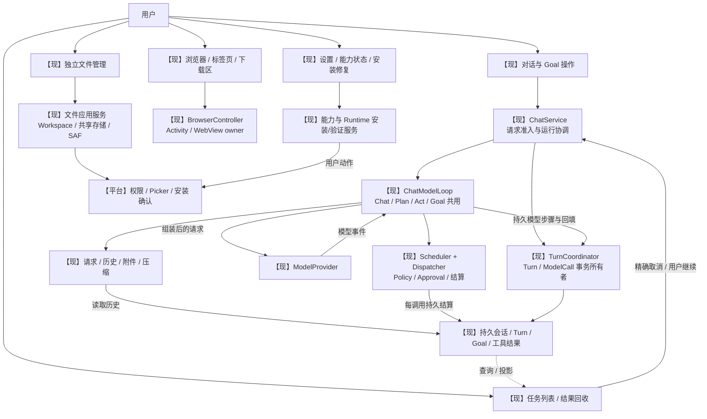

依据：[ChatService](https://github.com/dollarser/helix-agent/blob/27b643e895591464d88ea71d48528635768bfd60/app/src/main/kotlin/com/helix/app/chat/ChatService.kt)、[TurnCoordinator](https://github.com/dollarser/helix-agent/blob/27b643e895591464d88ea71d48528635768bfd60/app/src/main/kotlin/com/helix/app/chat/TurnCoordinator.kt)、[BrowserScreen](https://github.com/dollarser/helix-agent/blob/27b643e895591464d88ea71d48528635768bfd60/feature/browser/src/main/kotlin/com/helix/feature/browser/ui/BrowserScreen.kt)、[当前接口](../development/status.md#current-interfaces)。文件/浏览器也可由工具驱动，但那条路径须经图 C 的 Dispatcher；不因此强迫手动操作先建立 Agent Turn。

## 3. 现状：单循环、请求与工具曝光

图 B 的 ModePolicy 是曝光与执行模式约束；动态风险最终仍由每次调用的 Policy 判断。图中不存在四套 Loop，也不把测试中的旧 ContextBuilder 放进生产请求路径。

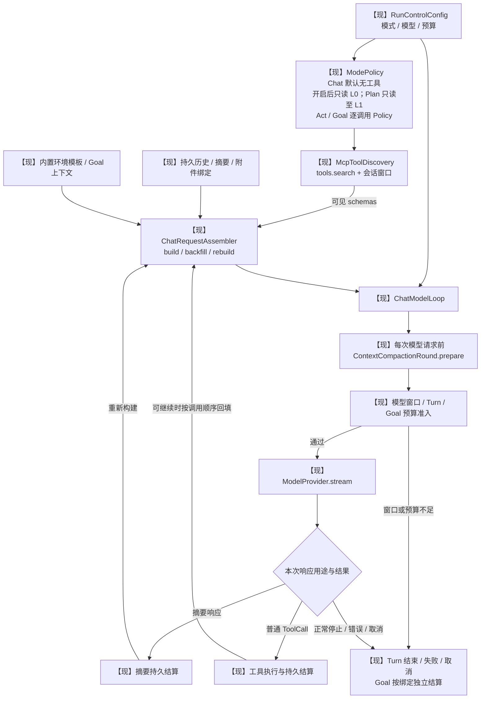

依据：[ChatModelLoop](https://github.com/dollarser/helix-agent/blob/27b643e895591464d88ea71d48528635768bfd60/app/src/main/kotlin/com/helix/app/chat/ChatModelLoop.kt)、[ChatRequestAssembler](https://github.com/dollarser/helix-agent/blob/27b643e895591464d88ea71d48528635768bfd60/app/src/main/kotlin/com/helix/app/chat/ChatRequestAssembler.kt)、[ContextCompactionRound](https://github.com/dollarser/helix-agent/blob/27b643e895591464d88ea71d48528635768bfd60/app/src/main/kotlin/com/helix/app/chat/ContextCompactionRound.kt)、[McpToolDiscovery](https://github.com/dollarser/helix-agent/blob/27b643e895591464d88ea71d48528635768bfd60/app/src/main/kotlin/com/helix/app/mcp/McpToolDiscovery.kt)。图简化控制流；压缩失败、未知副作用或取消也会阻止回填后的下一次请求。

## 4. 现状：ToolCall 执行、审批与持久结算

图 C 展示逻辑执行阶段，组件拆文件不改变这些边界。审批解析可由 L0、有效低风险规则或精确批次自动完成，不必每次弹窗。只有需要且获得的类型化 APPROVED proof 才在执行开始阶段消费；proof 消费不是成功凭证。

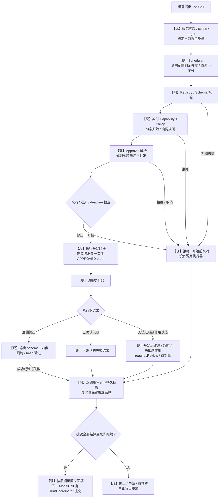

依据：[ToolDispatcher.executeStage](https://github.com/dollarser/helix-agent/blob/27b643e895591464d88ea71d48528635768bfd60/tools/framework/src/main/kotlin/com/helix/tools/framework/ToolDispatcher.kt)、[ToolScheduler](https://github.com/dollarser/helix-agent/blob/27b643e895591464d88ea71d48528635768bfd60/tools/framework/src/main/kotlin/com/helix/tools/framework/ToolScheduler.kt)、[工具编排](../architecture/mobile-tool-orchestration.md)。外部副作用不处于 Room transaction 内；验证失败或持久化失败不得推断副作用不存在。只有已确认无副作用的失败才可能按原契约有限重试。

图 C2 区分工具执行域与外部工具服务。QuickJS 没有特权 Host Bridge，PRoot 不挂载真实 Workspace。MCP/A2A 的请求由本地适配器发起，远端输出不可信，A2A 服务不是 Helix Remote Worker。

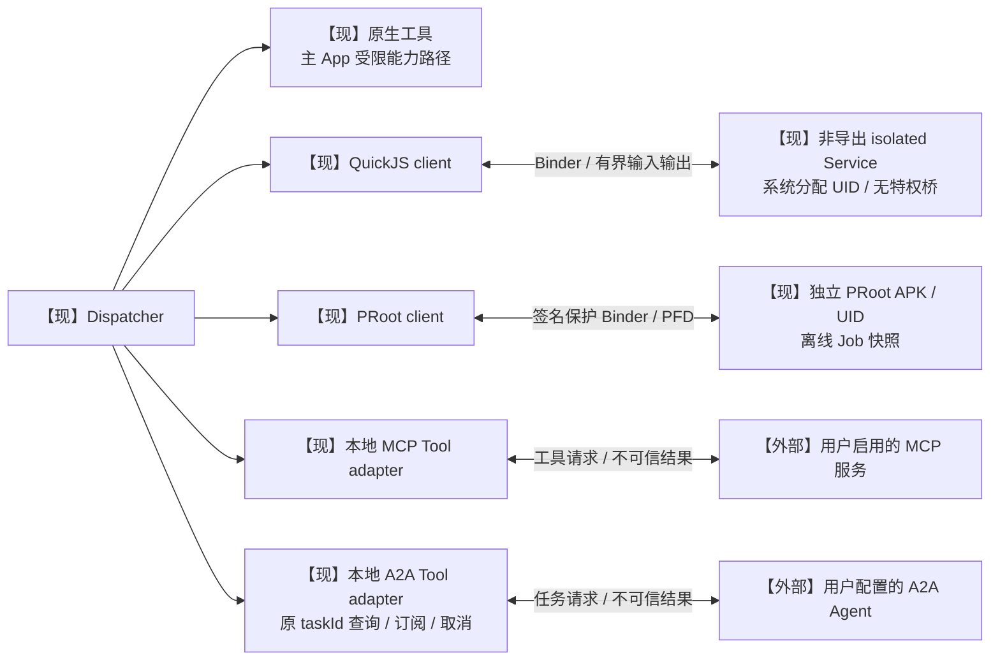

依据：[本地执行](../architecture/local-code-execution.md)、[ADR-0007](../adr/0007-companion-runtime-lifecycle.md)、[ADR-0016](../adr/0016-a2a-client-interoperability.md)。这里只表达执行域和请求方向，不把跨网络服务画成拥有本地 Capability 或 Approval 的模块。

## 5. 现状：模型 Provider 与订阅 UID

图 D 把订阅模型链与普通工具链分开。`Helix Subscriptions` 的内部代码仍位于 `runtime/cli-*`；其第三方协议适配不等于官方 CLI 在 Android 直接运行。

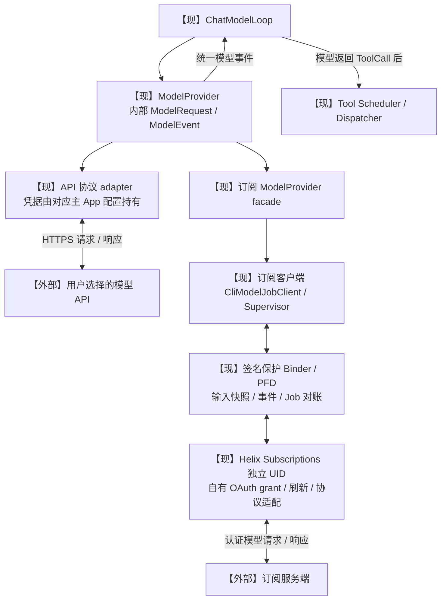

依据：[订阅 Provider](https://github.com/dollarser/helix-agent/blob/27b643e895591464d88ea71d48528635768bfd60/app/src/developer/kotlin/com/helix/app/provider/CodexSubscriptionProvider.kt)、[ModelProvider](https://github.com/dollarser/helix-agent/blob/27b643e895591464d88ea71d48528635768bfd60/provider/api/src/main/kotlin/com/helix/provider/api/ModelProvider.kt)、[ADR-0021](../adr/0021-third-party-subscription-protocol-adapter.md)。订阅凭据不返回主 App；连接检查、目录、能力检测和实际模型调用是不同操作，其成功状态不能互相替代。实现存在不代表本轮真实账号/长回复验收完成。

## 6. 现状：Goal 状态机与完成结算

图 E 对照当前 `GoalState` 与 reducer，不再遗漏 DRAFT、FAILED、CANCELLED 或 BLOCKED 的恢复边。标注的准入条件由协调器、状态机和预算共同执行；枚举允许的边不代表 UI 可跳过门控。

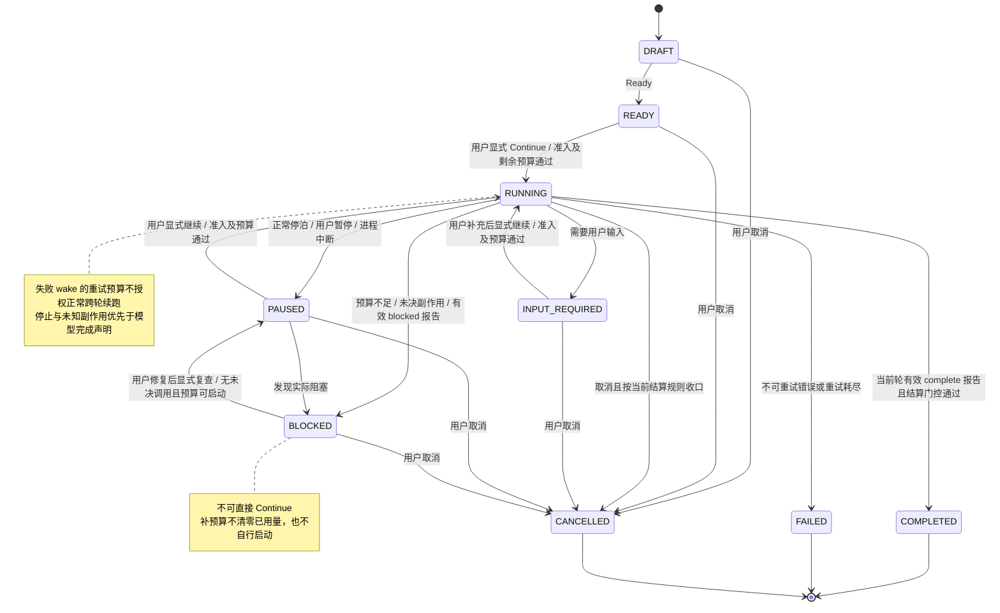

依据：[GoalState](https://github.com/dollarser/helix-agent/blob/27b643e895591464d88ea71d48528635768bfd60/core/model/src/main/kotlin/com/helix/core/model/GoalState.kt)、[GoalReducer](https://github.com/dollarser/helix-agent/blob/27b643e895591464d88ea71d48528635768bfd60/core/agent/src/main/kotlin/com/helix/core/agent/GoalReducer.kt)、[GoalRunSettlement](https://github.com/dollarser/helix-agent/blob/27b643e895591464d88ea71d48528635768bfd60/app/src/main/kotlin/com/helix/app/chat/GoalRunSettlement.kt)、[GoalBlockerResolution](https://github.com/dollarser/helix-agent/blob/27b643e895591464d88ea71d48528635768bfd60/app/src/main/kotlin/com/helix/app/chat/GoalBlockerResolution.kt)。预算进入 BLOCKED 按 ADR-0039；模型报告完成按 ADR-0040。reducer 内旧预算 KDoc 的 PAUSED 表述不作为图的依据。

图 E2 说明报告与真实终态的关系。`goal.report` 执行成功只说明报告已记录，最终完成在 Turn 结算时决定。图是判断摘要，不替代源码分支优先级。

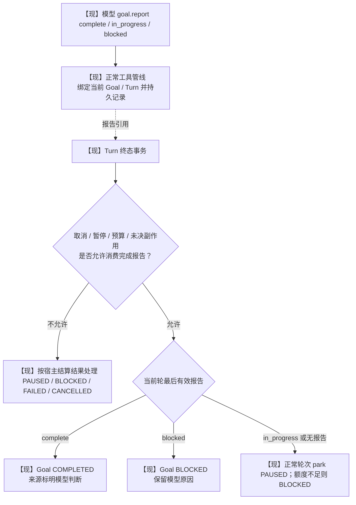

`COMPLETED` 表示模型报告完成且运行门控允许，不保证独立业务认证。可选工作流验收另见第 10 节，不恢复全局强制 verifier。

## 7. 现状：四种恢复与 Android 生命周期

图 F 把“恢复”拆开。查询记录、收回结果、用户继续和未知副作用核查是不同操作，没有一个通用 `resume` 箭头自动重启模型或工具。

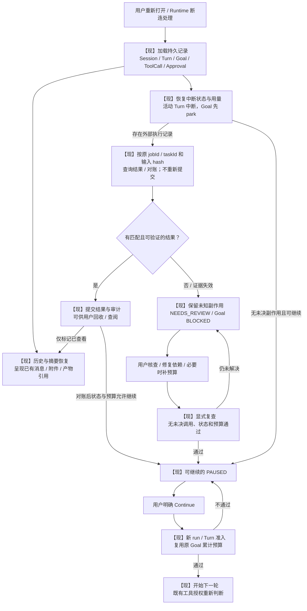

依据：[当前恢复边界](../development/status.md#known-limitations)、[ADR-0007](../adr/0007-companion-runtime-lifecycle.md)、[ADR-0039](../adr/0039-background-results-and-goal-blockers.md)。图中 Runtime/A2A 查询路径按各自契约执行；仅凭消息文本、取消请求已发送或文件名存在不能确认副作用。手动文件复制/移动日志有独立恢复协议，不是 Agent run 的 checkpoint，也不承诺断电原子事务或字节续传。

图 G 区分已有提醒与正在执行的前台服务。提醒 worker 没有自动启动模型的边。

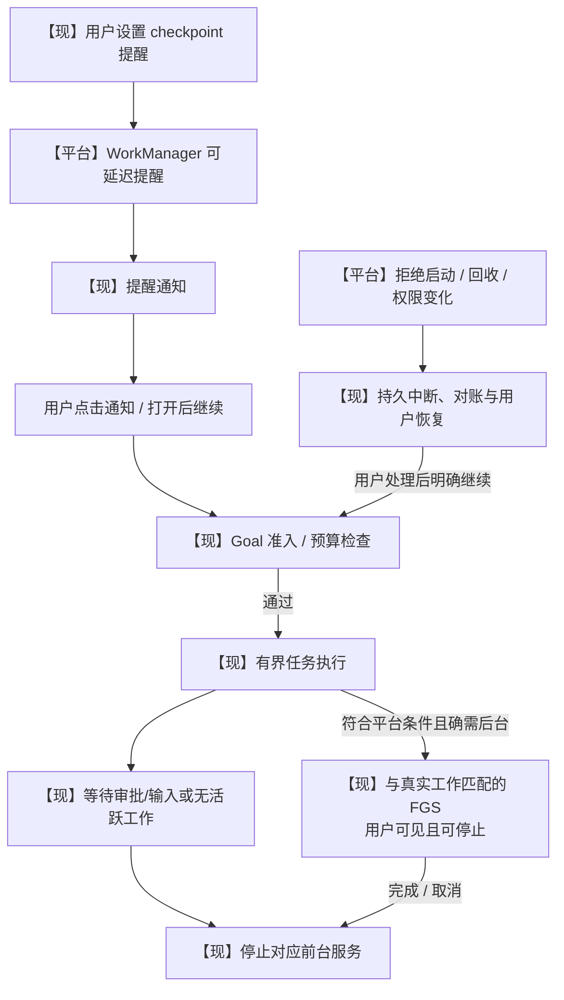

依据：[ADR-0004](../adr/0004-goal-run-wake-budget-semantics.md)、[ADR-0007](../adr/0007-companion-runtime-lifecycle.md)、[Android FGS 启动限制](https://developer.android.com/develop/background-work/services/fgs/restrictions-bg-start)。FGS 按全部活跃任务的实际需求管理，单任务等待不应错误停止其他任务所需服务；图省略聚合器细节。平台允许启动服务不等于 ToolCall 已批准，也不保证服务永远存活。

## 8. 候选：最小职责收敛与任务体验

图 H 对应正文 S1/S2。优先新增读模型和轻量 facade，不要求同时创建 GoalDriver、Plan Engine、Hooks 或 Task Orchestrator。手动文件/浏览器/安装继续走图 A。

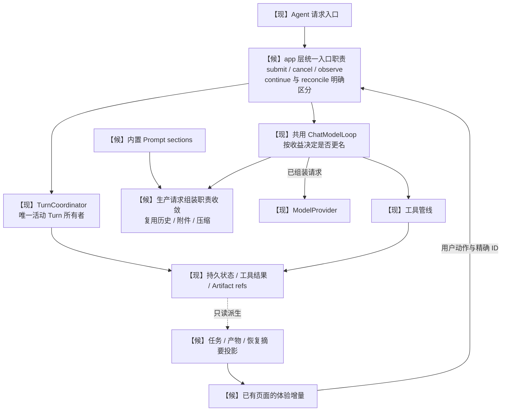

候选 facade 不创建第二个运行表，任务投影不接管 Goal 状态。请求主干迁移必须保持工具调用配对、图片重试绑定和摘要后的恢复；不能使用旧 ContextBuilder 直接替换生产路径。

## 9. 候选：Prompt 来源与 Plan 审阅

图 I 表达 Helix 的候选来源边界。排序或 scope 覆盖只影响组装，不提升信任或权限。外部内容进入模型上下文时始终保留来源；模型最终输出仍需真实 Policy 判断。

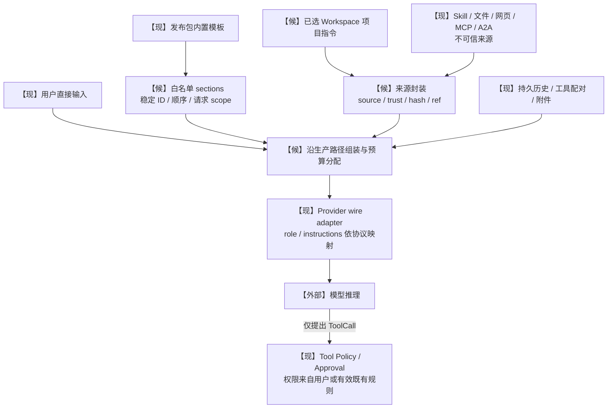

设计参考 [DeepSeek system-prompt](https://github.com/deepseek-ai/deepseek-harness/blob/master/docs/subsystems/system-prompt.md) 的有序 sections 与动态 context；本图中的信任包装与权限关系是 Helix 设计要求，不冒充上游原样实现。首版只整理内置组件，不开放外部插件注册或全系统提示词替换。

图 J 是候选 Plan 产品流程。普通 Act 可直接发起；结构化元数据工具尚需单独契约，Plan 审阅记录不能作为后续所有 ToolCall 的 Approval Proof。

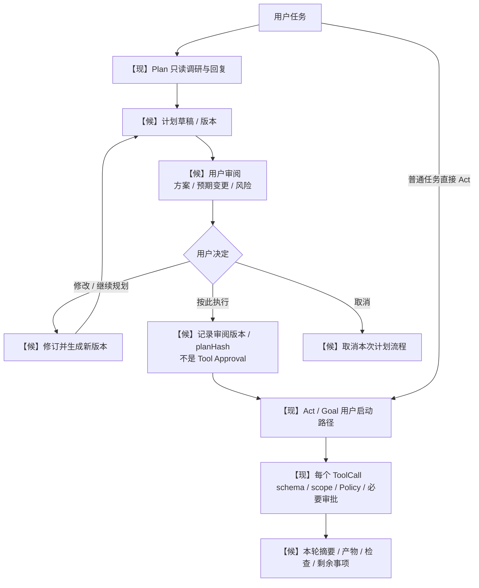

Plan/Todo 的内部元数据更新不能伪装成任意 READ_ONLY 文件写；必须绑定当前会话、版本、大小和来源。Act 摘要缺失不直接记任务失败，不强制每个简单操作多调用一次 `turn.report`。

## 10. 研究：自动续跑、工作流门禁与 Code Mode

图 K 是**未接入的研究模型**，不是当前 Goal 状态机。自动轮次要改变显式 Continue 语义，先完成正文第 6 节所列决策。候选 activation 在重启后默认关闭，Schedule/Channel 不能直接连到执行器。

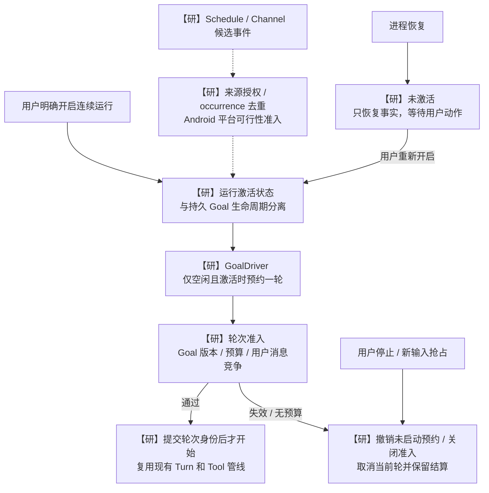

图 L 区分可选验收失败与真实阻塞。普通 Goal 不经过该门禁；可执行 Hook 的每项动作仍经过 Dispatcher 并记账。

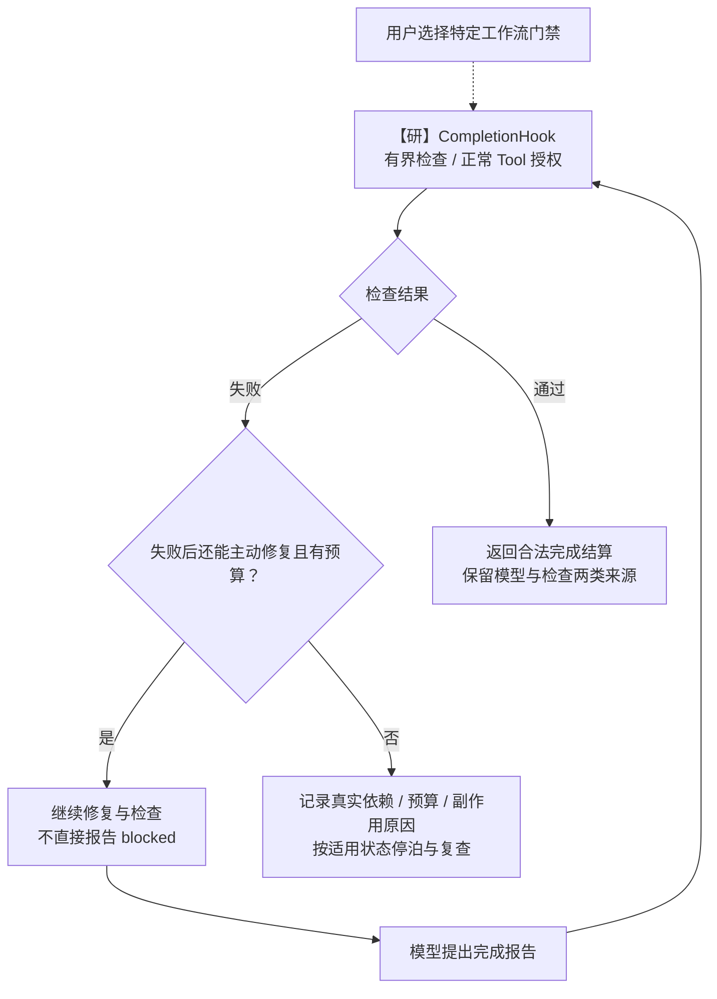

QuickJS Code Mode 不画成已经存在的工具桥：当前图 C2 的 isolated Service 没有 `helix.files.*` 宿主回调。若要增加，必须另行设计跨 UID 请求身份、审批等待、资源预算、嵌套调用、取消和对账，并重新评审无特权 Host Bridge 的现有边界。生产 child/Workflow 亦不在图 H 中预留空模块，依据 [ADR-0009](../adr/0009-bounded-local-orchestration.md) 的门禁独立评估。

## 11. 图文维护与校验

维护时以源码符号和正文候选编号为锚，不依赖会漂移的行号。每幅图须标明现状/候选/研究、状态所有者、跨域边和失败路径；改变箭头前先确认是否改变运行或授权契约。

校验分三层：Mermaid 语法与渲染、相对链接与目录、人工对照源码/ADR 的语义检查。渲染通过不证明架构已实现；源码结构存在不证明真实账号、OEM/Doze 或完整恢复验收通过。

本轮使用 Mermaid CLI `11.17.0` 完成全部 14 张图的 SVG 渲染，并抽查图 A/C/E/F/K 的可视输出。产物保存在本机忽略目录 `build/docs-refinement-2026-09-13/`；完整检查结果见[正文](helix-agent-complete-research-and-product-plan.md#9-维护与本轮检查边界)。

本次保留用户指定文件路径，因此仍受正文第 9 节说明的 `docs/` 根目录分类门禁阻塞；不为图集放宽全仓库检查。未来归档时按现状/候选职责决定归属并更新引用，不直接覆盖现有 `architecture/overview.md` 或新增一整套重叠的规范文档。
