# Helix 架构研究图集

> 核对日期：2026-09-16；源码基线：`main` 的 `782a70424fa3430f62067e0abb1024f246d8aebf`，核对开始时工作树干净。
> 与[重构研究正文](helix-agent-complete-research-and-product-plan.md)配套。图集解释职责、状态与执行域，不替代[架构规范](../architecture/overview.md)、[ADR](../adr/README.md)或[任务索引](../development/roadmap.md)。实现和验收进度以[状态文档](../development/status.md)为准。

## 1. 阅读约定

| 标记 | 含义 |
| --- | --- |
| 【实】 | 当前源码已有，不代表所有端到端验收完成 |
| 【计】 | 已接受的方案，相关 HXA 尚待交付或验收 |
| 【研】 | 尚不能据此实施的研究候选 |
| 【外】 | Android 或外部服务 |

每幅图独立说明时态。实线表达该图中的控制或数据流；虚线表达观察、约束或待接入关系，不代表权限继承。框可以代表职责，不要求新增同名模块。省略的内部步骤不表示可以绕过现有门禁。

## 2. 已实现：入口与状态所有权

统一入口已有 `AgentRuntime` 契约和 `AppAgentRuntime` 接线；后续应按实际依赖收敛实现，不能再以“新增统一入口”为起点。手动文件管理、浏览器和能力安装保留各自服务路径。

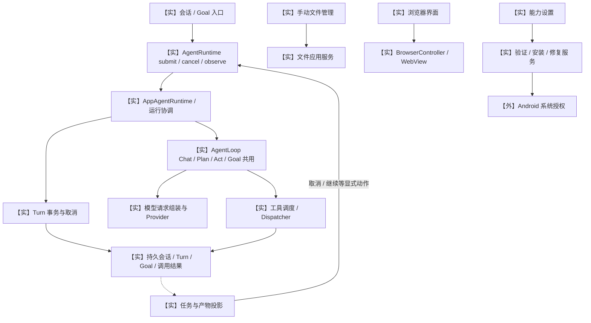

源码：[入口契约](../../core/agent/src/main/kotlin/com/helix/core/agent/AgentRuntime.kt)、[应用接线](../../app/src/main/kotlin/com/helix/app/chat/AppAgentRuntime.kt)、[共享循环](../../app/src/main/kotlin/com/helix/app/agent/AgentLoop.kt)。任务界面是持久事实的投影，不再维护一套独立任务生命周期。

## 3. 已实现：请求、Prompt 与上下文

`PromptRegistry` 与生产请求组装已存在。排序和作用域不提升来源权限；Skill、项目文件、网页和外部工具结果不能因进入模型上下文而变成授权。下图是逻辑组装关系，不要求把各类内容都注册为系统 Prompt。

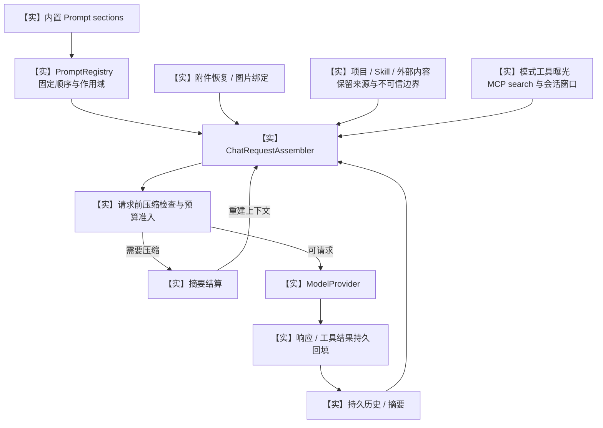

源码：[PromptRegistry](../../core/agent/src/main/kotlin/com/helix/core/agent/PromptRegistry.kt)、[Assembler](../../app/src/main/kotlin/com/helix/app/chat/ChatRequestAssembler.kt)、[压缩轮次](../../app/src/main/kotlin/com/helix/app/agent/ContextCompactionRound.kt)。后续优化须保留工具调用配对、图片归属、取消与错误结果；旧 `ContextBuilder` 不应被重新引入替换生产路径。

## 4. 已实现：每次工具调用的结算职责

这是现有控制点的逻辑视图，不是精确线程时序。当前审批实现与 HXA-209 的目标策略必须区分；不能把本图理解为所有调用都必须弹卡或消费证明。

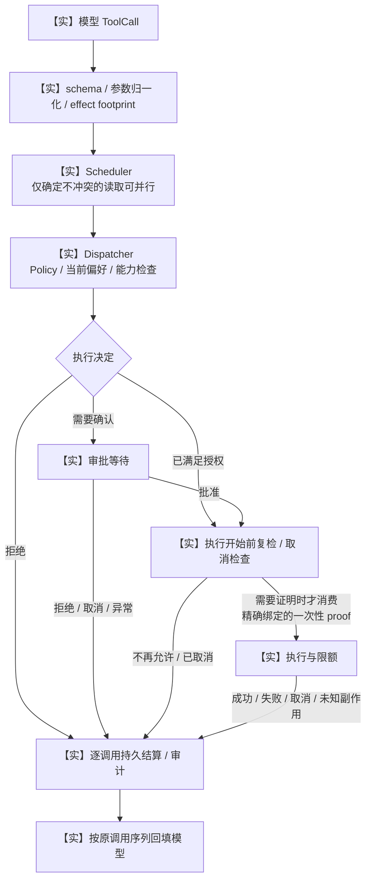

队列取消、审批等待取消和执行后的未知副作用均需留存结果。审批通过不等于执行已开始；证明在执行开始时消费。恢复不可把未知结果自动重放成成功。

## 5. 已接受待交付：HXA-209 会话授权

依据 [ADR-PERMISSIONS-001](../adr/permissions/001-session-authorization.md) 与 [HXA-209](../development/tasks/HXA-209.md)。这不是当前旧 resolver 已完成迁移的证明。应先证明执行域能落实限制，再接入预设和自定义策略。

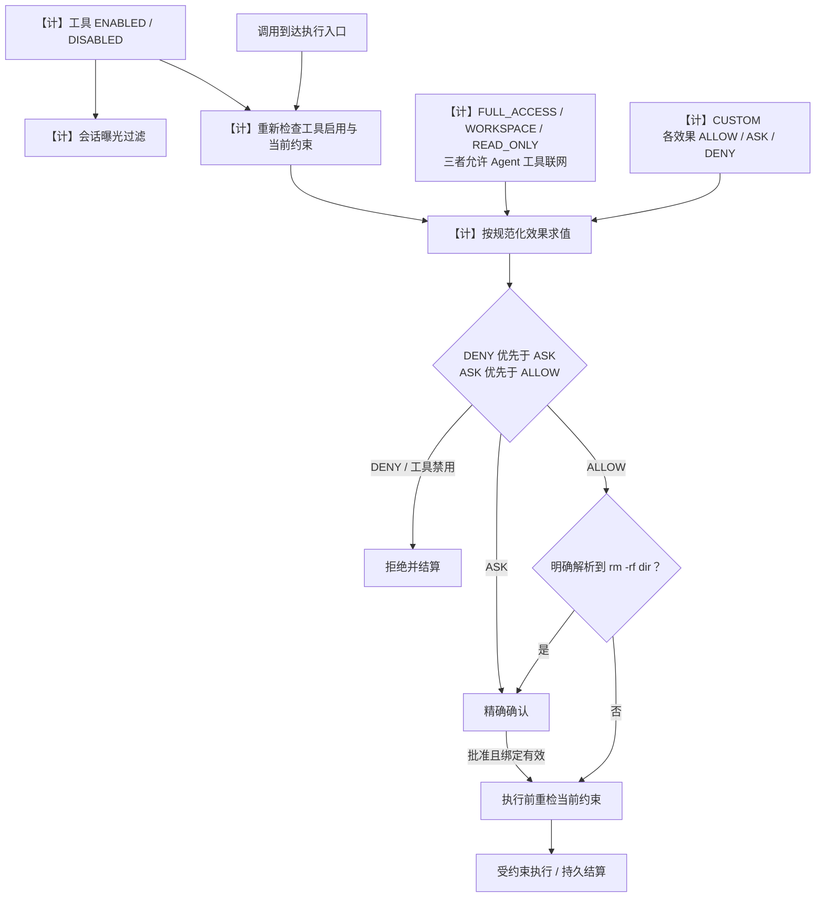

`DISABLED` 同时影响曝光与执行，旧调用或旧 proof 不能绕过。Chat/Plan 的模式限制仍独立生效；网络许可不授予文件权限，Provider 推理联网与 Agent 工具联网分开。特殊递归删除确认目前只覆盖明确解析出的 `rm -rf dir`，不能宣称覆盖所有等价删除程序；其他删除仍按效果策略处理。自定义拒绝写入必须覆盖 Shell 等间接路径，不能仅禁用 `write` 工具名。

## 6. 已实现：执行域与 Provider 链路

developer 的 PRoot、Subscriptions 是同 APK、同 UID 的私有进程；consumer 不打包这些组件。进程隔离不等于 UID 权限隔离。QuickJS 仍是独立 isolated UID，无特权主机桥。依据 [ADR-RUNTIME-001](../adr/runtime/001-execution-domains.md)；资产、干净 CI 与升级验收仍见 [HXA-193](../development/tasks/HXA-193.md)。

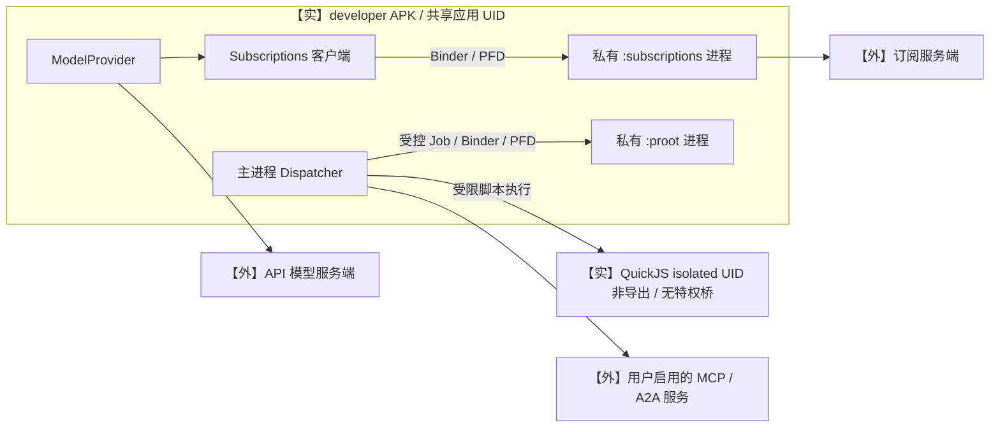

订阅协议适配是 Provider 路径，不是 Dispatcher 下的普通工具执行目标。同 UID 不提供凭据、文件或网络的内核隔离；相关约束须落实到真实执行入口，不能用图上的进程框充当安全证明。

## 7. 已实现：Goal 状态与运行激活

HXA-208 已交付自动续跑和模型工具面。状态图依据当前 `GoalState` 允许边；激活、预算与恢复准入另外求值，不把“持久未完成”解释为“现在可以自动运行”。

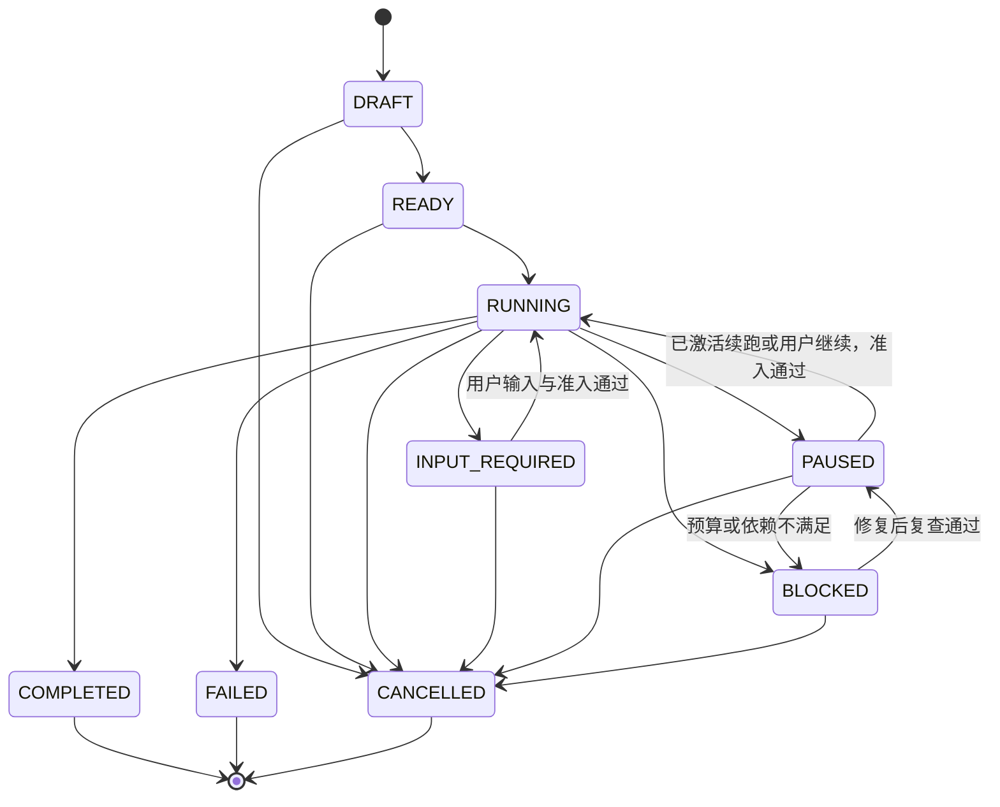

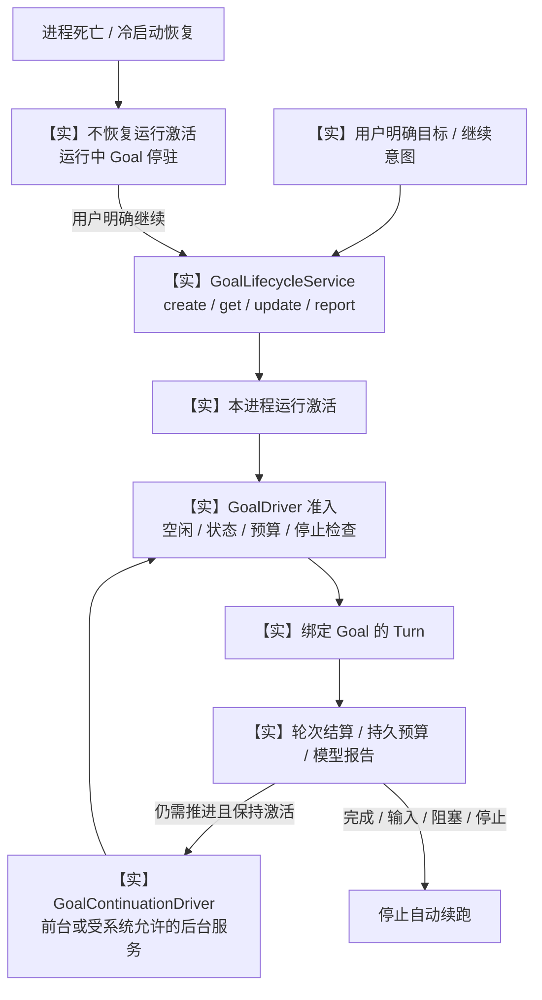

依据 [Goal ADR](../adr/goal/001-lifecycle-and-completion.md)、[状态枚举](../../core/model/src/main/kotlin/com/helix/core/model/GoalState.kt)、[续跑驱动](../../app/src/main/kotlin/com/helix/app/chat/GoalContinuationDriver.kt)。旧注释中“所有新 run 只能由用户逐次创建”不再概括当前行为；进程死亡后明确继续的约束仍成立。模型报告完成不恢复全局强制 verifier；测试失败且还能修复，不应直接判为无法推进的 blocked。

## 8. 已实现的恢复原则与待补体验

恢复界面仍需 [HXA-204](../development/tasks/HXA-204.md) 收口，但底层恢复必须区分四件事，不能只有一条笼统的 resume 箭头。

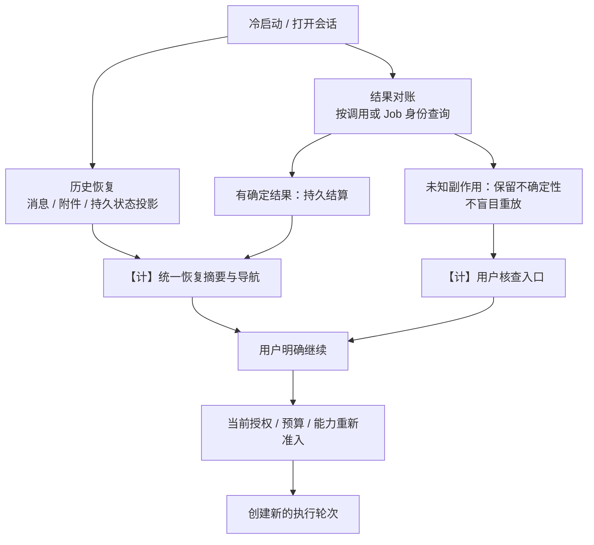

恢复历史不重新激活 Goal；恢复审批展示也不意味着旧等待槽或旧 proof 可继续使用。对账与新执行必须分离，尤其是外发、文件写入和 Runtime Job。

## 9. 已有 Plan / 投影与后续产品闭环

Plan 审阅服务、任务与产物界面已有实现。剩余工作是明确验收和导航闭环，不应重新创建 Plan Engine 或平行任务数据库。

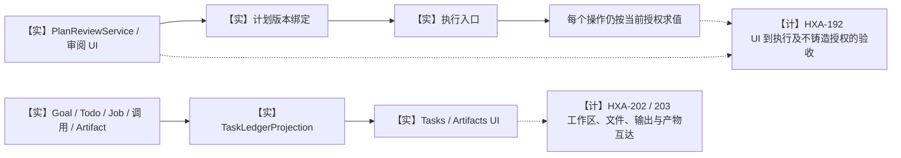

审阅计划只确认版本，不批准未来全部调用；按 HXA-209 选择的会话授权可以影响后续执行，但不能由 Plan 审阅暗中设置。任务显示状态、Turn 结束和 Goal 完成应分开表达。

## 10. 已接受待交付：终端与后台命令

依据 [ADR-RUNTIME-002](../adr/runtime/002-terminal-and-jobs.md)。现有 Job 能力不等于完整终端产品；HXA-194～199 是交付任务，不再等待一次重复的架构决策。

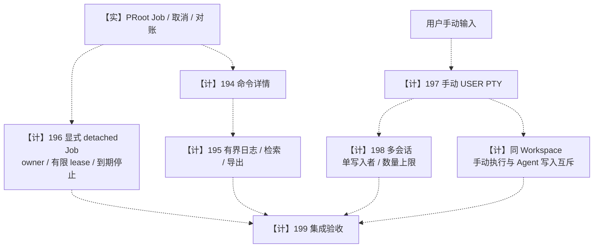

手动 PTY 不接收模型输入；它与 Agent 工具不是同一授权通道。后台 Job 不自动续租，死亡后不盲目重放；日志和会话数按 ADR 限额实现。197 不必等待 196，详细依赖与验收仅在任务索引维护。

## 11. 研究候选：不要据图自动启用

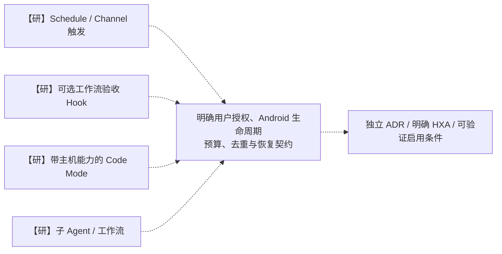

已有 Goal 自动续跑不是上述研究项；不要把完成的 HXA-208 再排一次。QuickJS 解释器存在也不等于可以新增主机桥；工作流验收不能恢复普通 Goal 的全局强制证据门禁。

## 12. 文档校验边界

本次仅更新研究正文与图集，不修改生产行为或宣布 HXA 完成。源码基线与图例固定在本文开头；后续刷新应整段更新事实，避免通过多层“增量说明优先”覆盖互相矛盾的旧图。文档检查与 Mermaid 渲染结果在提交说明中记录，不复用旧版本的验收数字。
