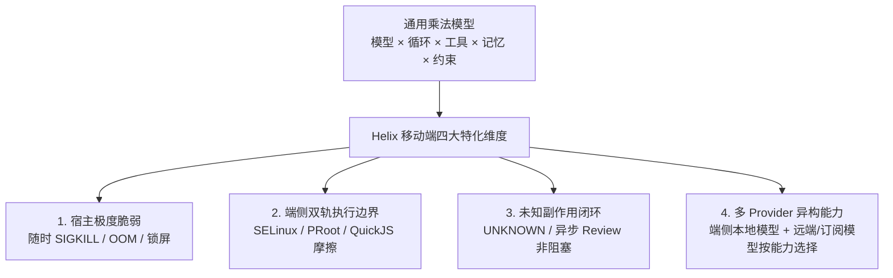
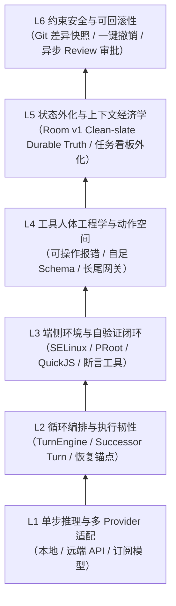

# Agent 能力决定因素与功能开发后提升指引

> 更新：2026-09-26。本篇为 Helix 综合研究模块，承接关于 Agent 能力决定因素的方法论分析，并结合移动端端侧单设备产品特性，为 Helix 功能开发收口后的能力跃升提供工程化落地指引。
> 关联入口：[01-架构与执行引擎](01-architecture-and-execution-engine.md)、[进程死亡恢复与 Harness 深度](process-death-recovery-and-harness-depth.md)、[02-上下文与会话交互](02-context-input-and-session.md)、[04-工具与扩展生态](04-tools-browser-and-extensions.md)。

---

## 1. 对通用 Agent 能力决定因素分析的评估

在评估外部方法论提出的 **「Agent 真实表现不仅由模型决定，还由循环、工具、环境、状态与约束共同决定」** 时，Helix 采用这一方向作为工程分析框架，但不把它视为严格的概率定律。模型与 Harness 是相互耦合的：模型能力决定可达到的策略上限，Harness 决定模型能否稳定获取事实、执行动作、验证结果、恢复失败并把能力兑现成长程任务成功率。

### 1.1 核心合理性：乘法效应与边际放大

通用分析的核心量化基准是：

$$P(\text{任务成功}) \approx \prod_{i=1}^{N} p_i$$

若进一步假设每一步相互独立且成功率相同，才可简化为 $p^N$。这只是**解释误差累积的示意模型**：真实 Agent 中错误往往相关，重试/自验证会改变路径长度，checkpoint 与回滚会截断失败传播，因此不能把下表直接当成任务成功率预测器或产品 SLO。

| 单步成功率 $p$ | 5 步简单任务 | 10 步中度任务 | 20 步长程任务 | 50 步复杂任务 |
| :---: | :---: | :---: | :---: | :---: |
| **90%** | 59.0% | 34.9% | **12.2%** | 0.5% |
| **95%** | 77.4% | 59.9% | 35.8% | 7.7% |
| **99%** | 95.1% | 90.4% | **81.8%** | 60.5% |
| **99.9%** | 99.5% | 99.0% | 98.0% | 95.1% |

这一模型主要用于提醒三个工程事实：
1. **路径越长，未被发现和修复的误差越容易累积**。不存在普适的“20 步分水岭”；真正需要测的是任务路径长度、错误检测率、恢复成本和重新规划质量。
2. **模型升级与 Harness 优化要按瓶颈选择**。如果失败主要来自推理、代码理解或规划上限，更强模型可能是最大杠杆；如果失败主要来自工具歧义、不可验证环境、上下文污染或恢复缺失，先修 Harness 往往收益更高。OpenAI 公开的 Codex 平台案例也显示，仅通过保留推理内容与上下文压缩等 Harness 改进，同一模型的 Agent 评测表现可以显著变化。
3. **短基准不能直接代表长程真实任务**。生产 Agent 需要面对环境漂移、外部副作用、人类审批、上下文压缩和多次恢复，因此评测必须覆盖完整轨迹而不是只看单轮回答质量。

---

## 2. Helix 移动端特化场景的关键补全

通用分析主要基于 PC / 服务器端长驻进程（如 WebCodex、Claude Code、Codex）的假设。在 **Helix 单设备 Android 端侧场景** 下，受移动操作系统资源管理与硬件约束影响，必须补全四个关键特化维度：



1. **宿主生命周期脆弱与进程猝死（Host Vulnerability & Process Death）**：
   - PC 守护进程几乎不无预警被杀；而在 Android 上，切后台、前台低内存、锁屏断网等行为随时引发系统 `SIGKILL`。
   - 若系统依赖内存变量、协程 Channel 暂存状态，在 20 步长任务中 Agent 几乎注定死于 OOM。**因此在移动端，“Room 强一致持久化（Durable Truth）+ 崩溃后 Successor Turn 继承恢复”不是优化项，而是长任务能够成立的基础设施（硬前置）**。
2. **端侧环境隔离与执行反馈摩擦（Sandbox & Perceptual Feedback Friction）**：
   - PC 上开 Docker 或 `git checkout` 极其轻量；Android 上受 Scoped Storage、SELinux、无原生 root、多进程 UID 隔离限制。
   - QuickJS 在非导出 isolated UID 运行，PRoot 在 developer 私有进程运行。环境反馈如果需要秒级 Binder IPC 或大对象拷贝，延迟会迅速拖垮模型上下文。
3. **副作用不确定性（UNKNOWN）与异步人机协作**：
   - 移动端网络切换（WiFi/5G）、主进程 SIGKILL 发生在工具执行与结果回写之间，会产生不可确认的外部副作用。
   - 传统 PC Agent 往往选择盲目重试或完全报错放弃；Helix 必须提供轻量、异步的 `NEEDS_REVIEW` 事实记录与恢复通道，避免一次断网就摧毁整个长任务。
4. **多 Provider 异构能力与本地模型特化**：
   - Helix 已接受“设备内本地模型是一等 `ModelProvider`”的架构：本地、远端 API、订阅通路都进入同一个 AgentLoop。是否承担完整工具调用/Goal 由真实 capability probe、上下文容量、结构化输出能力、设备资源和任务 eval 决定，而不是由“本地/小模型”标签或参数规模预先限制。摘要、预筛和分类只是低风险落点，不是架构上限。

### 2.5 生命周期原语：Codex 的 Thread / Session / Turn 与 Helix 映射

OpenAI 2026 年公开的 Codex App Server 架构把 **Thread** 定义为用户与 Agent 之间的 durable conversation container：一个 Thread 包含多个 Turn，可 create/resume/fork/archive，历史由 Harness 持久化。App Server 的 thread manager 会为每个 Thread 启动一个 **core session**；这里的 session 更接近“当前承载该 Thread 的运行时实例”，而不是第二个用户级 durable conversation。客户端本身可以断开/重连，不能成为长任务 source of truth。

因此，Codex 的“Thread 与 session 分开”本质是 **durable identity 与 runtime instance 分层**，不是要求产品同时给用户暴露两个长期会话概念。对 Helix 的最合理映射是：

| Codex 概念 | 生命周期职责 | Helix 对应 | 是否需要新增实体 |
| --- | --- | --- | --- |
| Thread | 长期对话身份、历史、fork/archive/reconnect | `Session` | **不需要**；Helix Session 已承担 Thread 语义 |
| Core session | 某个 Thread 当前的运行时承载/连接实例 | TurnEngine process-local runtime、live owner/observation | **不应做 durable 用户实体** |
| Turn | 一次用户输入触发的 Agent work | `Turn` | 已有 |
| Item / event | Turn 内消息、工具调用和进度事件 | Message/ModelCall/ToolCall + UI timeline projection | 已有事实与投影，无需复制 Codex 名称 |
| Goal | Thread-scoped 长期 objective，在安全 Turn boundary 继续 | `Goal` | 已有 |
| continuation turn | Thread idle 后为同一 objective 创建下一次工作 | successor `Turn` + 新 `GoalRun` | 已有方向 |
| client | 可断开/重连的展示与控制面 | Activity/UI/远程控制面 | 不作为 durable truth |

**Helix 裁决**：不要新增 `Thread` 表或把 `Session` 再包一层 Thread；那只会制造两个长期会话身份。需要明确的是：

1. `Session` = durable conversation/thread identity；
2. `Turn` = execution attempt；
3. `Goal` = Session-scoped long-lived objective，`GoalRun` = 一次尝试；
4. process-local runtime owner/connection = 可丢失执行实例，不拥有 durable truth；
5. 未来如果出现跨设备/远程 worker，需要的是 `RuntimeLease` / `ExecutionBinding` 一类租约或绑定，而不是第二个 durable conversation 概念。

这也解释了为什么 Helix 的 successor-Turn recovery 比恢复旧协程更稳健：恢复的是 Session/Goal/事实连续性，runtime instance 可以随进程死亡而丢弃。

外部依据：OpenAI [Unlocking the Codex harness](https://openai.com/index/unlocking-the-codex-harness/)；Codex [Using Goals](https://developers.openai.com/cookbook/examples/codex/using_goals_in_codex)。

---

## 3. Helix 端侧 Agent 六维能力决定因素深度拆解---

## 3. Helix 端侧 Agent 六维能力决定因素深度拆解

在 Helix 中，我们将通用五层模型结合移动端单设备特性，重构为**六维能力决定因素矩阵**。自底向上，越底层越属于基础设施与模型选型，越上层越依赖纯粹的系统工程设计：



---

### 3.1 L1 单步推理与多模型适配（Inference & Model Adaptation）

**决定什么**：决定单次交互（Turn）中逻辑推理、指令理解、代码生成以及输出格式的质量上限。

#### 子因素全景表

| 子因素 | 在 Helix 移动端的具体体现 | 典型失败模式与退化后果 |
| :--- | :--- | :--- |
| **推理深度与逻辑链** | 能否在单步完成多跳逻辑推演，预判文件修改带来的链式反应。 | 浅层模式匹配；遇到编译器类型推断错误或复杂状态机时直接崩溃，陷入逻辑死结。 |
| **长约束遵循** | 对系统 Prompt 中给出的负向指令（如“禁止覆盖无关变更”、“必须使用绝对路径”）的遵守率。 | 第 10 步之后遗忘安全规则；私自调用被禁用的破坏性 API。 |
| **结构化 Tool Call 准确率** | JSON Schema 参数组织、逃逸字符处理、必填字段不缺漏。 | JSON 语法截断、缺失必填字段，导致 Tool 调度器在反序列化阶段直接报 Schema 校验异常。 |
| **长上下文稳定性** | 上下文拉长至 32k～128k 时对首部和中间关键指令的注意力保持能力。 | “迷失在中间（Lost in the Middle）”；Prompt 头部设定的用户核心意图被后序工具长日志挤出注意力。 |
| **幻觉率与锚定能力** | 严格基于读取到的文件内容和环境事实发言，不编造不存在的信息。 | 凭空臆造文件路径（如 `/data/local/tmp/mock.kt`）或虚构根本不存在的 Android SDK API。 |
| **知不知与求助判断** | 遇到未知事实或关键歧义时，能够主动调用求助/问答工具，而非硬猜。 | 遇到缺失输入时强行盲猜，导致生成完全错误的配置并污染工作区。 |
| **端侧算力与资源约束** | 本地 Provider 的 tokens/s、首 token 延迟、峰值内存、KV cache、能耗、温升和后台存活能力。 | 模型可推理但长上下文触发 OOM/降频；响应延迟或功耗使“理论可用”无法成为产品能力。 |

> **关键机理**：L1 是**唯一由基础模型提供方决定、无法通过单纯 Prompt 调优完全解决的一层**。但工程上最致命的错误，是把上层缺陷误归因于 L1。例如模型填错参数，表面看是模型不听话，本质通常是 L4 工具 Schema 缺少校验示例或 L3 缺少预先查询。

---

### 3.2 L2 循环编排与执行韧性（Harness Loop & Recovery Resilience）

**决定什么**：决定如何将单步能力（Turn）组织成长程任务（Multi-step Goal），并在遭遇异常、超时或宿主崩溃时保持状态不丢失、执行不卡死。这是**让同样模型在不同 Agent 产品中表现产生数倍差距的核心中枢**。

#### 子因素全景表

| 子因素 | 在 Helix 移动端的具体体现 | 典型失败模式与退化后果 |
| :--- | :--- | :--- |
| **终止条件判定** | 何时判定任务达成（Goal Completed）、不可行放弃（Failed）或等待输入（Needs Input）。 | 任务早已完成却仍在做无意义微调陷入死循环；或仅仅修改完一个文件就过早宣布大功告成。 |
| **带信息换路重试** | 工具报错后，循环能否将错误上下文结构化回注，引导模型探索替代路线。 | “原样重复调用 5 次”——用完全相同的错误参数持续轰炸同一接口，白白耗尽 Token。 |
| **步骤粒度控制** | 单步规划是“一次改 10 个文件”还是“小步快跑、改一步验一步”。 | 步子迈太大导致一次性引发数十处编译错误难以排查；步子过细导致交互步数爆炸，迅速撞上上下文墙。 |
| **只读并发与写依赖编排** | 独立的文件读取、代码搜索并行发起，写操作严格串行并依赖前序结果。 | 错误地并行发起文件写入引发竞态写坏代码；或所有只读操作全串行，执行耗时成倍放大。 |
| **进程猝死与恢复锚点** | Android 系统随时可能在前台低内存、切后台或锁屏时下发 `SIGKILL`。 | 进程被杀后只能彻底放弃长任务从头重跑；或恢复时丢失断点上下文，引发脏状态。 |
| **硬性预算与防挂死** | 设定明确的步数上限、Token 预算与调用超时时钟。 | 无预算兜底导致后台静默无限死循环，用户手机发烫电量耗尽。 |
| **副作用确定性结算** | 崩溃或网络断开瞬间发生的动作，必须判定为 `UNKNOWN` 并进入安全结算。 | 盲目重试不可逆的网络请求或数据写入，导致支付或数据提交发生不可挽回的双重执行。 |

> **Helix 移动端特化**：服务端/桌面 Agent 通常可把运行时放在更稳定的长期进程里，而 Android 客户端必须把进程死亡视为常态故障。Helix 当前以 `Room v1 clean-slate Durable Truth` 保存生命周期事实；主进程被杀后关闭旧 Turn，通过 successor Turn + bounded RecoverySummary 延续任务，而不是复活旧 Turn 的内部 control state。真正必须持久化的是身份、历史、预算/审计事实与外部副作用真相，而不是某个协程或 model-call 栈帧。

---

### 3.3 L3 端侧环境与自验证闭环（Mobile Environment & Verifiability）

**决定什么**：决定 Agent 能否**看见自身行动的后果**，并在没有人类干预的情况下验证结果是否正确。这一层提升的是“错误被及时发现并纠正”的概率，而不是保证把某个抽象单步成功率固定拉升到 99%。

#### 子因素全景表

| 子因素 | 在 Helix 移动端的具体体现 | 典型失败模式与退化后果 |
| :--- | :--- | :--- |
| **自动化反馈闭环** | 能否就地执行语法检查、单元测试、日志捕获、静态断言或 UI 结构比对。 | Agent 改完代码只能盲猜“应该没问题”，任务真实成功率随步骤 $N$ 呈指数雪崩（$p^N$）。 |
| **端侧环境确定性** | PRoot Debian RootFS、QuickJS 沙箱、系统 Toolchain 的环境依赖与版本锁定。 | “上次可以跑这次挂了”的环境漂移；不同手机芯片架构（arm64-v8a vs x86_64）下的二进制行为不一致。 |
| **沙箱隔离性** | 单次实验性修改或失败命令是否会永久污染宿主环境或其它 Workspace。 | 一次 `rm -rf` 或错误的全局变量修改毁掉整个项目，后续步骤全部在脏环境上挣扎。 |
| **启动与执行延迟** | PRoot 进程冷启动、Binder IPC 跨进程数据拷贝、沙箱环境初始化的耗时。 | 每次验证需要等待 10 秒以上，导致 Agent 反思链路极度迟缓，用户体验彻底不可接受。 |
| **移动端特化就绪度** | Scoped Storage 文件权限、网络连接连通性、私有进程 UID 边界预置。 | 工具执行过程中由于未授予运行时存储权限或后台网络受限抛出 SecurityException 阻断流程。 |

> **关键机理**：自验证环境可以把“首次动作正确率”转化为“经过检测与修正后的轨迹成功率”。它与模型能力是互补关系：强模型减少错误发生，自验证减少错误逃逸；实际优先级应由任务评测决定，而不是预设其中一方总是更重要。

---

### 3.4 L4 工具人体工程学与动作空间（Tool Ergonomics & Action Guidance）

**决定什么**：决定模型能通过哪些动作改变环境，以及当动作遇到阻碍时系统给予的是“有效线索”还是“无效噪音”。

#### 子因素全景表

| 子因素 | 在 Helix 移动端的具体体现 | 典型失败模式与退化后果 |
| :--- | :--- | :--- |
| **Schema 自足性与清晰度** | 参数名称精确、类型严格、字段注释自包含（何时用、何时禁忌、副作用声明）。 | 参数仅标注 `string` 无解释，模型把相对路径传给需要绝对路径的接口，导致调用屡屡失败。 |
| **错误信息可操作性** | 报错不仅报告 Exception，还给出最接近的候选值与推荐修复方案。 | 返回冰冷的 `ENOENT: No such file` 或数百行底层 Java 堆栈，模型无法理解真相，只能盲猜重试。 |
| **动作粒度与可组合性** | 文件读写支持精确定位替换（chunk replace）；搜索结果直接返回行号。 | 必须把 2000 行文件全量覆盖写回，极易在回写时产生代码丢失截断或并发冲突。 |
| **工具集容量与长尾检索** | 高频核心动作直接可见，长尾 MCP/A2A/系统能力按需发现；常驻数量由模型、schema 长度与真实选择准确率评测决定。 | 无差别注入大量低相关 Schema 会占用上下文并增加选择歧义；过度隐藏又会增加 discovery 往返和漏发现。 |
| **幂等性与安全预览** | 读操作天然幂等；大范围写操作支持 dry-run 差异预览与确认机制。 | 重复调用带来不可预料的叠加副作用，导致环境处于不确定状态。 |

> **对比范例**：
> - ❌ **反面报错（无价值堆栈）**：
>   ```text
>   java.io.FileNotFoundException: /data/user/0/com.helix/workspace/foo.kt (No such file)
>       at java.io.FileInputStream.open0(Native Method)
>       at java.io.FileInputStream.open(FileInputStream.java:231)
>   ```
> - ✅ **正面报错（可操作路标）**：
>   ```text
>   文件未找到: /workspace/foo.kt
>   当前目录下最接近的文件为:
>     - /workspace/Foo.kt (注意大小写)
>     - /workspace/foo_test.kt
>   若您打算创建新文件，请使用 files.create 并提供初始模板。
>   ```

---

### 3.5 L5 状态外化与上下文经济学（State Externalization & Context Economics）

**决定什么**：决定长达数十轮的执行过程中，Agent 是否还能记清最初的目标、核心约束以及当前探索的真实进展。

#### 子因素全景表

| 子因素 | 在 Helix 移动端的具体体现 | 典型失败模式与退化后果 |
| :--- | :--- | :--- |
| **任务看板外化（Task Ledger）** | 超过 5 步的任务必须将子步骤拆解并持久化落入外化数据结构（如 Room Goals/Tasks）。 | 完全依靠模型上下文记忆，在执行到第 25 步时彻底忘记最初规划，在细枝末节上无限盘桓。 |
| **关键约束强行钉住（Pinning）** | 用户的全局不可违背要求（如“不要修改原有测试”、“保持旧接口向下兼容”）置顶常驻。 | 上下文压缩或滑动窗口滚动时，最关键的安全边界被当作陈旧对话剪掉，引发破坏性操作。 |
| **上下文滑动修剪经济学** | 大段命令输出（如 1000 行编译日志）折叠提取关键事实；长会话动态分层压缩。 | 工具返回的无用日志瞬间撑爆模型的上下文窗口（Context Window），引发昂贵且不可逆的截断。 |
| **跨 Turn 与跨会话持久化** | 所有的中间决策依据与不可逆事实均记录在 Durable 存储中。 | 切换会话再切回时，Agent 忘掉此前的所有调研结论，不得不重新扫描整个项目。 |
| **污染控制（Pollution Control）** | 对前序失败尝试的错误路径进行剪枝，防止错误假设在上下文中形成强化暗示。 | 前面步骤模型凭空假设了一个错误的包名，这个错误包名持续在上下文中出现，导致模型全程被带偏。 |

> **核心工程定律**：**长任务成功的关键绝不是让 Prompt 记住更多，而是坚决把该外化的信息持久化到上下文之外。** 结构化的任务清单与 Room 事实表，永远比模型的长文本注意力更稳定。

---

### 3.6 L6 约束安全与可回滚性（Constraints & Rollback Mechanism）

**决定什么**：决定 Agent 被允许走多快、多远、探索多激进。这是最反直觉的一层——**约束机制设计得越完善，Agent 的实际能力就越强，因为可回滚性是能力的放大器**。

#### 子因素全景表

| 子因素 | 在 Helix 移动端的具体体现 | 典型失败模式与退化后果 |
| :--- | :--- | :--- |
| **Git 差异快照与一键撤销** | 执行关键重构或大范围代码修改前，自动在本地 Git 创建轻量快照锚点。 | 没有回滚兜底，模型在探索失败后只能尝试用笨拙的 manual edit 反复擦除，越改越烂最终烂尾。 |
| **权限分级与非阻塞审批** | 纯读与沙箱内安全操作自动放行；网络写、外部文件变更高风险操作支持异步 Review。 | 过于保守导致每一步弹出确认框打断长任务；或完全放开导致 Agent 误删用户私人文件。 |
| **沙箱硬边界隔离** | 借助 Linux UID、SELinux、Scoped Storage 划定 Agent 可写与只读边界。 | 边界不清导致模型耗费大量 Turn 去试探没有权限的路径，最终因 Permission Denied 退出。 |
| **故障安全退出（Fail-Safe）** | 遭遇不可恢复异常或取消中断时，主动释放持有的并发锁，清理临时文件。 | 中断后留下锁死的独占文件或挂起的后台守护进程，导致后续任务全部无法启动。 |
| **全链路审计与可复盘性** | 完整的 Turn 日志、Tool 调用输入输出、状态变迁轨迹全量入库可查。 | 遇到长任务失败无法定位到底是 L2 调度问题、L3 环境问题还是 L1 模型幻觉，无法迭代改进。 |

> **关键洞察**：**能回滚才敢激进**。一个支持 `workspace.rollback` 的 Agent，可以大胆尝试大规模代码重构，哪怕改崩了也能 1 秒复原并换路尝试；而一个不支持回滚的 Agent，只能小心翼翼地一次改动两三行代码，搜索空间被死死限制。

---

## 4. 四个外部与任务级决定因素（补充维度）

除了上述内部六层框架，Agent 在真实场景中的落地效果还受到以下四个系统外在维度的强烈支配：

### 4.1 任务表述与约束清晰度（Goal Formulation）
- **目标可验收性**：模糊的目标（“优化登录模块性能”）让 Agent 无法判定何时结束；明确的目标（“把登录冷启时间控制在 500ms 内并补齐耗时埋点单测”）使 Agent 能够构建自主验证回路。
- **隐式约束显式化**：好的人机交互界面会在任务启动前主动帮助用户提炼约束（如“是否允许改动数据库 Schema？”、“是否需要保持旧版接口兼容？”），避免 Agent 在未明示的边界上做无用功。

### 4.2 人工介入点契约（Human-in-the-Loop Interventions）
- **从阻塞 Modal 到 durable Review fact**：高风险或副作用不确定时记录 `NEEDS_REVIEW` / ToolCall review 事实。用户处理后不复活旧 Turn；后续通过 successor Turn 读取 review 结果和当前世界继续。审批是安全事实，不应成为旧执行栈的恢复入口。

### 4.3 多 Provider 异构路由（Hybrid Provider Routing）
- **不按“本地小模型 / 云端强模型”硬编码职责**：本地模型具有隐私、离线和低网络成本优势，远端模型通常具有更强的推理/上下文资源，但具体职责应由模型元数据、capability probe、资源状态和任务 eval 决定。
- **一等 Provider，而不是辅助模型旁路**：本地 Provider 能力满足时可以驱动完整 AgentLoop；能力不足时做用户可见降级。Helix 不维护一套“云端 AgentLoop”和另一套“本地摘要链”。
- **路由优化目标是任务效用而非单一 token 成本**：至少同时考虑成功率、延迟、能耗/温升、网络与隐私、上下文容量、工具调用可靠性和失败后的恢复成本。

### 4.4 任务本身的性质与失败代价（Task Nature & Cost of Failure）
- **天然对 Agent 友好的任务**：具备客观严密反馈（如编译报错、单元测试跑通、静态断言成功）、步骤可独立解耦、执行过程可秒级回滚。
- **对 Agent 极不友好的任务**：缺乏客观检验标准（如“设计一个优美的界面风格”）、长链强耦合、外部副作用不可逆（如涉及真实扣费、发送不可撤回邮件）。对于此类任务，系统应主动引导降级或提高人工参与度。

---

## 5. 功能开发完成后的 Agent 能力提升实施指引（Playbook）

当基础功能（API、DAO、Schema、UI 基础流程）开发完毕并收敛后，下一阶段的重心应从**“功能连通（Feature Completeness）”**转向**“能力放大（Capability Multipliers）”**。以下按投入产出比排序：

### 阶段一（P0）：构建模型“自我验证闭环”（Verifiable Action Loop）

> **核心原则**：不能自我验证的 Agent，每一步都是在赌博；给 Agent 一个验证工具，比换一个更贵的模型更能提升 $p$。

1. **写操作伴随就地验证器（Validation Tooling）**：
   - 当模型调用 `files.write` 或 `files.edit` 修改了代码/配置后，不要让模型凭记忆确认，而是提供轻量静态校验工具（如语法检查、lint、JSON/YAML schema 验证）。
   - 为模型提供直接执行断言、读取运行 exit code 的命令闭环（在 PRoot 环境内快速执行 `pytest / gradle check / test script`）。
2. **移动端 UI/浏览器操作的视觉/结构闭环**：
   - 浏览器与 Accessibility 操作之后，工具返回不仅仅是“点击成功”，必须包含行动后的界面变化快照（轻量级 DOM 摘要或 Accessibility Tree 差异，支持视觉得分校验）。
3. **输出断言工具（Assertion Tools）**：
   - 为 Agent 引入轻量级自我检查工具，如 `assert_file_contains`、`assert_http_status`，使 Agent 能在宣布“任务完成”前自主跑完验收用例。

### 阶段二（P0）：工具面错误信息的可操作化（Actionable Error Feedback）

> **核心原则**：工具报错不应是堆栈转储（Stacktrace Dump），而应是清晰的排障指引。

1. **从“抛错”到“建议”**：
   - ❌ 坏报错：`FileNotFoundException: /data/user/0/.../repo/src/foo.kt (No such file or directory)`
   - ✅ 好报错：`文件不存在: src/foo.kt。当前目录最接近的文件为: src/Foo.kt, src/foo_test.kt。若要新建文件请使用 files.create。`
2. **边界参数前置阻断并返回提示**：
   - 模型给出的编辑块（replace chunk）未匹配到原文件行时，工具直接在结果中返回前后 5 行的当前实际内容，模型无需重新调用读取工具即可在下一步修正。
3. **高频工具与长尾能力分层**：
   - 不设“15 个以上必然退化”或“固定 6～8 个最佳”的静态阈值；不同模型、Schema 长度和工具相似度差异很大。
   - 用 eval 测量 tool-selection accuracy、无效 discovery 次数、Prompt token 占用和完成时间，再决定哪些工具常驻、哪些走搜索/插件网关。原则是保持高频动作低摩擦，同时避免低相关长尾 Schema 常驻污染上下文。

### 阶段三（P1）：长任务状态外化与结构化任务看板（State Externalization）

> **核心原则**：长任务的关键不是在 Prompt 里记住更多，而是把该外化的信息持久化到上下文之外。

1. **任务清单外化（Tasks & Goal Ledger）**：
   - 当任务跨多个独立工作单元、预计会经历上下文压缩/恢复，或存在明确里程碑时，应把计划与完成事实外化；不使用固定“超过 5 步必须建表”的静态阈值。
   - 上下文截断、压缩或 successor Turn 恢复时，从 durable Goal/Task facts 重建必要进展；模型可调整计划，但不能把旧上下文文本当唯一状态源。
2. **决策依据与不可逆事实持久化**：
   - 将用户在中间过程中给出的显式约束（如“不要删除现有测试”、“使用严格模式”）作为固定事实注入，防止在滑动窗口压缩中被丢弃。

### 阶段四（P1 候选）：Workspace 差异快照与可回滚机制（Rollback as a Multiplier）

> **核心原则**：可回滚性是能力放大器，但 Helix 的 Workspace binding ADR 仍未接受，以下是能力目标而非当前已交付契约。

1. **Git/Workspace checkpoint**：
   - 对适用的 Git 项目，可在复杂探索前建立显式 checkpoint/worktree/差异锚点；必须保留并行用户变更，不能用粗暴 reset/stash 作为默认回滚。
2. **探索失败的可验证恢复**：
   - 回滚应只撤销本次 Agent ownership 范围内的变更，并验证工作树/资源身份；非 Git、SAF、外部副作用分别使用各自的恢复语义，不能用 `workspace.rollback` 一个抽象掩盖所有后端差异。

### 阶段五（P2）：基于能力证据的多 Provider 路由（Capability-aware Routing）

1. **统一 Provider contract**：本地、远端 API、订阅通路共享同一 ModelRequest/ModelEvent 与 AgentLoop；运行位置不决定权限和工作流。
2. **建立任务级 eval 与资源画像**：记录不同 Provider 在代码修改、工具调用、长上下文、视觉/结构化输出等任务上的成功率、延迟、成本、温升和恢复次数。
3. **路由只基于可验证事实**：按 capability、exact model metadata、当前设备资源和用户偏好选择 Provider；未知能力保持未知，不通过模型名/参数规模猜测。

### 阶段六（P0/P1）：建立轨迹级 Agent Eval 与可观测性

功能“能跑通”之后，能力优化必须由同一组任务集和轨迹指标驱动，否则很容易把偶然成功误判成架构提升。建议至少长期记录：

| 指标 | 说明 |
| --- | --- |
| **Task success / verified completion** | 最终结果是否通过客观验收，而不是模型是否声称完成 |
| **First-pass success** | 不依赖纠错时一次完成的比例，主要反映模型/工具契约质量 |
| **Recovery-adjusted success** | 允许自验证、换路、successor Turn 后的最终成功率，反映完整 Harness 能力 |
| **Invalid tool-call rate** | Schema/不存在工具/错误参数导致的无效动作比例 |
| **Repeated-failure rate** | 相同错误参数或相同失败策略重复出现的比例 |
| **Human intervention rate** | 每个任务需要用户回答、审批、人工修复的次数；区分必要安全审批与能力不足求助 |
| **UNKNOWN / review incidence** | 外部副作用进入不确定状态的频率、平均解决时长和重复 effect 拦截率 |
| **Context recovery fidelity** | compaction/reconnect/successor Turn 后关键约束、已完成事实和未解决风险是否保真 |
| **Latency / token / energy** | wall-clock、模型 token、网络流量、本地模型能耗/温升；不能只优化单一成本 |
| **Tool discovery overhead** | 为找到正确工具增加的 discovery 轮次、token 与失败率 |

优化顺序应采用 **同任务 A/B + 失败归因**：模型升级、Prompt、工具 Schema、执行环境、context policy、Provider 路由分别做可隔离实验。OpenAI 公开 Codex 平台案例显示，保留推理内容和 context compaction 等 Harness 改动在同一模型上也能带来大幅评测变化，这说明“模型固定时 Harness 仍是一级变量”；但反过来也不能据此否定模型升级本身的价值。

---

## 6. Helix Agent 能力自检清单（15 问）

在后续进行功能评估、缺陷复盘或针对特定场景做能力优化时，应把下面问题作为证据收集框架。多个层级往往同时耦合，**不能机械地把“第一个否”当成唯一根因**；应结合失败轨迹、频率和修复收益定位主瓶颈：

```text
[L3 端侧感知与验证]
  1. Agent 在做出修改后，能不能自主验证结果是否正确（运行测试、查看编译错误、获取运行输出）？
  2. 工具执行失败时，返回的错误信息是否明确指导了下一步怎么修正（而不是抛出原始异常码）？
  3. 环境依赖是否可复现？是否存在因 Android 权限变化或后台被杀导致的环境漂移？
  4. 当前常驻工具集是否经过真实 tool-selection / token-pressure eval，而不是使用固定数量阈值？

[L2 循环、生命周期与执行韧性]
  5. 模型在连续尝试失败时，是盲目原样重试，还是能够获取错误上下文进行换路？
  6. 进程被系统回收或崩溃后，能否通过 Room Durable Truth 与 Successor Turn 干净续上，而不是彻底从头再来？
  7. 是否存在硬性的时间与 Token 预算门槛，防止死循环并能在超限时吐出结构化诊断证据？
  8. Session / Turn / Goal / GoalRun / process-local runtime owner 的职责是否清晰，是否存在两个 durable owner 或把 runtime identity 当业务 identity 的情况？

[L6 约束与回滚能力]
  9. 模型在进行破坏性或大范围修改前，是否有与实际后端匹配的 checkpoint/回滚策略？
 10. 权限与审查机制是否支持关键节点非阻塞审查，而不是每一步弹出 Modal 阻断长程运行？

[L5 记忆与状态外化]
 11. 经历长轨迹、context compaction 或 reconnect 后，最初目标、关键约束和 unresolved effects 是否仍可准确恢复？
 12. 长任务的中间进展是否持久化外化到了 Task/Goal/Artifact 等 durable facts 中？
 13. UI/live Flow 全部丢失后，系统能否只依赖 durable state 重建可继续工作的 Session，而不猜旧执行栈？

[L1 模型与 Provider 单步能力]
 14. 每个 exact model 的 tool/vision/reasoning/context/resource 能力是否来自 probe/metadata/eval，而不是模型名或“本地/云端”标签？
 15. 在确认主要 Harness 瓶颈已量化后，单步推理、多跳规划或代码生成是否仍是任务失败的主要来源？
```

---

## 7. 架构映射案例与长程韧性证明

| 架构维度 | WebCodex（外部长驻 / 服务器端） | Helix（移动端端侧单设备产品） |
| :--- | :--- | :--- |
| **执行边界** | 外部 Runner 守护进程 + 远程 MCP Server | 进程内 Room 驱动 + 私有进程 PRoot / QuickJS |
| **宿主脆弱性应对** | Thread 历史与 Agent runtime 留在长期 App Server/运行环境，客户端可断开重连 | 面对 Android `SIGKILL`，使用 Room v1 durable facts + old Turn terminal + Successor Turn 接续 |
| **副作用确定性** | 依赖远程 Task 状态轮询 | `UNKNOWN` 状态标记 + 异步 `NEEDS_REVIEW` 闭环 |
| **工具组织方式** | 大工具面采用分层/动态发现，避免所有长尾 Schema 无差别常驻 | 高频核心动作低摩擦直达，长尾 MCP/A2A/插件按需发现；数量阈值由 eval 决定 |
| **探索安全机制** | 工作区/沙箱/审批与持久 Thread 解耦 | 当前以权限、effect review、Scoped Storage/执行域约束为主；Workspace Git 自动快照/一键回滚仍是候选能力，不应写成已交付事实 |

---

## 8. 核心结论与工程哲学

1. **模型不是唯一变量，也不能预设永远是最大或最小变量**：长程任务的实际瓶颈可能来自推理上限，也可能来自循环韧性、工具设计、环境、自验证或状态管理；应靠轨迹级 eval 决定优化顺序。
2. **六层是乘法关系而非加法关系**：任何一层的严重短板（如工具报错晦涩、环境缺少回滚、进程被杀无法恢复）都会通过指数效应吃掉底层模型的全部推理红利。
3. **做实基础设施才是能力跃升的前提**：
   - **给它眼睛和标尺**（L3 自验证闭环工具与断言）；
   - **给它明确的路标**（L4 可操作的工具报错信息）；
   - **给它安全绳**（L6 Workspace 差异快照与可回滚能力）；
   - **给它记事本**（L5 外化任务表与 Room 持久化事实）；
   - **给它防弹衣**（L2 进程死亡后的 Successor 续接机制）。
4. **功能连通只是起点，能力放大要靠可测闭环**：每完成一个业务功能，用 15 问自检框架定位风险，并用固定任务集的轨迹指标验证是否真正提升成功率、恢复质量和人工介入成本，而不是只凭一次成功 demo 判断“Agent 变强了”。

## 9. 外部证据与术语来源

- OpenAI, [Unlocking the Codex harness: how we built the App Server](https://openai.com/index/unlocking-the-codex-harness/)：Thread/Turn/core session、持久线程与客户端重连。
- OpenAI Developers, [Using Goals in Codex](https://developers.openai.com/cookbook/examples/codex/using_goals_in_codex)：Goal 为 thread-scoped objective，只在安全 Turn boundary continuation。
- OpenAI Developers, [Codex as a platform](https://developers.openai.com/blog/codex-as-a-platform)：同一模型下，reasoning retention/context compaction 等 Harness 设计也会显著影响 Agent 评测结果。
- Helix 当前恢复裁决：[进程死亡恢复与 Harness 深度](process-death-recovery-and-harness-depth.md)；当前实现证据见 [HXA-220](../../completion-records/HXA-220.md) 与 [HXA-221](../../completion-records/HXA-221.md)。
