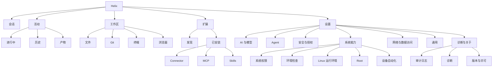

# Helix 移动端导航、菜单命名与设置交互深度审查

> 审查日期：2026-09-24
> 基线：当前本地 `main @ 3cf89027` 工作树
> 范围：抽屉导航、菜单命名、页面层级、Capabilities / Readiness / Permissions / Audit / Extensions / Settings 的边界，及 Settings 内部折叠与子页面设计。
> 前提：产品尚未上线，**不考虑旧 route、testTag、页面枚举或现有信息架构的兼容成本**，以当前最优用户体验为目标。

---

## 0. 核心结论

初步审查的大方向是正确的：

- 当前抽屉层级过多；
- `会话 → 会话`、`扩展 → 扩展` 的单项分组无意义；
- `工作` 混入 Tasks / Artifacts / Git / Files / Browser / Terminal，用户心智不统一；
- `能力 / 准备 / 权限 / 设置 / 审计` 五个顶层入口高度工程化；
- SettingsScreen 虽然已经使用 `SettingsGroup` 卡片容器，但本质仍是**十余块功能连续纵向堆叠**；
- Extensions 和 Settings 之间确实存在 Skill / Connector 的重复入口。

但如果完全不考虑兼容，建议比初稿再前进一步：

> **不要继续使用“抽屉一级组 → 展开二级项”的树形结构。**

移动端抽屉最适合承担 **4～6 个一级场景切换**，而不是桌面 IDE 式目录树。

Helix 更合理的全局 IA 是：

```text
Helix
├── 会话
├── 活动
├── 工作区
├── 扩展
└── 设置
```

其中：

- **会话**：Chat / Goal / Plan / 当前会话能力；
- **活动**：后台任务、运行记录、产物；
- **工作区**：文件、Git、终端、浏览器；
- **扩展**：市场、已安装、连接器、Skills、MCP；
- **设置**：模型与服务、Agent 行为、安全与授权、系统能力、网络、通用、诊断。

这样比“1 个常驻入口 + 3 个可折叠组”更适合手机，也能从根本上消除当前菜单术语和层级混乱。

---

# 一、当前真实实现审查

## 1.1 当前 Shell 一共有 13 个 Destination

当前 `ShellDestination` 实际包含：

```text
Sessions
Tasks
Artifacts
Git
Files
Browser
Extensions
Capabilities
Readiness
Permissions
Settings
Audit
Terminal
```

`GroupedNavigation` 再将其划分为：

```text
会话
└── 会话

工作
├── 任务
├── 成果
├── Git
├── 文件
├── 浏览器
└── 终端

扩展
└── 扩展

设置与管理
├── 能力
├── 准备
├── 权限
├── 设置
└── 审计
```

虽然代码已经对“只有一个子项”的组自动省掉组标题，但**信息架构本身仍是按旧四组建模**，且当当前页面在某组内时会自动展开该组。

### 问题不是单纯“项目太多”

更核心的问题是：

> **当前 ShellDestination 把“用户任务”“工具表面”“系统状态”“配置入口”“诊断入口”放在了同一个导航层级。**

这些页面不属于同一种抽象层级。

---

# 二、抽屉导航：建议取消二级折叠树

## 2.1 为什么不建议保留初稿中的三级分组方案

初稿提出：

```text
会话
工作台（展开）
  任务监控
  交付产物
  文件
  Git
  终端
  浏览器
扩展中心
系统与管理（收起）
  设置
  环境就绪与能力
  审计
```

这比当前版本好，但仍有三个问题。

### 问题 A：6 个工作台子项默认展开仍然太重

手机抽屉宽度有限，抽屉的主要价值是快速跳转，不是展示产品完整 sitemap。

展开后：

```text
工作台
  任务监控
  交付产物
  工作区文件
  代码版本
  控制终端
  内嵌浏览器
```

其实已经接近一个小型桌面 IDE Activity Bar + Explorer 组合。

尤其中文名称拉长后，会让抽屉产生“说明书感”。

### 问题 B：用户不会把 Browser / Terminal 理解为与 Tasks 同一导航级别

用户心智上：

- Task / Artifact 是 Agent **运行结果**
- File / Git / Terminal / Browser 是 Agent **工作环境**

它们是两个不同概念。

### 问题 C：Capabilities / Readiness 仍然被当成产品主场景

实际上它们的代码说明得很清楚：

- Capabilities = “当前设备/应用能否提供某项系统能力”
- Readiness = “为了某个目标，现在还缺什么”

它们本质是**诊断与修复界面**，不是用户每天主动浏览的内容。

---

# 三、推荐的最终抽屉结构

## 3.1 一级导航只保留 5 项

推荐：

```text
┌──────────────────────────────┐
│ Helix                        │
│                              │
│  💬 会话                     │
│  ◉ 活动                     │
│  📁 工作区                   │
│  🧩 扩展                     │
│                              │
│ ─────────────────────────── │
│  ⚙ 设置                     │
└──────────────────────────────┘
```

不使用展开/收起。

### 一级入口定义

| 一级入口 | 英文 | 职责 |
| --- | --- | --- |
| **会话** | Chats | 对话、Plan、Goal、当前会话上下文与会话级能力 |
| **活动** | Activity | 当前/历史任务、后台 Job、产物、执行结果 |
| **工作区** | Workspace | Files、Git、Terminal、Browser |
| **扩展** | Extensions | Marketplace、Installed、Connector、MCP、Skill |
| **设置** | Settings | 全局偏好、模型、安全、授权、系统能力、网络、诊断 |

这比 13 个 Shell destination 更符合移动端导航规模。

---

# 四、为什么建议新增“活动”，而不是继续使用“任务 + 成果”

当前 Tasks 和 Artifacts 是两个独立顶层页面，但它们高度相关。

用户真正关心的是：

```text
Agent 做了什么？
现在做到哪里？
产生了什么？
哪里失败了？
我能否打开结果？
```

这应形成一个“Activity / Runs”中心。

## 4.1 推荐页面

```text
活动
├── 进行中
├── 历史
└── 产物
```

可使用顶部 Segmented Button / Tabs：

```text
[ 进行中 ] [ 历史 ] [ 产物 ]
```

其中：

### 进行中

聚合：

- 当前 Turn；
- Goal；
- detached Linux Job；
- 需要确认/恢复的操作；
- Terminal 长任务（如果有）。

### 历史

对应当前 Tasks 的历史维度。

### 产物

对应当前 Artifacts。

这样可以删除一个顶层 Shell route，同时让“任务产生结果”的路径更自然。

---

# 五、工作区应该成为真正的工作台

当前：

```text
Files
Git
Browser
Terminal
```

分别占一个抽屉项。

建议合并到：

# 工作区

页面内部使用顶级 tab 或 toolbar：

```text
工作区
[ 文件 ] [ Git ] [ 终端 ] [ 浏览器 ]
```

如果手机横向空间不足：

```text
工作区
┌──────────────────────┐
│ 📁 文件              │
│ 🌿 Git               │
│ >_ 终端              │
│ 🌐 浏览器            │
└──────────────────────┘
```

进入后再保留最近选择的工具。

## 5.1 名称不要过度解释

初稿提出：

- 工作区文件
- 代码版本
- 控制终端
- 内嵌浏览器

语义比当前清晰，但在已经进入“工作区”的情况下，这些长名称反而冗余。

推荐直接：

```text
文件
Git
终端
浏览器
```

因为父级“工作区”已经承担语义。

### Git 是否需要改名“版本控制”

不建议中文主标题写“代码版本”。

开发者对 `Git` 的认知成本最低。

推荐：

```text
主名称：Git
副说明：查看当前工作区变更与 Diff
```

---

# 六、会话页应该继续承担哪些能力

“会话”是 Helix 的核心入口。

不建议把以下内容做成全局抽屉入口：

- 当前会话 Connector；
- 当前会话权限模式；
- 当前模型；
- Goal；
- Plan / Act；
- 当前会话上下文；
- 修订 / fork。

这些都应该在会话上下文内解决。

特别是：

> **“当前会话授权”不适合放在全局 Settings 的中部。**

当前 `SessionPermissionSection` 同时管理：

1. 新会话默认权限；
2. 当前会话权限；
3. 全局 Tool enable/disable。

这是三个不同 scope。

应该拆开。

---

# 七、Capabilities、Readiness、Permissions 为什么不应继续做三个顶层页面

这是当前 IA 最严重的问题之一。

---

## 7.1 Capabilities

当前 Capability Center 展示：

- Files
- Browser
- Notifications
- Calendar
- Accessibility
- Runtime
- MCP 等

每项有：

```text
Ready
Needs permission
Off
Unavailable
```

并提供 Test / Repair / Disable。

本质是：

> **系统能力状态中心**

不是普通用户的一级业务入口。

推荐新名称：

# 系统能力

英文：

`System Capabilities`

不要只叫“能力”。

“能力”在 Agent 产品里至少可能表示：

- 模型能力；
- 工具能力；
- 系统权限；
- Agent skills；
- multimodal capability。

过于宽泛。

---

## 7.2 Readiness

当前 Readiness 是按目标：

```text
对话
文件
浏览器
Linux 运行时
```

计算：

```text
模型连接
工作区
网页浏览
PRoot Runtime
```

并给出“下一步”。

它更像：

> **运行检查 / Setup Doctor**

“准备”是非常不合适的中文菜单名称。

推荐名称：

# 环境检查

英文：

`Environment Check`

或：

# 运行检查

英文：

`Readiness Check`

“环境就绪”比“准备”清楚，但依然偏工程术语。

如果页面核心目标是“告诉用户为什么当前功能不能用”，最好的用户语言是：

> **环境检查**

---

## 7.3 Permissions

当前页面明确是：

> System grants only

包含：

- 通知
- 日历
- Notification Listener
- 系统 App settings
- All-files

所以顶层名称“权限”也过宽。

推荐：

# 系统权限

英文：

`System Permissions`

这样才能与：

```text
Agent 授权
工具权限
会话权限
系统权限
```

明确区分。

---

# 八、Capabilities 和 Readiness 要不要合并？

初稿建议合并。

我的结论：

> **不建议直接把两个页面完全合并成同一长页，但建议归属于同一“系统能力”设置子页面。**

原因：

### Capabilities 是“能力维度”

```text
通知    Ready
日历    Missing
浏览器  Ready
PRoot   Off
```

### Readiness 是“目标维度”

```text
如果我要聊天：
模型 ✓

如果我要运行 Linux：
模型 ✓
Workspace ✓
PRoot ✗
→ 下一步：修复 Runtime
```

二者是同一数据的两种 projection，而不是同一个列表。

最佳设计：

```text
设置
└── 系统能力
    ├── 概览
    │   ├── 模型
    │   ├── 文件
    │   ├── 浏览器
    │   ├── 通知
    │   ├── 日历
    │   ├── 无障碍
    │   └── Linux Runtime
    │
    └── 环境检查
        ├── 对话
        ├── 文件
        ├── 浏览器
        └── Linux
```

或者使用 Tab：

```text
系统能力
[ 能力 ] [ 环境检查 ]
```

这样保留两个 projection 的价值，又不会占两个抽屉入口。

---

# 九、设置页：不推荐“6 个超大 Accordion”

初稿提出 6 张卡片全部放在一个 SettingsScreen，然后展开/收起。

这个方案比现在强，但不是最优。

## 9.1 Accordion 适合“局部高级选项”，不适合充当页面路由

如果卡片里包含：

- Provider 列表；
- Token budget；
- Goal；
- Root；
- PRoot；
- 权限；
- 工具列表；
- LAN；
- Egress；

那么折叠以后只是把超长页面“藏起来”。

用户仍然需要：

1. 打开 Settings；
2. 找卡片；
3. 展开；
4. 在巨大的 section 中继续滚动。

这仍然是单页面信息架构。

---

# 十、推荐：Settings Hub + 子页面

最终 Settings 首页建议类似 Android / ChatGPT / VS Code Settings：

```text
设置

AI 与模型
模型服务、默认模型、上下文与推理设置
>

Agent
默认执行模式、单轮预算、Goal 默认预算
>

安全与授权
Agent 权限模式、工具可用性、高敏感操作
>

系统能力
系统权限、环境检查、PRoot、Root、自动化
>

网络
局域网访问、高敏数据出站
>

通用
语言、存储与数据、界面偏好
>

诊断与关于
审计日志、版本、许可证、诊断
>
```

每一项点击进入独立子页面。

这比 6 张 Accordion 更好。

---

# 十一、推荐的 Settings IA

## 11.1 AI 与模型

```text
AI 与模型

模型服务
  已配置 3 个
  >

默认模型
  GPT-...
  >

上下文与推理
  自动上下文 · 默认推理
  >
```

### 应包含

- ProviderManager
- API key / OAuth / Subscription Provider
- 模型列表
- 模型能力
- 默认模型
- reasoning 参数
- context window override

### 不应包含

- Turn budget
- Goal budget
- PRoot
- Connector

---

# 十二、Agent 设置

推荐标题：

# Agent

而不是：

`Agent 规划与运行控制`

移动端标题应该短。

内部：

```text
默认执行方式
  普通
  规划
  Goal

单轮限制
  Token / Steps / Model calls
  >

Goal 默认限制
  >

输入交付
  排队 / 转向策略
  >
```

## 12.1 “Turn 预算”应改名

当前：

> Turn 预算

这个是明显内部工程术语。

推荐：

# 单轮运行限制

副说明：

> 控制一次回复最多使用的模型调用、步骤和 Token。

Advanced 里面再显示：

- 输入上限
- 输出上限
- 最大步骤
- 最大模型调用

“预算”可以作为内部概念，不必暴露给所有用户。

---

## 12.2 “Goal 运行设置”应改名

推荐：

# Goal 默认限制

或，如果希望进一步中文化：

# 自主任务默认限制

但 Helix 已经把 Goal 当产品概念的话，可以保留：

> Goal 默认限制

不要写“Goal 运行设置”，因为整个页面本来就是设置。

---

# 十三、安全与授权

推荐：

```text
安全与授权

安全模式
  Standard
  >

新会话默认授权
  工作区
  >

当前会话授权
  在会话内管理

工具可用性
  38 / 41 已启用
  >

敏感操作规则
  >
```

---

## 13.1 Safety Profile

当前：

```text
安全配置
当前：Advanced
切换到 Advanced
```

推荐统一成：

# 安全模式

值：

```text
标准
高级
```

UI 不建议中英文混合：

```text
Standard
Advanced
```

可以在副说明保留：

```text
高级（Advanced）
```

---

## 13.2 当前会话授权不应出现在全局设置

当前 `SessionPermissionSection` 混入：

```text
新会话默认模式
当前会话模式
工具可用性
```

建议拆成：

### Settings

只保留：

```text
新会话默认授权
全局工具可用性
```

### Chat / Session Settings

放：

```text
当前会话授权
完全访问
工作区
只读
自定义
```

因为“当前会话”的配置应该跟着当前会话。

这会显著减少 Settings 的上下文混乱。

---

# 十四、系统能力

推荐：

```text
系统能力

系统权限
  3 / 4 已启用
  >

环境检查
  对话、文件、浏览器、Linux
  >

Linux 运行环境
  已就绪
  >

Root
  未启用
  >

设备自动化
  无障碍已启用
  >
```

---

## 14.1 PRoot Runtime 不应直接堆在 Settings 首页

当前 Settings 直接出现完整的：

- 状态
- 验证
- 修复
- License
- 删除
- Rebaseline

这些属于典型“详情页操作”。

Settings 首页最多展示：

```text
Linux 运行环境
已就绪
>
```

进入详情才显示完整动作。

---

## 14.2 Root 与 Automation 也同理

不应该直接把复杂 Root section 和 Automation section 展开在 Settings 主页。

Settings 主页是导航和摘要，不是控制台。

---

# 十五、网络设置

推荐一级 Settings 子页面：

# 网络与数据访问

不要叫：

> 网络出站与局域网审计

原因是“审计”会误导。

内部：

```text
局域网访问
  允许 2 个地址
  >

敏感数据出站
  3 条规则
  >
```

---

## 15.1 “高敏出网规则”对普通用户过于工程化

详情页可以保留精确术语，但 Settings 首页推荐：

> 敏感数据出站

副说明：

> 控制哪些模型或扩展可向指定网络目标发送敏感内容。

详情页标题可继续：

> 敏感数据出站规则

---

# 十六、通用设置

推荐：

```text
通用

语言
  跟随系统
  >

外观
  跟随系统 / 浅色 / 深色
  >

数据与存储
  >

通知
  >
```

注意：

当前系统通知授权应归系统权限，但“通知行为偏好”如果以后有：

- Goal 完成通知
- 后台 Job 通知
- 声音
- 震动

则应放通用。

“授权”和“偏好”不要混为一谈。

---

# 十七、审计日志的位置

初稿把 Audit 放在：

> 系统与管理 → 审计日志

我建议进一步下沉。

普通用户极低频主动打开 Audit。

推荐：

```text
设置
└── 诊断与关于
    ├── 审计日志
    ├── 诊断
    ├── 导出调试信息
    ├── 版本
    └── 开源许可
```

但如果未来 Helix 明确面向：

- 企业安全；
- 审批合规；
- Agent 操作追责；

再把 Audit 提升到一级。

当前个人开发者 Agent 定位下没有必要。

---

# 十八、Extensions 页面已经证明“扩展应该彻底移出 Settings”

当前 `ExtensionsScreen` 已经同时拥有：

```text
发现市场
已安装与自定义
```

并实际包含：

- Marketplace
- Skill Authoring
- Skill Installation
- Connector

而 `SettingsScreen` 又再次包含：

- SkillAuthoringSection
- SkillInstallationSection
- ConnectorSection

这是明确重复。

推荐：

> **Settings 中彻底删除 Skill / Connector / MCP 安装管理。**

Settings 只允许出现：

```text
扩展默认行为
安全策略
网络策略
```

扩展对象本身全部在 Extensions 页面管理。

---

# 十九、Extensions 页面本身也需要二次整理

当前“已安装与自定义”仍是：

```text
Skill Creator
----
Skill Installer
----
Connector
```

纵向堆叠。

推荐改成：

```text
扩展

[ 发现 ] [ 已安装 ]

已安装
  Connector
  MCP
  Skills
```

右上：

```text
＋ 添加
```

添加弹出：

```text
添加扩展

从市场安装
导入 Connector
添加 MCP Server
导入 Skill
创建 Skill
```

### 不建议继续使用：

```text
Skill 安装器
创建与校验 Skill
```

作为页面长期固定大 Section。

它们属于“动作”，不是“内容分类”。

---

# 二十、菜单名称最终建议

## 20.1 抽屉

| 当前 | 初稿 | 最终推荐 |
| --- | --- | --- |
| 会话 | 会话 | **会话** |
| 任务 | 任务监控 | 合并到 **活动** |
| 成果 | 交付产物 | 合并到 **活动 → 产物** |
| 文件 | 工作区文件 | **工作区 → 文件** |
| Git | 代码版本 | **工作区 → Git** |
| 终端 | 控制终端 | **工作区 → 终端** |
| 浏览器 | 内嵌浏览器 | **工作区 → 浏览器** |
| 扩展 | 扩展中心 | **扩展** |
| 能力 | 环境就绪与能力 | **设置 → 系统能力** |
| 准备 | 环境就绪 | **设置 → 环境检查** |
| 权限 | 系统授权 | **设置 → 系统权限** |
| 设置 | 偏好设置 | **设置** |
| 审计 | 审计日志 | **设置 → 诊断与关于 → 审计日志** |

---

# 二十一、为什么“短名称 + 副说明”优于长菜单名

例如初稿：

```text
任务监控
交付产物
工作区文件
代码版本
控制终端
内嵌浏览器
```

这些名称单独看很清晰，但组合到手机抽屉里会很重。

推荐：

```text
活动
工作区
扩展
设置
```

进入工作区后：

```text
文件
Git
终端
浏览器
```

然后使用副说明：

```text
Git
查看变更、Diff 与仓库状态
```

信息层级会更自然。

---

# 二十二、默认展开 / 收起：最终原则

因为推荐方案不再使用 Drawer Accordion，所以抽屉无展开状态。

Settings 也不使用“大卡片 Accordion”作为一级 IA。

折叠只用于**详情页中的高级内容**。

---

## 22.1 推荐折叠规则

### 默认展示

- 当前状态；
- 最常用值；
- 主要开关；
- 修复动作；
- 1～2 行说明。

### 默认折叠

- 高级参数；
- 完整工具列表；
- debug 信息；
- Provider-specific 参数；
- Token 细分；
- Raw IDs；
- Egress binding 细节；
- Runtime legal / rebaseline；
- 高风险 destructive 操作。

---

## 22.2 示例：单轮运行限制

```text
单轮运行限制

总 Token 上限
128k

[ 高级设置 ▾ ]
```

展开：

```text
输入上限
输出上限
最大步骤
最大模型调用
```

这是 Accordion 的正确使用方式。

---

## 22.3 示例：Linux 运行环境

```text
Linux 运行环境
● 已就绪

[验证] [修复]

高级维护 ▾
```

展开：

```text
基线信息
重新建立基线
许可证与来源
删除运行环境
```

---

# 二十三、页面标题与顶栏建议

当前 TopBar 使用 `ShellDestination.titleRes`。

重构后建议主页面标题稳定为：

```text
会话
活动
工作区
扩展
设置
```

子页面：

```text
设置 / AI 与模型
设置 / Agent
设置 / 安全与授权
设置 / 系统能力
设置 / 网络与数据访问
设置 / 通用
设置 / 诊断与关于
```

手机上不一定真的显示 breadcrumb，可通过：

```text
← AI 与模型
```

实现。

---

# 二十四、推荐最终信息架构



---

# 二十五、建议的新路由模型

既然不考虑兼容，不建议继续让 `ShellDestination` 表示所有页面。

拆成：

```kotlin
enum class MainDestination {
    CHATS,
    ACTIVITY,
    WORKSPACE,
    EXTENSIONS,
    SETTINGS,
}
```

然后子页面：

```text
activity/running
activity/history
activity/artifacts

workspace/files
workspace/git
workspace/terminal
workspace/browser

extensions/discover
extensions/installed
extensions/add

settings/models
settings/agent
settings/security
settings/system
settings/system/permissions
settings/system/readiness
settings/system/linux
settings/network
settings/general
settings/diagnostics
settings/diagnostics/audit
```

这样“全局场景”和“内部页面”从模型层就不再混淆。

---

# 二十六、推荐的新 Settings 首页视觉结构

```text
设置

┌──────────────────────────────┐
│ AI 与模型                    >
│ 模型服务、默认模型、推理参数 │
└──────────────────────────────┘

┌──────────────────────────────┐
│ Agent                        >
│ 执行方式、单轮限制、Goal     │
└──────────────────────────────┘

┌──────────────────────────────┐
│ 安全与授权                   >
│ 安全模式、默认权限、工具     │
└──────────────────────────────┘

┌──────────────────────────────┐
│ 系统能力                     >
│ 权限、环境检查、Linux、Root  │
└──────────────────────────────┘

┌──────────────────────────────┐
│ 网络与数据访问               >
│ 局域网、敏感数据出站         │
└──────────────────────────────┘

┌──────────────────────────────┐
│ 通用                         >
│ 语言、外观、数据与存储       │
└──────────────────────────────┘

┌──────────────────────────────┐
│ 诊断与关于                   >
│ 审计日志、版本、许可证       │
└──────────────────────────────┘
```

关键区别：

> Settings 首页本身不编辑复杂配置，只提供摘要与入口。

---

# 二十七、页面间重复功能的最终归属

| 功能 | 唯一归属 |
| --- | --- |
| Provider / Model 管理 | 设置 → AI 与模型 |
| 当前模型快速切换 | 会话 |
| Marketplace | 扩展 → 发现 |
| Connector | 扩展 → 已安装 |
| MCP | 扩展 → 已安装 |
| Skill 安装 | 扩展 |
| Skill 创建 | 扩展 → 添加 |
| 新会话默认 Agent 权限 | 设置 → 安全与授权 |
| 当前会话权限 | 会话 |
| 全局 Tool enable/disable | 设置 → 安全与授权 |
| Android 权限 | 设置 → 系统能力 → 系统权限 |
| Capability 状态 | 设置 → 系统能力 |
| Readiness | 设置 → 系统能力 → 环境检查 |
| PRoot | 设置 → 系统能力 → Linux 运行环境 |
| Root | 设置 → 系统能力 → Root |
| Automation / Accessibility | 设置 → 系统能力 → 设备自动化 |
| LAN | 设置 → 网络与数据访问 |
| Egress | 设置 → 网络与数据访问 |
| Audit | 设置 → 诊断与关于 |
| Tasks | 活动 |
| Artifacts | 活动 |
| Git | 工作区 |
| Files | 工作区 |
| Browser | 工作区 |
| Terminal | 工作区 |

遵守：

> **一个概念一个主要归属。**

其他页面只允许提供 deep link，不复制完整配置 UI。

---

# 二十八、初稿中值得保留的判断

以下判断完全认可：

1. “准备”名称不合格。
2. “能力”过于抽象。
3. “权限”必须区分系统权限和 Agent 授权。
4. Settings 不能继续作为功能杂物间。
5. Skill / Connector 应移出 Settings。
6. Tasks / Artifacts / Git / Files / Terminal / Browser 当前混组缺乏清晰心智模型。
7. 低频系统运维入口不应该占据抽屉黄金区域。
8. 配置页面需要摘要、分组和 progressive disclosure。

---

# 二十九、对初稿需要修改的地方

## 修改 1：不建议默认展开“工作台 6 项”

改为一个一级“工作区”。

## 修改 2：不建议“系统与管理”继续作为抽屉折叠组

整个组应该收进“设置”。

## 修改 3：不建议 Settings 采用 6 张大型 Accordion 作为最终结构

改用 Settings Hub + 子页面。

Accordion 只用于子页面的高级参数。

## 修改 4：菜单名称不要普遍加长

“控制终端”“内嵌浏览器”“代码版本”不如：

```text
终端
浏览器
Git
```

父级已经说明它们属于工作区。

## 修改 5：Readiness 与 Capabilities 不直接物理合并

合并导航归属，但保留两种 projection：

```text
系统能力
├── 能力
└── 环境检查
```

---

# 三十、实施优先级

## Phase 1：先改 IA，不改业务逻辑

- 新建 5 个 MainDestination；
- Drawer 改为固定 5 项；
- Tasks + Artifacts 建 Activity 容器；
- Files/Git/Terminal/Browser 建 Workspace 容器；
- Capabilities/Readiness/Permissions/Audit 从 drawer 移除；
- Settings 变成入口页。

这是体验收益最大的一步。

---

## Phase 2：消除重复配置

- Settings 删除 SkillAuthoring；
- Settings 删除 SkillInstallation；
- Settings 删除 ConnectorSection；
- 当前会话 permission 移到 Chat；
- PRoot/Root/Automation 变成 System 子页；
- Audit 移到 Diagnostics。

---

## Phase 3：名称与文案统一

重点统一：

```text
能力        → 系统能力
准备        → 环境检查
权限        → 系统权限
安全配置    → 安全模式
Turn 预算   → 单轮运行限制
Goal 运行设置 → Goal 默认限制
高敏出网规则 → 敏感数据出站规则
```

同时避免：

```text
Provider / Runtime / Turn
```

在普通用户主标题中无必要混用英文工程术语。

Developer 详情页可以保留技术名称。

---

## Phase 4：Progressive Disclosure

针对复杂详情页增加：

- 摘要；
- 默认值；
- 高级设置折叠；
- 危险操作折叠；
- 诊断信息折叠。

而不是对 Settings 一级分类做 Accordion。

---

# 三十一、最终建议

如果 Helix 现在可以自由重构，不需要兼容旧版本，我建议不要对当前 Drawer 做“局部整理”，而是直接改变导航模型：

> **从“功能列表型导航”转为“场景型导航”。**

当前模型：

```text
一个功能 = 一个 Drawer Destination
```

应改成：

```text
一个核心用户场景 = 一个 Main Destination
场景内部再组织相关工具和设置
```

最终仅保留：

```text
会话
活动
工作区
扩展
设置
```

这是本轮审查最重要的结论。

它同时解决：

- Drawer 过长；
- 一级二级重复；
- Work 组杂乱；
- Capability / Readiness / Permission 概念混乱；
- Settings 无底洞；
- Extension 重复；
- Audit 过度曝光；
- Terminal / Browser 等工具与业务入口平级；
- 手机小屏幕需要频繁展开/滚动的问题。

从产品形态看，这也会让 Helix 更像一个真正的 **Mobile Agent Workspace**，而不是“把所有已实现功能都挂到侧边栏”的工程工具集合。
