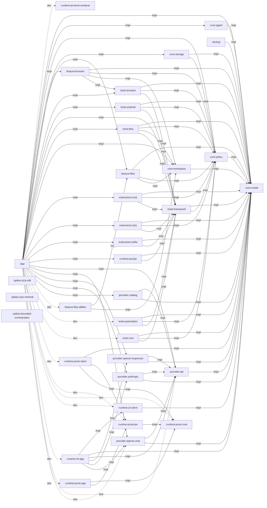
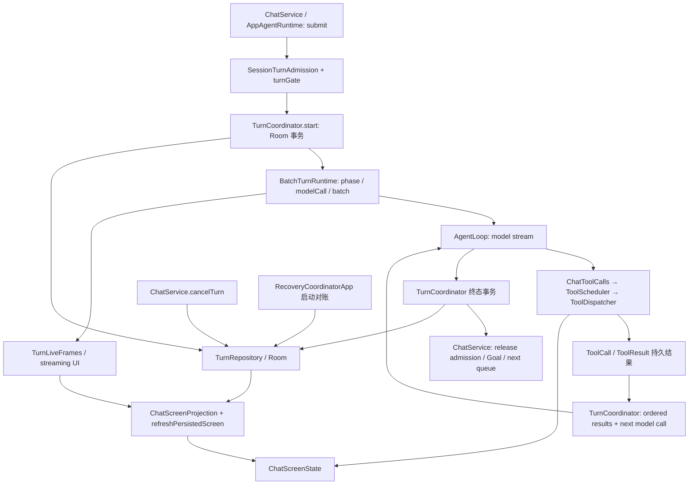
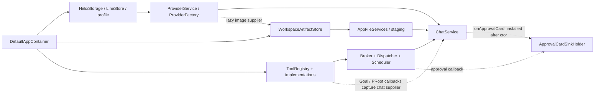

# 维度二:软件架构

审查日期：2026-09-24。基线：`3cf8902739c8b18b3f81ea286c471ec5faea92d4`，包含审查时未提交及未跟踪生产代码（尤其 Root 文件后端）。仅静态阅读、CodeGraph 定位与文本/依赖统计；未运行 Gradle、构建、测试、设备或网络验证。所有源码路径相对 `/Users/dollars/Helix`，行号以读取时的工作树为准；建议不是已实施变更。审查期间存在并行编辑：末次 status 新增 FilesScreen.kt 修改，统计是读取时快照而非锁定工作树；核心发现按已读取源文件取证。

题面统计需修正：`settings.gradle.kts:30–63` 是 **32 个常规模块**，`:66–72` 另有 **3 个可选 spikes**，共 35。模块目录中只有 app、proot-app、cli-app、terminal-renderer 四份独立 `build.gradle.kts`，其余由根脚本配置；不存在可读取的“32 份模块构建文件”。已检查这四份及根脚本。按这些模块的 `src` 统计 1,858 个 Kotlin 文件；`src/main` 985 文件 / 143,955 行，其中 app/main 356 文件 / 55,193 行，约 **38.3%**。此口径排除测试、flavor、生成目录和仓库外嵌副本，不能把含测试/不同源集的“46%”称为主源码占比。行数含注释及空行。

## 总评

- **分层**：Gradle 层基本遵守依赖方向，但 egress UI 直达持久仓储、恢复应用逻辑引用 UI 决策类型，应用内边界有缺口（A04/A05）。
- **模块划分**：协议与执行域边界合理；app 的问题在状态与用例所有权尚未收敛，不能靠按包批量建模块解决（A02/A03）。
- **依赖**：声明的项目依赖是无环 DAG；不存在 feature→core:storage、client→对应 app、provider/tools→app 的项目边；根脚本集中配置降低了局部可读性（A13）。
- **扩展性**：Tool 与协议 Provider 有可测试接缝；新增文件后端、恢复状态、运行调度功能会碰到多处中心分支与共享状态（A01/A08/A10）。
- **耦合度**：主要风险集中在 ChatService、跨层恢复模型、DI 回调环和生命周期控制器；不是所有长文件都低内聚（A02/A04/A06）。

去重问题共 **15 项：P0 2、P1 8、P2 5**。P0 使用本次给定的“当前维护/扩展阻碍或极高单点风险”口径，不等同于全部属于发布阻断漏洞。

## 模块依赖图(mermaid)+ 不变量违规清单

### 完整项目依赖

箭头为依赖方 → 被依赖方。实线 `impl` 为 implementation，虚线 `dev` 为 developerImplementation，点线 `test` 为 androidTestImplementation。**没有项目级 api 边**；根脚本 `build.gradle.kts:608–610` 把 map 中的全部边加入 implementation。第三方库的 api（例如协程、JSON、Compose）不在项目图中。

| 模块 | 构建来源 / 项目依赖（全部列出） |
| --- | --- |
| `:app` | `app/build.gradle.kts`；`:runtime:terminal-renderer` (developerImplementation, `app/build.gradle.kts:76`)；`:core:model` (implementation, `app/build.gradle.kts:78`)；`:core:agent` (implementation, `app/build.gradle.kts:79`)；`:core:policy` (implementation, `app/build.gradle.kts:80`)；`:core:storage` (implementation, `app/build.gradle.kts:82`)；`:feature:files` (implementation, `app/build.gradle.kts:83`)；`:feature:browser` (implementation, `app/build.gradle.kts:85`)；`:tools:browser` (implementation, `app/build.gradle.kts:89`)；`:tools:android` (implementation, `app/build.gradle.kts:93`)；`:tools:framework` (implementation, `app/build.gradle.kts:98`)；`:tools:files` (implementation, `app/build.gradle.kts:101`)；`:core:workspace` (implementation, `app/build.gradle.kts:102`)；`:extensions:mcp` (implementation, `app/build.gradle.kts:105`)；`:extensions:a2a` (implementation, `app/build.gradle.kts:108`)；`:extensions:skills` (implementation, `app/build.gradle.kts:111`)；`:runtime:quickjs` (implementation, `app/build.gradle.kts:118`)；`:provider:api` (implementation, `app/build.gradle.kts:123`)；`:provider:openai-chat` (implementation, `app/build.gradle.kts:124`)；`:provider:openai-responses` (implementation, `app/build.gradle.kts:125`)；`:provider:anthropic` (implementation, `app/build.gradle.kts:126`)；`:provider:catalog` (implementation, `app/build.gradle.kts:127`)；`:feature:files-allfiles` (developerImplementation, `app/build.gradle.kts:129`)；`:tools:automation` (developerImplementation, `app/build.gradle.kts:130`)；`:tools:root` (developerImplementation, `app/build.gradle.kts:131`)；`:runtime:proot-client` (developerImplementation, `app/build.gradle.kts:132`)；`:runtime:proot-ipc` (developerImplementation, `app/build.gradle.kts:136`)；`:runtime:proot-core` (developerImplementation, `app/build.gradle.kts:138`)；`:runtime:cli-client` (developerImplementation, `app/build.gradle.kts:139`)；`:runtime:cli-app` (developerImplementation, `app/build.gradle.kts:140`)；`:runtime:proot-app` (developerImplementation, `app/build.gradle.kts:141`)；`:provider:api` (androidTestImplementation, `app/build.gradle.kts:181`)；`:provider:openai-chat` (androidTestImplementation, `app/build.gradle.kts:182`) |
| `:core:model` | `build.gradle.kts:96–163 / settings.gradle.kts:66–72`；无 project 依赖 |
| `:core:agent` | `build.gradle.kts:167`；`:core:model` (implementation, `build.gradle.kts:167`) |
| `:core:policy` | `build.gradle.kts:168`；`:core:model` (implementation, `build.gradle.kts:168`) |
| `:core:storage` | `build.gradle.kts:169`；`:core:model` (implementation, `build.gradle.kts:169`)；`:core:policy` (implementation, `build.gradle.kts:169`) |
| `:core:workspace` | `build.gradle.kts:170`；`:core:model` (implementation, `build.gradle.kts:170`) |
| `:provider:api` | `build.gradle.kts:171`；`:core:model` (implementation, `build.gradle.kts:171`) |
| `:provider:openai-responses` | `build.gradle.kts:172`；`:provider:api` (implementation, `build.gradle.kts:172`)；`:core:model` (implementation, `build.gradle.kts:172`) |
| `:provider:openai-chat` | `build.gradle.kts:173`；`:provider:api` (implementation, `build.gradle.kts:173`)；`:core:model` (implementation, `build.gradle.kts:173`) |
| `:provider:anthropic` | `build.gradle.kts:174`；`:provider:api` (implementation, `build.gradle.kts:174`)；`:core:model` (implementation, `build.gradle.kts:174`) |
| `:provider:catalog` | `build.gradle.kts:175`；`:provider:api` (implementation, `build.gradle.kts:175`)；`:core:model` (implementation, `build.gradle.kts:175`) |
| `:extensions:mcp` | `build.gradle.kts:176`；`:core:model` (implementation, `build.gradle.kts:176`)；`:core:policy` (implementation, `build.gradle.kts:176`)；`:tools:framework` (implementation, `build.gradle.kts:176`) |
| `:extensions:a2a` | `build.gradle.kts:177`；`:core:model` (implementation, `build.gradle.kts:177`)；`:core:policy` (implementation, `build.gradle.kts:177`)；`:tools:framework` (implementation, `build.gradle.kts:177`) |
| `:extensions:skills` | `build.gradle.kts:178`；`:core:model` (implementation, `build.gradle.kts:178`)；`:tools:framework` (implementation, `build.gradle.kts:178`) |
| `:feature:browser` | `build.gradle.kts:182`；`:core:model` (implementation, `build.gradle.kts:182`)；`:core:policy` (implementation, `build.gradle.kts:182`)；`:core:workspace` (implementation, `build.gradle.kts:182`)；`:tools:browser` (implementation, `build.gradle.kts:182`) |
| `:feature:files` | `build.gradle.kts:183`；`:core:model` (implementation, `build.gradle.kts:183`)；`:core:policy` (implementation, `build.gradle.kts:183`)；`:core:workspace` (implementation, `build.gradle.kts:183`) |
| `:feature:files-allfiles` | `build.gradle.kts:184`；`:feature:files` (implementation, `build.gradle.kts:184`)；`:core:workspace` (implementation, `build.gradle.kts:184`) |
| `:runtime:quickjs` | `build.gradle.kts:188`；`:core:model` (implementation, `build.gradle.kts:188`)；`:tools:framework` (implementation, `build.gradle.kts:188`) |
| `:runtime:terminal-renderer` | `runtime/terminal-renderer/build.gradle.kts`；无 project 依赖 |
| `:runtime:proot-core` | `build.gradle.kts:191`；无 project 依赖 |
| `:runtime:proot-ipc` | `build.gradle.kts:195`；`:runtime:proot-core` (implementation, `build.gradle.kts:195`) |
| `:runtime:proot-client` | `build.gradle.kts:196`；`:core:model` (implementation, `build.gradle.kts:196`)；`:runtime:proot-ipc` (implementation, `build.gradle.kts:196`)；`:runtime:proot-core` (implementation, `build.gradle.kts:196`) |
| `:runtime:proot-app` | `runtime/proot-app/build.gradle.kts`；`:runtime:proot-core` (implementation, `runtime/proot-app/build.gradle.kts:66`)；`:runtime:proot-ipc` (implementation, `runtime/proot-app/build.gradle.kts:70`) |
| `:runtime:cli-client` | `build.gradle.kts:197`；`:core:model` (implementation, `build.gradle.kts:197`) |
| `:runtime:cli-app` | `runtime/cli-app/build.gradle.kts`；`:runtime:cli-client` (implementation, `runtime/cli-app/build.gradle.kts:41`)；`:core:model` (implementation, `runtime/cli-app/build.gradle.kts:42`)；`:provider:api` (implementation, `runtime/cli-app/build.gradle.kts:43`)；`:provider:openai-responses` (implementation, `runtime/cli-app/build.gradle.kts:44`)；`:provider:anthropic` (implementation, `runtime/cli-app/build.gradle.kts:45`)；`:provider:openai-chat` (implementation, `runtime/cli-app/build.gradle.kts:46`) |
| `:tools:framework` | `build.gradle.kts:198`；`:core:model` (implementation, `build.gradle.kts:198`)；`:core:policy` (implementation, `build.gradle.kts:198`) |
| `:tools:android` | `build.gradle.kts:202`；`:core:model` (implementation, `build.gradle.kts:202`)；`:core:policy` (implementation, `build.gradle.kts:202`)；`:tools:framework` (implementation, `build.gradle.kts:202`) |
| `:tools:automation` | `build.gradle.kts:203`；`:core:model` (implementation, `build.gradle.kts:203`)；`:core:policy` (implementation, `build.gradle.kts:203`)；`:tools:framework` (implementation, `build.gradle.kts:203`) |
| `:tools:browser` | `build.gradle.kts:208`；`:core:model` (implementation, `build.gradle.kts:208`)；`:core:policy` (implementation, `build.gradle.kts:208`)；`:tools:framework` (implementation, `build.gradle.kts:208`) |
| `:tools:files` | `build.gradle.kts:209`；`:core:model` (implementation, `build.gradle.kts:209`)；`:core:policy` (implementation, `build.gradle.kts:209`)；`:core:workspace` (implementation, `build.gradle.kts:209`)；`:tools:framework` (implementation, `build.gradle.kts:209`) |
| `:tools:root` | `build.gradle.kts:210`；`:core:model` (implementation, `build.gradle.kts:210`)；`:core:policy` (implementation, `build.gradle.kts:210`)；`:tools:framework` (implementation, `build.gradle.kts:210`) |
| `:testing` | `build.gradle.kts:211`；`:core:model` (implementation, `build.gradle.kts:211`) |
| `:spikes:a2a-sdk` | `build.gradle.kts:96–163 / settings.gradle.kts:66–72`；无 project 依赖 |
| `:spikes:a2a-minimal` | `build.gradle.kts:96–163 / settings.gradle.kts:66–72`；无 project 依赖 |
| `:spikes:bounded-orchestration` | `build.gradle.kts:96–163 / settings.gradle.kts:66–72`；无 project 依赖 |

### 不变量核查

| 不变量 | 静态结论与证据 | 违规/限制 |
| --- | --- | --- |
| 1 core 不依赖 Android UI/其他基础设施模块 | `build.gradle.kts:167–170` 仅 core→model/policy；model/agent/policy/workspace 在 JVM 集合 `:146–163`。storage 是明确的 Android 数据适配层 `:98、262–292`，Room 是其实现依赖。 | 未发现项目依赖违规。不能扩大成“core/storage 不得用任何 Android API”；若要所有 core 纯 JVM，需要另立 storage-port/adapter 迁移决定。 |
| 2 UI 经应用服务访问持久化/执行 | 全部生产 Composable 与 ui 目录扫描未见直接 Room DAO、OkHttp、QuickJS 或 PRoot client 调用。**但** `MainActivity.kt:407` 传 `container.storage.highSensitivityRules` → `ui/SettingsScreen.kt:64` → `egress/EgressRuleSection.kt:59、72、107、124` 直接 all/save/revoke。 | **A05：1 条完整边界违规链**。不是“直接拿 DAO”而是 UI 绕过应用服务使用具体仓储。仓储再到 DAO 的证据为 `core/storage/src/main/kotlin/com/helix/core/storage/repository/EgressRuleRepositories.kt:37–57`。其余 SessionInput/Plan 的存储 DTO import 属泄漏/耦合，不算 DAO 调用。 |
| 5 QuickJS isolated；PRoot/CLI 私有进程；consumer 排除 | `runtime/quickjs/src/main/AndroidManifest.xml:9–14`：`:helix_js`、isolated=true、exported=false；`JsExecutionService.kt:343` 创建 QuickJs。`runtime/proot-app/src/main/AndroidManifest.xml:8–25` 全部执行入口在 `:proot` 且不导出；`runtime/cli-app/src/main/AndroidManifest.xml:7–27` 在 `:subscriptions` 且不导出；`HelixApplication.kt:64` 拦截非主/isolated 进程的主容器初始化。 | 静态配置未发现违规；不替代 merged manifest/APK/device 验收。本轮没有构建制品，不能声称实测隔离通过。 |
| consumer 排除的传递闭包 | `app/build.gradle.kts:76、129–141` 仅 developer 引入 renderer、PRoot core/ipc/client/app、CLI client/app、root、automation；共享依赖没有回流上述 runtime。`app/src/consumer/kotlin/com/helix/app/proot/ProotToolModule.kt:23、60–69` false/no-op，`app/src/consumer/kotlin/com/helix/app/root/RootModule.kt:14–33` 无 libsu。 | 未发现 consumer 将 PRoot/CLI 执行模块打入的静态路径；共享 proot 包是数据投影/接口，不等于运行时执行代码。 |
| 3 工具统一管线 | `ChatToolCalls.kt:245–262` → scheduler；`ToolDispatcher.kt:332–348` 校验/政策/执行；`:733–787` 限额/结果；`:1019` 审计结束。`DefaultAppContainer.kt:501–550` 统一装配。 | 抽查内建、MCP/A2A 注册链未见第二生产 dispatcher；手动文件 UI 不属于模型 ToolCall，不能据此报绕行。 |
| 4 用户授权，模型不授予 | `DefaultAppContainer.kt:479–528` 同一 SessionPermissionService 同时供给权限配置和工具可用性；`ToolDispatcher.kt:803–825` 执行前重读并消费 proof。 | 已见正确接线；没有把模型/扩展注解视为授权。不是全路径安全认证。 |
| 6 冷绑定 | `app/src/developer/kotlin/com/helix/app/proot/ProotToolModule.kt:68–89` 仅构造 supervisor/client；`runtime/proot-client/src/main/kotlin/com/helix/runtime/proot/client/ProotRuntimeSupervisor.kt:71–118` openConnection 才 bind；`ProotJobClient.kt:125–156` 提交时调用；显式 verify 位于 module `:345`。 | 抽查未见注册/切 profile 自动绑定；仍需设备生命周期验证。 |
| 7 A2A 客户端 | `app/src/main/kotlin/com/helix/app/a2a/A2aAppService.kt:72–98` 注销、reconcile/cancel、工具调用事实；项目边仅 extensions:a2a→model/policy/framework。 | 没有发现 Server/递归子 Agent 接入；外部 Task 对账不是本地 child agent。 |
| 8 手工 DI / 9 渠道 | `DefaultAppContainer.kt:90–96`、`app/build.gradle.kts:23–31、118`；consumer 保留 QuickJS。 | 无 Hilt；STANDARD 不能按模块名称误判为减配。Root Agent 与手动文件后端仍应分别论证渠道差异。 |

对特别指定方向逐条核查：feature→storage **无**；proot-client→proot-app **无**；cli-client→cli-app **无**（实际是 `runtime/cli-app/build.gradle.kts:41` 的 app→client，client 内含 wire 契约）；provider→app **无**；tools→app **无**。`core:storage→core:policy`、`runtime:quickjs→tools:framework`、`feature:browser→tools:browser` **不是违规**，不应为消灭箭头而把所有类型塞进 core:model。

## :app 单体剖析与模块拆分建议(含顺序)

### 35 个包的职责归类

下表为 main 源集，根目录装配另列；“证据”给出该包一个实际源码锚点，不把目录名当作全部职责证据。

| 包 | 文件/行 | 归类及主要职责 | 源码锚点 |
| --- | --- | --- | --- |
| `a2a` | 4 / 880 | 产品集成：外部 Agent 配置、Task 持久化与工具桥 | `app/src/main/kotlin/com/helix/app/a2a/A2aAppService.kt:18` |
| `agent` | 27 / 3585 | 应用运行：模型循环、批次生命周期、上下文、预算 | `app/src/main/kotlin/com/helix/app/agent/AgentLoop.kt:24` |
| `allfiles` | 1 / 13 | 基础设施：应用共享存储 scope 标识 | `app/src/main/kotlin/com/helix/app/allfiles/AllFilesSource.kt:10` |
| `approval` | 7 / 1861 | 基础设施/应用：审批 broker、卡片映射与授权编辑 | `app/src/main/kotlin/com/helix/app/approval/ApprovalCardUi.kt:18` |
| `audit` | 1 / 206 | 产品：审计日志查询 | `app/src/main/kotlin/com/helix/app/audit/AuditLogService.kt:39` |
| `capability` | 2 / 186 | 基础设施：系统 grant 适配 | `app/src/main/kotlin/com/helix/app/capability/StorageCapabilityGrantRecorder.kt:15` |
| `chat` | 59 / 10849 | 产品+运行混合：会话、草稿、发送、Turn、投影、恢复 | `app/src/main/kotlin/com/helix/app/chat/AgentTurnHost.kt:18` |
| `companions` | 1 / 11 | 遗留基础设施：Runtime APK signer 策略 | `app/src/main/kotlin/com/helix/app/companions/RuntimeApkPolicy.kt:4` |
| `connector` | 12 / 2080 | 产品：安装、替换、OAuth 与 Compose 设置 | `app/src/main/kotlin/com/helix/app/connector/ConnectorCatalog.kt:15` |
| `diagnostics` | 2 / 267 | 基础设施：进程与设备状态证据 | `app/src/main/kotlin/com/helix/app/diagnostics/DiagnosticBundlePreview.kt:10` |
| `egress` | 1 / 323 | 产品+持久化混合：出网规则设置 | `app/src/main/kotlin/com/helix/app/egress/EgressRuleSection.kt:59` |
| `export` | 3 / 381 | 产品：会话 JSONL 导出 | `app/src/main/kotlin/com/helix/app/export/SessionExportCredentials.kt:12` |
| `files` | 17 / 3142 | 产品+基础设施：文件浏览、预览、手动传输与恢复 | `app/src/main/kotlin/com/helix/app/files/FileManagerBatchOperations.kt:8` |
| `foreground` | 2 / 325 | 基础设施：dataSync 前台服务生命周期 | `app/src/main/kotlin/com/helix/app/foreground/DataSyncForegroundController.kt:9` |
| `git` | 5 / 557 | 产品基础设施：只读 Git 状态/diff | `app/src/main/kotlin/com/helix/app/git/GitStatusModel.kt:9` |
| `goal` | 12 / 1216 | 应用用例：目标生命周期、预算、提醒 | `app/src/main/kotlin/com/helix/app/goal/GoalDeletionCoordinator.kt:6` |
| `internal` | 1 / 69 | 基础设施：LineStore、SharedPreferences、内存实现 | `app/src/main/kotlin/com/helix/app/internal/LineStore.kt:17` |
| `language` | 1 / 182 | 产品基础设施：语言选择与 Context 包装 | `app/src/main/kotlin/com/helix/app/language/AppLanguageStore.kt:33` |
| `marketplace` | 4 / 1060 | 产品：扩展索引、预览、安装 | `app/src/main/kotlin/com/helix/app/marketplace/MarketplaceCatalog.kt:5` |
| `mcp` | 11 / 1329 | 产品集成：连接、OAuth、存储和工具桥 | `app/src/main/kotlin/com/helix/app/mcp/McpAppService.kt:21` |
| `network` | 1 / 62 | 基础设施：LAN scope 设置 | `app/src/main/kotlin/com/helix/app/network/LanScopeStore.kt:11` |
| `plan` | 2 / 532 | 应用用例：Plan 审阅/批准/执行绑定 | `app/src/main/kotlin/com/helix/app/plan/PlanReviewService.kt:19` |
| `privacy` | 1 / 91 | 应用用例：删除编排 | `app/src/main/kotlin/com/helix/app/privacy/PrivacyDeletionService.kt:19` |
| `profile` | 1 / 81 | 应用设置：Standard/Advanced profile 状态 | `app/src/main/kotlin/com/helix/app/profile/SafetyProfile.kt:18` |
| `proot` | 14 / 751 | 跨源集契约/产品：命令结果、后台任务、恢复投影 | `app/src/main/kotlin/com/helix/app/proot/BackgroundJobAction.kt:4` |
| `provider` | 18 / 2017 | 产品装配：协议工厂、配置、模型选择、图像解析 | `app/src/main/kotlin/com/helix/app/provider/CleartextBindingStore.kt:23` |
| `readiness` | 1 / 188 | 纯投影：功能准备状态 | `app/src/main/kotlin/com/helix/app/readiness/Readiness.kt:14` |
| `recovery` | 4 / 723 | 应用运行：进程重启对账、Goal 使用量 | `app/src/main/kotlin/com/helix/app/recovery/GoalDurableUsageLedger.kt:16` |
| `runcontrol` | 4 / 251 | 应用设置：模式、预算和原因编码 | `app/src/main/kotlin/com/helix/app/runcontrol/AndroidResourceGate.kt:11` |
| `skills` | 7 / 719 | 产品集成：创作、安装、设置 UI | `app/src/main/kotlin/com/helix/app/skills/SkillAuthoringSection.kt:24` |
| `terminal` | 1 / 52 | 跨源集契约：手动终端入口 | `app/src/main/kotlin/com/helix/app/terminal/ManualTerminal.kt:4` |
| `todo` | 2 / 259 | 应用用例：任务账本及工具 | `app/src/main/kotlin/com/helix/app/todo/TaskLedgerProjection.kt:15` |
| `tool` | 3 / 404 | 装配/基础设施：管线、持久化审计接缝 | `app/src/main/kotlin/com/helix/app/tool/ApprovalCardSinkHolder.kt:16` |
| `ui` | 108 / 18222 | 产品表示：导航、会话、文件、任务、设置混合平铺 | `app/src/main/kotlin/com/helix/app/ui/AdaptiveConversationHeader.kt:34` |
| `voice` | 2 / 135 | 产品基础设施：语音识别端口/Android 适配 | `app/src/main/kotlin/com/helix/app/voice/SpeechRecognitionLauncher.kt:27` |

根目录另外 14 文件 / 2,184 行，含组合根、Activity、Application、资源入口。

### 包间耦合与拆分顺序

静态 import 抽查（计 import 语句，不等于调用次数）：`ui→chat` 59 条，`chat→agent` 50 条，`ui→agent` 2 条；反向 `chat→ui` 7 条，另外 connector→ui 1、skills→ui 2。MainActivity→ui 18 条属于正常装配。隐式同包引用、全限定名和回调未纳入这些数字，因此不作为完整 fan-in。

具体深度：`ui/SettingsScreen.kt:70` 和 `ui` 下会话页面消费 ChatService；`ChatService.kt:5–26、226–254` 消费 AgentLoop/TurnCoordinator；`chat/TurnRecoveryActions.kt:3–5、99–107` 再引用 ui 的 recoverySummary 做操作准入。形成 **UI→chat→UI 包环**，并非 Gradle 环。`chat/TurnRecovery.kt:4–7` 是另一条反向边。`connector/ConnectorSection.kt:31`、`skills/SkillInstallationSection.kt:19` 对共享 UI helper 的引用合理，但 helper 应有明确 common UI 归属。

`docs/research/project-structure-and-engine-review.md:7、11、17` 要求先收敛状态所有权、取得构建/测试收益后才考虑模块化。以下是候选评估和顺序，**不是建议立即新建全部模块**：

| 顺序 | 候选与建议边界 | 收益 | 成本/前置条件 |
| --- | --- | --- | --- |
| 1 | 先在 app 内划出 `conversation/runtime`、`conversation/presentation`、`recovery` 包；未来候选 `:feature:conversation` | 清除 A02/A03/A04，最直接减少跨职责修改 | 高；先抽窄持久化端口和单一 runtime owner，不能直接搬 ChatService 到新模块。 |
| 2 | `files` + 对应 Files UI → 候选 `:feature:file-manager`；原 `:feature:files` 保持 SAF/导入基础设施 | 文件功能可独立测试/导航接入；减少 Root/SAF 分支蔓延 | 中；需把 FileEntry/FileMeta 从 FileManagerService 嵌套类型抽出，注入导航/字符串/Root backend。`RootFileOperations.kt:26、60` 已显示接口反依赖门面模型。 |
| 3 | connector、marketplace、mcp/skills/a2a 的应用服务与页面 → 候选 `:feature:extensions`，先内部按域分包 | 同一安装/启停用户流程，统一生命周期；复用现有 extensions 协议模块 | 中高；存储桥和 Secret/OAuth 端口需注入，不建议三个小功能各建独立 Gradle 模块。证据 `DefaultAppContainer.kt:578–640`。 |
| 4 | proot、terminal 产品集成 → 候选 `:feature:terminal`（developer 依赖），共享只读结果契约留中立包 | 编译期渠道边界、页面/Job 管理测试更集中 | 中高；必须先把 `ProotToolModule.kt:87` 的 `() -> ChatService` 收窄为预算端口，不能引入 feature→app。 |
| 5 | provider 管理页/ProviderService → 候选 `:feature:provider-settings`；工厂留组合根或窄 factory 包 | 配置流程与协议解析测试解耦 | 中；模型图像和 subscription 的 lazy supplier 先独立，协议适配器保持各自岛。证据 `ProviderFactory.kt:30–68`。 |
| 6 | goal、plan、todo 先按 `tasks/application` 收敛，不立即拆三个模块 | 审阅、执行绑定、任务展示共同入口 | 高；共用 Turn 生命周期和 Room 事务。`ChatService.kt:1253–1405、3733–3781`；先确定事务 owner，再考虑 `:feature:tasks`。 |
| 7 | voice 留 conversation 平台适配包 | 当前只有 2 文件/135 行，端口已足够 | 单独模块收益不足；不以文件夹数量追求模块数量。 |

“最先被压垮”的三个点：①新 Queue/Steer/Goal 需求仍需改 `ChatService.kt:2875–3532` 及 UI 发布；②新并发/恢复语义必须同步串行参考与批次生产模型，当前已在 `RecoveryCoordinator.kt:34` 发生失配；③新增文件后端要同时改 listing/preview/metadata/share/mutation 分支，工作树 Root 接入已在 `FileManagerService.kt:254–255、329–365` 展现该成本。

## 大文件职责分析与拆分方案(每个大文件一节)

### 度量口径与源码索引

公开成员按目标类本体直接声明统计：Kotlin 默认 public 与 override 均计入，internal 单列；不计自动生成的 data-class 成员、构造参数、嵌套类型的方法和 companion 成员。文件行数与类行数不是同一口径。Compose 两文件按顶层可调用函数统计。历史“113 方法/40 构造依赖”未采用，不能把嵌套回调参数、属性和 internal 函数都称 public。

| 文件（后文短名均指此路径） | 行数 | 直接公开函数 / 属性 | 补充 |
| --- | ---: | ---: | --- |
| `app/src/main/kotlin/com/helix/app/chat/ChatService.kt` | 4047 | 86 / 7 | 86 = 81 普通函数 + 5 override；另有 27 个 internal 函数、9 个 internal 属性。构造器实际 16 个参数。 |
| `tools/framework/src/main/kotlin/com/helix/tools/framework/ToolDispatcher.kt` | 1174 | 2 / 0 | dispatch、endTurn；另有 internal 测试接缝；文件包含请求/结果类型。 |
| `runtime/proot-app/src/main/kotlin/com/helix/runtime/proot/app/ProotJobRunner.kt` | 942 | 9 / 0 | 另 6 internal 函数；companion get 和 2 常量另计。 |
| `feature/browser/src/main/kotlin/com/helix/feature/browser/BrowserController.kt` | 877 | 59 / 14 | 公开属性包含 storage、adBlock、userScripts。 |
| `core/workspace/src/main/kotlin/com/helix/core/workspace/WorkspaceArtifactStore.kt` | 779 | 19 / 0 | `:62 fun interface ArtifactSink` 是嵌套类型，不是第 20 个函数。 |
| `app/src/main/kotlin/com/helix/app/DefaultAppContainer.kt` | 766 | 0 / 31 | 类型自身 internal；31 个覆写属性，不是 31 构造参数，构造器仅 Context。 |
| `feature/browser/src/main/kotlin/com/helix/feature/browser/ui/BrowserScreen.kt` | 765 | 1 / 0 | 顶层 public BrowserScreen；另 6 个 private helper。 |
| `app/src/main/kotlin/com/helix/app/connector/ConnectorSection.kt` | 743 | 1 / 0 | 顶层 public ConnectorSection；另 5 个 private helper（含 suspend 轮询）。 |
| `app/src/main/kotlin/com/helix/app/files/FileManagerService.kt` | 705 | 25 / 2 | 另 1 internal moveOrCopy；不是 35 个构造依赖。 |
| `core/agent/src/main/kotlin/com/helix/core/agent/TurnReducer.kt` | 694 | 2 / 0 | reduce、afterProcessDeath。 |
| `app/src/main/kotlin/com/helix/app/agent/TurnCoordinator.kt` | 681 | 15 / 1 | 类 internal；companion start、常量另计；同文件另含 BatchTurnRuntime。 |

拆分行预算是设计目标（不含测试），不是精确搬迁承诺；保留单一生命周期/事务 owner，避免把长方法切成可随意排序的步骤。

### ChatService.kt — A02 / A03，严重低内聚

独立职责已可用具体区段划分：

| 职责 | 证据 | 建议类型及预算 |
| --- | --- | --- |
| Session CRUD、搜索、fork、选择/关闭 | `:667–958` | `SessionCatalogService` 250–350 行；只处理会话用例，发送命令经 runtime 端口。 |
| 草稿与附件 staging、Provider/模型选择 | `:989–1248、1435–1660` | `ComposerDraftController` 250–350；`AttachmentStagingCoordinator` 300–450；现有 ChatDraftStore、StagedAttachmentProcessor 继续复用。 |
| 发送准入、回执去重、出网确认及快照再验证 | `:1662–2233` | `SubmissionAdmission` 400–550；`EgressConfirmationStore` 120–180，pendingSend/target/attachmentIds/submission 统一为不可变确认记录。 |
| Goal/Plan 操作、显式用户意图及预算 | `:399–515、1253–1405` | `GoalContinuationController` 250–400，复用 ChatGoalActions/GoalLifecycleService；不新建另一套 Goal reducer。 |
| Queue/Steer 读取编辑、消费与下一输入调度 | `:2875–3382` | `SessionInputDeliveryService` 350–500，准入和启动仍调用唯一 TurnRuntimeOwner。 |
| 运行资源、启动屏障、取消、异常终局 | `:522–531、613–654、2655–2756、3384–3826` | `TurnRuntimeOwner : AgentTurnHost` 500–650；唯一拥有 admission、job、cancel、GoalTimeBudget、live frames 与终局资源释放。协调器保留持久事务。 |
| UI 投影及 Tasks 面板刷新 | `:285–346、2343–2388、3868–3983` | `ChatPresentationStore` 250–350；`TaskDashboardQuery` 150–250；只有前者能写 ChatScreenState。 |
| 审批桥接和工具调用 | `:210–224、2437–2460` | `TurnApprovalBridge` 150–220；ChatToolCalls 专注 dispatch/settlement，不再接收可写 screen。 |
| 恢复与 repair 导航 | `:268–269、325–343、2399–2435` | 现有 ChatRecoveryActions/TurnRecoveryActions 合成 `TurnRecoveryService`（180–300）；`RecoveryUiStore` 120–180；导航事件交 UI owner。 |

字段所有权必须同时迁移，否则拆文件不能降低耦合：

- **运行协调**：turnGate、sessionTurnAdmission、turnLiveFrames、systemStops、turnCancels、goalTimes、inputTurnControls、goalContinuation、goalUserRequests（`:398–419、522–532、613–654`）。transportState（`:315–316`）是 FGS 所需的运行派生状态，留运行侧，迁移后也不能从当前页面推断后台 Turn 生命周期。
- **UI 投影**：_sessions、_sessionSearch/searchJob、_backgroundTasks、backgroundJobsState、goalDashboardState、planDashboardState、artifactFilesState、_screen、reminderGoalState、openSession（`:285–346、537–544`）。profile/runControl 是外部 store 的只读转发，不应复制为新事实源。
- **审批桥接**：ChatService 的 pendingSend/pendingEgress/pendingAttachmentIds 是 Provider 出网确认，**不是工具审批 proof**；工具审批事实属于 ChatToolCalls.pendingApprovals/dispatchFacts 和 StorageApprovalBroker（`ChatToolCalls.kt:60–69、101–109`）。这两个域不能因都叫“确认”合并。
- **恢复**：recovery/turnRecovery、recoverySettingsNavigation 与 screen 中 recoveries/busy（`:268–269、329–343、3917–3936`）。持久恢复决定属于 RecoveryCoordinatorApp，UI busy 不应成为其完成证明。

最终 ChatService 留 150–250 行兼容门面，逐步让 UI 依赖 Commands/ReadModel 端口；不是一次复制出九个同样可写共享状态的 service。

### ToolDispatcher.kt — A11，领域内聚较高

`:268–325` attempt/retry/异常审计；`:367–557` capability/policy/用户预设授权；`:584–645` schema/descriptor 校验；`:655–730` proof 取得；`:733–927` 开始时重读、执行限额、失败语义；`:950–1061` 结果绑定、截断/哈希及审计。两个 public 函数说明外部接缝稳定，不能仅按 1,174 行判为上帝类。

建议内部 `DispatchValidation` 100–150 行、`DispatchAuthorization` 250–350、`ExecutionStartGate` 120–180、`ToolOutcomeVerifier` 100–150、`AttemptAudit` 80–120；Dispatcher 保留 220–300 行固定序列。proof 消费必须仍紧贴执行开始，异常仍每 attempt 一次审计，禁止可重排插件链。

### ProotJobRunner.kt — A07，多生命周期资源合居

`:64–105` 进程单例、持久 job store、日志与 executor；`:124–173` detached/manual 资源名额；`:184–282` 恢复启动/提交准入/PFD 接管；`:284–321` 输入归档解包校验；`:325–548` 环境构造、进程启动、流捕获、超时/取消；`:552–689` 终态/输出归档/证据发布；`:692–770` ACK、查询、取消、对账、截止期限/孤儿清扫。文件尾还含 loader/进程辅助函数。

现有抽取（ProotJobStore、ProotResultArchiveStore、JobExecutionWindow）是好的基础。建议 `JobInputPreparer` 100–150、`ProotProcessLauncher` 180–250、`JobOutputMaterializer` 140–200、`JobLeaseSupervisor` 100–150；Runner 保留 250–350，唯一持有 LiveJob 与 generation/lease/owner。manual terminal 与 Agent Job 仅共享资源名额，不合并授权/恢复语义；不得为拆类破坏 PFD finally 关闭路径。

### BrowserController.kt — A08，控制器范围超过单一生命周期

`:78–89` 同时创建 storage/广告/用户脚本/标签/下载；`:126–330` 标签导航与 WebView 操作；`:344–452` snapshot/token/固定脚本工具；`:454–529` 下载、隐私清理、查找；`:535–689` 存储加载、互斥写入和偏好副作用；`:722–877` View owner attach/detach、host 回调投影。

59 个命令本身可作为 feature facade；问题是直接公开可变协作者（`:78–80`）并把应用持久状态与 Activity 资源共同实现。`editStored` 先持久化再发布（`:579–582`）已有一致性保护，不能误称“完全没有仓储层”。建议 `BrowserProfileStore` 180–250、`BrowserPageSession` 220–300、`BrowserToolSession` 120–180；门面 200–300，既有 BrowserViewOwner/DownloadQueue 保留。把 storage/adBlock/userScripts 降为私有，读模型通过只读 StateFlow。

### WorkspaceArtifactStore.kt — A12，宽接口但有清晰领域边界

`:75–99` workspace 布局；`:127–247` 原子 artifact 发布/流式写、quota、hash、sink；`:248–420` 有界读取、probe、stat/list/search；`:422–539` mkdir/copy/move；`:541–553` 委派 trash/privacy；`:570–639` containment 与流式摘要。不是 Room store，不应把 artifact file-first 协议改成数据库事务假原子性（`:58–60、105–117`）。

建议 `WorkspaceReader` 160–220、`ArtifactPublisher` 220–280、`WorkspaceFileMutations` 150–220，门面 80–120。共享 `ScopedPathResolver` 和 quota 规则，保留已有 WorkspaceTrashOperations/PrivacyOperations；不要重复实现路径校验。高复用本身合理，P2 是接口隔离与回归面问题。

### DefaultAppContainer.kt — A06，组合职责合理，时间耦合需处理

`:96–200` storage/settings/provider；`:227–339` registry、workspace、files/browser；`:340–438` built-in/tool/flavor 注册；`:445–554` broker/dispatcher/scheduler；`:578–640` MCP/Connector/A2A；`:653–715` attachment/chat 与观察绑定；`:724–739` privacy。构造 Context 一个参数、公开 31 服务属性，不是“38 参数构造器”。

不建议 Hilt/Koin 或 service locator。保留唯一组合根（约 350–450 行），用 `ProviderAssembly` 80–120、`ToolAssembly` 160–220、`ExtensionAssembly` 100–150 辅助 factory；核心修改是先构造 `ApprovalEventHub`（60–100 行）供 broker/presentation 双方使用，消除后置 sink 安装；具体构造环见后文 DI。辅助 factory 不得隐式启动服务或私藏新全局单例。

### BrowserScreen.kt — A08 的表示层部分

`:70–108` 收集浏览器事实与 modal 本地状态；`:110–133` 返回栈优先级；`:136–460` omnibox、WebView 容器、页面/对话框和动作接线；`:464–477` SAF 保存 launcher；`:480–716` error/download/privacy/context menu；`:718–765` suggestions。已有多个私有组件，因此历史“765 行单函数”不准确（主函数大约 390 行）。

建议 `BrowserScreenState` 80–120（modal/返回优先级纯模型），`BrowserContent` 160–220，`BrowserDialogHost` 160–220，`BrowserDownloadUi` 100–150；route 保留 120–180。SAF ActivityResult 与 WebView owner 仍由 Android 页面生命周期拥有，不把 WebView 搬进 ViewModel；读事实来自 controller，页面只持展示状态。

### ConnectorSection.kt — A09，UI 拥有 OAuth 协议工作流

`:44–239` import/paste/preview/replace 与列表；`:242–439` endpoint auth/tool selection/enablement；`:442–636` OAuth 配置/开始/撤销/取消及 job 状态；`:657–695` device-code 展示；`:698–743` SlowDown/Pending/Success/error/到期轮询。服务已经包住网络调用，但 Compose scope 仍决定 OAuth 的时序语义，UI 重建与协议任务寿命绑在一起。

建议 `ConnectorManagementStateHolder` 180–250（导入与列表），`EndpointSettingsCard` 150–200，`ConnectorOAuthCoordinator` 180–240（取消、attempt identity、轮询截止、SlowDown；注入 Clock/Delay），`DeviceCodeCard` 70–100；Section 保留 150–200。优先并入现有 mcp OAuth coordinator 的明确职责，避免新旧双方轮询同一 attempt。

### FileManagerService.kt — A10，新增 Root 暴露后端选择缺口

`:96–181` 导入导出；`:183–307` sources/listing/SAF/Root 分流；`:324–413` preview/metadata/share；`:415–543` rename/copy/mkdir/命名；`:550–639` trash/restore/purge/batch。已有 FileManagerPreview、Transfers、Trash 与 ManualFileOperations；问题不是零抽象，而是这些抽象边界不一致，Root 读操作重新回到门面逐方法分支，mutation 又有 production manual 与旧测试 fallback 双路径（`:430–463`）。

建议 `FileBrowseBackend`（list/stat/preview/share，80–120 行接口/值对象），`FileBackendResolver` 60–100，Workspace/Saf/Root 三适配器各 120–220；现有 `ManualFileOperations` 继续唯一编排可恢复修改；`FileManagerService` 缩至 180–250。把 FileEntry/FileMeta 移到 `files/model`，测试通过 backend fake 使用生产路径，不为测试保留一套旧 mutation 实现。

### TurnReducer.kt — A01 的参考模型部分，本身内聚高

`:30–67` reduce 与进程死亡入口；`:69–305` lifecycle/cancel/resume；`:315–448` model stream/结束/串行 tool 队列；`:450–558` approval/execution/result；`:587–683` budget 与 invariant 校验。两个公开函数，内部以事件划分，不能按文件大就判低内聚。

生产 `TurnCoordinator.kt:60–63` 明确不复用该串行 reducer，全仓生产引用扫描只见注释/定义。**但 RecoveryCoordinator 仍活用相同串行假设**，所以也不能说串行模型完全无生产影响。先建立 `TurnLifecycleContractCases`（测试数据 150–250 行）映射串行参考、BatchTurnRuntime 与 durable recovery；补齐生产并发恢复覆盖后，再将参考实现明确命名 `SerialTurnReferenceReducer` 或移至 test-support。若拆内部函数，仅 `SerialModelStepReducer` 150–200、`SerialToolStepReducer` 150–200，主 reducer 220–300；不删除现有测试换绿。

### TurnCoordinator.kt — A03，持久事务内聚较高，owner 声明不完整

同文件 `:65–147` 是纯 BatchTurnRuntime；coordinator `:190–282` model/tool 开始与提交；`:293–435` 批次结果、Steer 与响应边界；`:436–500` 输入交付/压缩；`:509–563` 终局和持久转移；`:591–641` 初始消息/turn/model-call 原子创建。多数职责属于一个事务 owner，应保留。

建议首先把 `BatchTurnRuntime.kt` 单独放文件 100–150 行（更易纯 JVM 测试）；coordinator 目标 350–450 行；`TurnPromptRecorder` 80–120、`TurnInputCommitter` 100–160 为其内部协作者。禁止让它们各开事务后再由外层拼接。对 cancel/恢复的写入口收敛成 `TurnLifecycleStore`（100–180）而不是另造 coordinator。

## 状态所有权

### Turn 生命周期实链

- **提交**：`ChatService.kt:1668–1737` 统一发送/回执；`:3384–3532` 进行持久去重、每会话准入；`:3542–3583` worker 在 start gate 后运行；`TurnCoordinator.kt:591–641` 原子写入 turn、输入和 first model call。
- **运行**：BatchTurnRuntime 保存进程内 checkpoint（`TurnCoordinator.kt:68–73`）；Room turn 是 durable lifecycle；ModelStreamState 是未提交文本/用量 accumulator，流 delta 经 `ChatService.kt:3717–3725` 进入 live frames。这是合理的持久/瞬态分工，不必强制每个 token 写 DB。
- **工具批**：`ChatToolCalls.kt:245–290` 持久 tool row、平台调度、逐项 settlement，再通知 BatchTurnRuntime。`TurnCoordinator.kt:293–324` 以原序写模型可见消息后开下一 model call；UNKNOWN 被拒绝发生在事务前 `:297`，是生命周期契约需明确的边界，不能偷偷把 UNKNOWN 当成功继续。
- **终态**：`TurnCoordinator.kt:509–547` 负责终态事务；`ChatService.kt:3733–3781` 负责资源/Goal/输入队列交接，`:3785–3811` 隔离后置投影通知失败。现已有终局保护，不应称“终态完全无原子性”。
- **恢复**：`RecoveryCoordinatorApp.kt:75、135–147` 扫描 DB 并构造 PersistedTurn；`:78–120、155–189` 写恢复结果；`HelixApplication.kt:71–81` 再通知 ChatService。该入口受 A01 串行假设阻断。

### 重复事实与实际可写入口

| 事实 | 写入者与证据 | 判断/收敛方向 |
| --- | --- | --- |
| Turn durable phase | TurnCoordinator `:194、246、304–319、537`；ChatService cancel `:2696、2718`；RecoveryCoordinatorApp `:172` | 确有三个写入者；live cancel 和运行同时存在，不只是进程重启专用。保留请求取消与终局的不同动作，但统一 TurnLifecycleStore 的转移约束和事务端口；不是简单禁掉取消写入。 |
| 进程内 phase 与 durable phase | BatchTurnRuntime `:68、86、96、142–145`；TurnRepository `:69–85` | 两份是有意的 checkpoint/持久状态，不能仅因双份即报 bug；但 Repository 校验入参 turn 快照后无 revision/CAS（`:78–85`），依赖调用方事务和 stop 检查。扩展新入口容易漏掉，需收敛 owner；未证明当前必现竞态。 |
| ChatScreenState | ChatService `:3882、3903、3979`；ChatRecoveryActions `:93–101`；TurnRecoveryActions `:124–137`；ChatToolTimeline `:83–94` | 同一 MutableStateFlow 传给多个协作者（ChatService `:218、269、336`）。update 原子性防止丢更新，不证明不同来源状态语义一致。改为单 writer 接收 typed projection events。 |
| 工具卡片、耗时、状态 | ChatToolTimeline 的 live rows；ChatScreenProjection `:26–35` 叠加 durable rows；ChatToolCalls `:66–69` dispatch/approval 内存表 | approval row 与 tool result 才是耐久事实；卡片是 read model。规定 transient overlay 的键/过期/替换策略，不能整体 refresh 时凭页面旧值恢复事实。 |
| activeTurn/streamingText | ModelStreamState → publishTurn `ChatService:3723–3725`；refresh 从 lastTurn 和 current streamingText 重建 `:3923` | 同一展示字段两条生成路径；建议 stream overlay 按 turnId 存放，由统一 projector join，不从上一屏 activeTurn 借文本。当前具体跨 turn 错配是否可触发：待核实。 |
| 会话选择与草稿 | openSession AtomicReference `:537–544`、drafts `:195`、screen.openSessionId `:3908` | UI 选择状态与 durable session 是不同事实，不应把 draft 自动持久化当修复；单一 selection store + projection。 |
| FGS 状态 | ChatService `:2343–2361` 从 background tasks 派生 transportState；DefaultAppContainer `:710–713` 消费 | 当前已不依赖“仅打开的会话”，这是正确边界；迁移时保持从全部运行任务推导。 |

A03 指的是所有权与测试约束分散，**不把所有缓存都称为重复业务事实，也不宣称所有双写已有数据损坏**。拆分完成的静态标准：UI state 的 MutableStateFlow 不再跨服务传递；应用层的 Turn 更新经同一窄生命周期端口；恢复可处理与生产一致的批次基数。

## 扩展点评估

| 扩展任务 | 当前需新增/修改的位置 | 接缝与可无 app 测试能力 |
| --- | --- | --- |
| 同一域新增 Tool | 新 descriptor/executor；所在域注册器（例如 `DefaultAppContainer.kt:393–429`）；必要时 `SessionToolEffectClassifier` 对新的效果语义增加可信映射。若新增模块再改 settings/root map/app 依赖。 | `tools/framework/src/main/kotlin/com/helix/tools/framework/ToolSource.kt:35`、`ToolRegistry.kt:30–52`、ToolImplementationRegistry 和 Dispatcher 是稳定 JVM 接缝。普通 Tool 不需改 Dispatcher；效果/并发必须由平台判定，不能让新 Tool 自称只读取得权限。可在 tools JVM 模块 fake capability/broker/audit 独测；Android bridge 仍需相应平台测试。 |
| 新 Provider，沿用现有协议 | `provider/catalog/src/main/kotlin/com/helix/provider/catalog/ProviderTemplateCatalog.kt:61` 类似 generic 模板/目录条目；端点/模型配置及 catalog 测试 | 通常不需新模块或改核心枚举。历史“一律 6+ 文件”不成立。 |
| 新 Provider 协议 | 新适配器模块（codec/stream/model catalog），settings/root JVM/dependency map、app/build 依赖、`core/model/src/main/kotlin/com/helix/core/model/ProviderProtocol.kt`、`ProviderFactory.kt:43–68` 分支/图像桥、catalog | ModelProvider 的 list/stream 与 WireClient 可 fake，协议/传输测试无需 app；app 只承担持久配置和装配。枚举扩展需要再检查序列化与 exhaustive when。建议 `ProtocolProviderFactory` registry 显式注册工厂；不需要自动扫描插件或统一三家协议 payload。 |
| 新 Runtime 后端 | 独立 private service/manifest、IPC 协议/DTO/client、host tool executor/availability/recovery adapter、developer 装配及 consumer unavailable 实现；如新增执行目标要核对 core model 和平台并发/效果策略 | 当前无通用 `RuntimeBackend` SPI。`ProotJobClient.kt:112–156、214–218` 是具体 PRoot/PFD API；`CliModelJobWire.kt:18–38` 是具体 Binder 协议。core schema/awaiter 可不依赖 app 测试，真实 IPC 必须设备；host 集成仍落 app。建议仅抽窄 `CommandJobPort`、`RuntimeReadinessPort`，保留 QuickJS isolated 与同 UID 后端的不同信任/生命周期。 |
| 新 MCP 服务/现有 HTTP transport | 用户配置/Connector 数据即可，通常零源码修改；新增 transport 改 façade adapter 与对应 wiring，`SdkMcpClientFacade.kt:22–34` 目前固定 StreamableHttp；developer stdio 是另一桥 | `extensions:mcp` 为 JVM，可独立 fixture 测试；OAuth/Room/source enablement 仍 app。扩展 transport 先增加 `McpTransportFactory`，不要让 SDK 类型进入 UI。 |
| 新 Skill | 用户导入或 `extensions/skills/src/main/kotlin/com/helix/extensions/skills/BuiltInSkills.kt:4–10` 的内建内容；安装复用 `SkillInstallationService.kt:16–34` | repository/importer/loader 在 extensions:skills JVM；不为每个 Skill 写 app service。Skill 内容不能改变工具授权。 |
| 新 A2A Agent | 配置/Card/用户选 Skill，经 `A2aAppService.kt:72–98` 的 registry/Task bridge；新协议特性才改 extensions:a2a 与持久桥 | 现有为 Android library（根脚本 `:106`），纯 codec 可 JVM 测，网络/Room Task 集成需要平台 fixture。不需也不允许为接入新外部 Agent 增加递归调度 owner。 |

ToolSource 注释说 sources 是唯一 descriptor 来源，但 `ToolRegistry.kt:49` 另有公开 register，生产 built-in 注册器使用该路径。这里是“来源可信性由装配端保证”，并非 Kotlin 类型层强制只有 ToolSource 能注册；未发现模型获得 registry 写入权，不将这一措辞差异认定授权漏洞。

### DI 构造图、时序与测试接缝

多数服务是 eager val：storage `DefaultAppContainer.kt:96`、Provider `:166`、workspace `:282`、fileServices `:322`、Browser `:339`、pipeline `:452`、MCP `:578`、A2A `:629`、Chat `:661`。显式 lazy：vision image `:162`、OAuth coordinator `:591`、Connector `:609`、Marketplace `:622`、privacy `:724`。Chat 自身的 toolCalls/agentLoop/goals/recovery 又是 lazy（`ChatService.kt:210–269`），init 已启动 refresh/observer（`:645–648`）。Browser 构造也开始加载持久设置（`BrowserController.kt:540–559`）。**eager 对象不等于 eager 绑定 PRoot 服务**，必须按调用证据区分。

构造的真实环是 broker→approval card presenter(ChatService)→pipeline→broker。当前用 holder `DefaultAppContainer.kt:445、459–460、701` 和 nullable sink `tool/ApprovalCardSinkHolder.kt:18–28` 打破，提前回调会明确抛错而非自动批准。另有 workspace 声明顺序与 Provider image supplier 的前向引用（`:155–175`）、注册器捕获 `() -> ChatService`（`:418`）。这些不是 Gradle 环，是“构造必须完成后才可调用”的时间耦合。可把 ApprovalEventHub 先构造并由 presentation 观察，命令回到 broker；Goal/PRoot 只收窄 Budget/GoalCommandPort，不捕获整个 ChatService。

测试接缝并非不存在：ChatService 可注入 storage、provider、clock、scope、IDs、strings 与 subscription recovery；`app/src/androidTest/kotlin/com/helix/app/chat/ParkedTurnCancelSettlementDeviceTest.kt:240–277` 构造独立数据库/LineStore/provider/附件 fake，但 `:261` 又借生产 appContainer.toolPipeline；`app/src/androidTest/kotlin/com/helix/app/ui/AppUiTestSupport.kt:36` 从 Application 拿整容器。ProviderFactory 接收 WireClient (`:30–41`)；LineStore 有内存实现 (`internal/LineStore.kt:55–68`)。因此结论是**服务可局部替换，完整容器仅 Context 入参导致整合测试经常借真实对象图**。建议提供类型化 `AppAssemblyInputs`（Clock、wire factory、repository factories、runtime ports），而不是全局可变 override map；优先让业务测试摆脱真实 pipeline 和 Room，再评估 Gradle 模块收益。

## 源集策略

| 切面 | 当前证据/差异 | 评价 |
| --- | --- | --- |
| RootFileModule | consumer **54 行**，developer **189 行**；前者 `:16–25` 返回 isSupported=false、无 Root backend；后者 `:23–32、54–128、131–186` 实现读取、预览、分享和手动修改 | 是编译期实现替换，54/189 是本对文件，不是 RootModule。新工作树已有 RootFileOperations 接缝（`:10–73`），方向正确。 |
| RootModule | consumer **34 行**、developer **159 行**；consumer `:16–33` no-op/unavailable；developer `:45–60` 持全局 access/session 并注册工具，`:87–89` 开始有 Compose Section | 不应为消除重复让 consumer 依赖 libsu。应拆 `RootFeatureFactory` + `RootSettingsSection`；当前模块对象把 UI、工具注册、全局状态放一起，构造/测试重建容易受旧 singleton 影响。 |
| ProotToolModule | consumer `:23、60–69` false/no-op；developer `:45–89` object/lateinit/wireForTest，`:138–140` 注册 LinuxRunTool 与 detached 工具 | 有意渠道边界。代价是静态同名 object 没有共同接口约束，方法增删要人工同步；consumer 大量 Nothing/unavailable 也不适合作通用可替换服务。 |
| LinuxRunTool | 只在 `app/src/developer/kotlin/com/helix/app/proot/LinuxRunTool.kt`，由 developer module `:138` 注册 | 不需要给 consumer 创建同等大小的 LinuxRunTool 桩；源集粒度合理。descriptor/executor 可在既有 developer feature 包内部进一步分离。 |
| 共享 proot/terminal 产品事实 | main 的 CommandResultProjection/RecoveryReport/ManualTerminalLauncher 与 developer 实现分开 | 合理：consumer 可以读取历史结果/显示 unavailable，而不带执行模块。不能看到 main/proot 目录便判违反渠道隔离。 |

RootFileOperations 与 RootModule 不是重复授权实现：前者是手动文件管理后端，后者是 Agent Root 工具会话。不能把手动 Root grant 自动转成 Agent scope。`app/src/main/kotlin/com/helix/app/files/RootFileOperations.kt:6–8` 已明确这一区分。A14 的改进是由共享 **窄接口**约束两个 factory 的返回类型，减少 object API 人工对齐；不合并不同权限域，不给 STANDARD 添加无依据的确认。

## 目录结构评估

顶层按技术领域/执行域（core/provider/runtime/tools），app 内按 feature 与 kind 混合。`ui` 108 文件/18,222 行，chat 59/10,849，agent 27/3,585。缺点是同一功能横跨 ui 与 feature service 包，业务决策还反向依赖 ui（A04）。但“UI 文件在 connector 包”本身**不算误放**：若统一 feature-first，`connector/ui/ConnectorSection` 比全部搬进巨型 ui 更清晰。

建议稳定目标：`conversation/{application,runtime,presentation,ui}`、`files/{application,backend,ui}`、`extensions/{connector,mcp,skills,a2a,marketplace}`、`settings/ui`、`common/ui`、`di`。真正需要移动的是 `ui/RecoveryFactsProjection.kt:48–116` 的 RecoveryOperation/准入纯决策，迁到 `recovery`；不是强行把所有 `*UiModels` 归回一个公共 ui。Kotlin `internal` 是**模块级**可见性，包重命名不会建立编译隔离；历史“包是唯一可见性单位”说法不正确。

`app/internal/LineStore.kt:17–55` 是明确的 persistence port + SharedPreferences adapter + fake，`internal` 包名过泛但类职责不坏。可更名 `settings/persistence`，接口与 Android adapter 分文件，内存实现移 test-support/preview 支持时需保留生产默认用法（ChatService `:143`），不能直接删除。

`app/companions/RuntimeApkPolicy.kt:4–10` 只做包名/signer 匹配；全仓引用扫描仅自身与 `app/src/test/kotlin/com/helix/app/companions/RuntimeApkPolicyTest.kt:9–23`，未见生产调用。是旧 companion APK 模型遗留候选，不是当前 runtime 冷绑定边界的实现证明。先标记历史/参考归属并核对外部门禁，再删除或迁移；无需新建 companions 模块。

runtime 八模块的理由：QuickJS 的 isolated 执行域；terminal-renderer 的受控第三方资源/native 包装（`runtime/terminal-renderer/build.gradle.kts:113–166`）；proot-core 的 JVM schema/归档；proot-ipc 的 Binder/PFD 契约；proot-client 的 host 连接/对账；proot-app 的私有进程执行；cli-client 的主机端与共享 wire；cli-app 的订阅执行。**没有足够证据要求合并**。CLI wire 与 client 同模块是一处不对称：`runtime/cli-app/build.gradle.kts:41` 因协议复用依赖整个 client；若新增第二实现或 client 膨胀，再考虑 `:runtime:cli-ipc`，目前不能仅为目录对称新增第九模块。终端 renderer 独立是供应链/生成资源边界，不是普通 UI 小组件过拆。

## 问题清单(按严重度排序,每条含 5 要素)

### P0

**A01 — 并发执行与启动恢复仍使用不同基数契约。**

- 问题/机制：生产 BatchTurnRuntime 支持多 call，同一批可并发；恢复 DTO 仍 require RUNNING≤1，scan 在恢复事务前构造 DTO，失败后下次启动仍读取同一数据。
- 文件:行号：`core/agent/src/main/kotlin/com/helix/core/agent/RecoveryCoordinator.kt:34`；`app/src/main/kotlin/com/helix/app/agent/TurnCoordinator.kt:91–97`；`tools/framework/src/main/kotlin/com/helix/tools/framework/ToolScheduler.kt:52–63`；`app/src/main/kotlin/com/helix/app/recovery/RecoveryCoordinatorApp.kt:75、135–147`；`app/src/main/kotlin/com/helix/app/HelixApplication.kt:80–81`。
- 影响范围：两个 RUNNING 工具的非终态 Turn 在进程死亡后会阻断该轮启动的整个恢复计划，Goal/输入停车及后置 UI 通知也不会执行；属于静态可达机制，未声称本轮设备复现。
- 严重度及理由：**P0**，不是纯审美债；新增并发能力已与恢复契约冲突，存在当前功能/架构阻断。
- 建议：`PersistedBatchTurn` + `uncertainToolCallIds: Set`，RecoveryPlan 逐 call 表达；映射生产批次与参考串行测试，再增加 2+ RUNNING、混合 pending/approval、重复恢复和终态父场景，不删除旧测试。

**A02 — ChatService 同时拥有提交、运行资源与产品页面的单点。**

- 问题/机制：草稿、附件、egress、Goal、Queue/Steer、运行取消/结算和全部 UI 投影共用一个服务，增加任一功能都会进入同一修改热点。
- 文件:行号：`app/src/main/kotlin/com/helix/app/chat/ChatService.kt:138、210–269、398–419、1668、2875、3384、3733、3888`。
- 影响范围：会话、任务、后台运行、审批、恢复、附件、Provider 选择与 UI 测试；直接公开函数 86，分散协作者也回调该类。
- 严重度及理由：**P0**，按本次“极高结构单点风险”口径；依据是生命周期/权限事实交织，不是 4,047 行本身或假定性能故障。
- 建议：按大文件节抽 `TurnRuntimeOwner`、`SubmissionAdmission`、`SessionInputDeliveryService`、`ChatPresentationStore` 等；先改变所有权再移动代码，保留 AgentRuntime/AgentTurnHost 入口与一个终局 owner。

### P1

**A03 — 持久状态转移与 UI 状态写权限分散。**

- 问题/机制：coordinator 自称 single persistence owner，但 live cancel 和恢复直接更新 turn；UI state 同时被运行、工具卡片、恢复动作写入，原子 update 无法表达跨来源语义顺序。
- 文件:行号：`TurnCoordinator.kt:150–152、537`；`ChatService.kt:2696、2718、3903、3979`；`ChatRecoveryActions.kt:93–101`；`TurnRecoveryActions.kt:130`（两者均在 app/chat）；`core/storage/src/main/kotlin/com/helix/core/storage/repository/TurnRepository.kt:78–85`。
- 影响范围：停止/终态竞争、恢复展示、流式 overlay、批次结果；现有事务和取消检查有效，但新写入口的正确性依赖人工复制约定。
- 严重度及理由：**P1**，已明确双写/多写结构；未把未复现的竞态升级成确定数据损坏。
- 建议：窄 `TurnLifecycleStore` 统一转移契约；`ChatPresentationStore` 唯一写屏幕，typed events/按 turnId 的 overlay 替代共享 MutableStateFlow。

**A04 — app 内 feature/kind 混排形成 UI↔应用包环。**

- 问题/机制：恢复操作准入复用放在 ui 的 recoverySummary，应用服务反向依赖展示目录；ui 平铺与中心 ChatService 将多个 feature 绑在同一编译单元。
- 文件:行号：`app/src/main/kotlin/com/helix/app/chat/TurnRecoveryActions.kt:3–5、99–107`；`app/src/main/kotlin/com/helix/app/ui/RecoveryFactsProjection.kt:48–116`；`app/src/main/kotlin/com/helix/app/ui/SettingsScreen.kt:70`。
- 影响范围：恢复/会话 UI 和将来的模块抽取；是包依赖环，不是项目 DAG 环。
- 严重度及理由：**P1**，表示层模型变更可改变应用动作准入，阻碍独立业务测试与模块化；app 占比只是背景指标。
- 建议：`recovery/RecoveryDecision` 领域投影与 `ui/RecoveryPresentation` 分离；按 feature 收拢 UI，再按测量收益引入 feature 模块。

**A05 — egress UI 直接操作具体持久仓储。**

- 问题/机制：Compose 自建规则、时间与 IO 调度，直接 save/revoke/all，没有应用用例边界。
- 文件:行号：`app/src/main/kotlin/com/helix/app/egress/EgressRuleSection.kt:59、72、97–107、124`；`app/src/main/kotlin/com/helix/app/MainActivity.kt:407`；`core/storage/src/main/kotlin/com/helix/core/storage/repository/EgressRuleRepositories.kt:37–57`。
- 影响范围：Advanced 出网规则设置、用户操作审计/时钟测试和配置 UI；不是已证明权限绕过，领域构造仍校验规则。
- 严重度及理由：**P1**，明确违背“UI 经应用服务间接访问”的边界，业务时序难以无 UI 验证。
- 建议：`EgressRuleService` 100–160 行，注入 Clock/Repository，提供 list/create/revoke typed outcome；UI 仅编辑 draft 与展示结果，不新增无授权的审批要求。

**A06 — 手工装配依赖后置安装及全服务回调。**

- 问题/机制：broker→ChatService→pipeline 构造环由 nullable holder 延迟接通，Provider image 与 Goal/PRoot 回调还依赖声明顺序。
- 文件:行号：`DefaultAppContainer.kt:155–175、418、445–460、701`；`app/src/main/kotlin/com/helix/app/tool/ApprovalCardSinkHolder.kt:18–28`。
- 影响范围：启动顺序、容器测试、替换审批/运行服务；提前调用会失败关闭，并非未经确认执行。
- 严重度及理由：**P1**，合法可调用时点不由类型表达，重构容易引入初始化故障；手动 DI 本身无错。
- 建议：先构造 `ApprovalEventHub`，双方依赖窄端口；增加 `AppAssemblyInputs` 显式测试构造；保留唯一组合根，不引入 Hilt/全局 locator。

**A07 — ProotJobRunner 将协议准入、资源 owner、进程启动与结果物化耦合。**

- 问题/机制：PFD、executor、LiveJob、detached/manual 名额、启动环境、deadline 与 archive 发布在同一类交织，资源 finally 的正确性跨多阶段。
- 文件:行号：`ProotJobRunner.kt:124–173、204–282、284–393、616–689、704–770`。
- 影响范围：前台 Job、后台 Job、终端共享额度、进程死亡与结果重取。
- 严重度及理由：**P1**，后端扩展/输出协议修改波及生命周期关键路径；不沿用历史“RejectedExecutionException 必现泄漏”断言。
- 建议：抽 `JobInputPreparer`、`ProotProcessLauncher`、`JobOutputMaterializer`、`JobLeaseSupervisor`；Runner 保留唯一资源 owner。

**A08 — 浏览器 facade 内含持久偏好、页面生命周期和工具能力状态。**

- 问题/机制：Controller 同时公开底层 storage/engine、处理持久化队列和 Activity host；页面又集中维护 modal/back-stack，扩展浏览器功能需触碰不同生命周期。
- 文件:行号：`BrowserController.kt:78–89、535–589、722–770`；`BrowserScreen.kt:70–124、464`。
- 影响范围：浏览器导航、书签/历史/脚本、工具 snapshot 与配置变更；已有 BrowserViewOwner 的身份校验应保留。
- 严重度及理由：**P1**，测试替换只给 Context/clock，持久化与 View 生命周期难独立验证；不是因为命令数量多。
- 建议：`BrowserProfileStore`、`BrowserPageSession`、`BrowserToolSession`；显示层 `BrowserScreenState/DialogHost`，隐藏可变 collaborators。

**A09 — Connector OAuth 轮询协议由 Compose scope 驱动。**

- 问题/机制：UI 保留 pollingJob/attempt 展示状态，并执行 Pending/SlowDown/到期循环；页面退出会改变协议流程寿命。
- 文件:行号：`ConnectorSection.kt:469–473、517–522、698–743`。
- 影响范围：Connector device-code 登录、旋转/导航/重试与取消；未运行设备测试，不宣称已经持久丢 token。
- 严重度及理由：**P1**，协议状态机属于可独测应用流程，当前无法只测试协调器覆盖这些 UI 内规则。
- 建议：现有 OAuth 服务承接 `ConnectorOAuthCoordinator`，以 attempt identity 暴露 StateFlow，注入 clock/delay，页面仅发送显式 begin/cancel。

**A10 — 文件后端接口不统一，Root 扩展退回门面分支。**

- 问题/机制：读取/预览在门面识别 Root/SAF，修改另走 ManualFileOperations 或旧 fallback，接口还返回门面嵌套模型。
- 文件:行号：`FileManagerService.kt:254–255、329–365、430–463、496–502`；`app/src/main/kotlin/com/helix/app/files/RootFileOperations.kt:26、60`。
- 影响范围：workspace、共享存储、SAF、Root 的列表/预览/复制/恢复及测试真实性；包含未提交实现。
- 严重度及理由：**P1**，当前新增后端已迫使多个现有方法修改，后续扩展成本有直接证据。
- 建议：`FileBrowseBackend/Resolver` + 独立值对象；保留唯一 ManualFileOperations 写路径，fake 同一个生产 backend 接缝。

### P2

**A11 — Dispatcher 内部阶段状态聚集，修改审查成本偏高。** 问题机制是校验、授权、执行前重读、结果及每 attempt 审计共同操作 ctx；证据 `ToolDispatcher.kt:332–348、803–825、950–1061`；影响全部工具的授权/结果管线。**P2**：入口稳定且领域内聚高，未发现仅因结构导致绕行。建议提取不可任意重排的 DispatchValidation/DispatchAuthorization/OutcomeVerifier 等内部类型，保留单入口与 proof 消费位置。

**A12 — WorkspaceArtifactStore 面向不同消费者暴露过宽 API。** artifact 发布、浏览、普通变更、privacy/trash 同门面；证据 `WorkspaceArtifactStore.kt:127、196、248、387、457、496、541–553`；影响 tools、附件、文件 UI、runtime 结果导入。**P2**：同属 workspace，已有委派且无 app/Android 反向依赖。建议 WorkspaceReader/ArtifactPublisher/FileMutations 窄接口共享 containment/quota，门面兼容迁移。

**A13 — 模块依赖和差异配置集中在根脚本。** 根 map/when(path) 同时控制模块归类、Room、SDK、测试及特殊 artifact 规则；证据 `build.gradle.kts:96–212、222–262、301–305、392、480–495、608–610`。影响新增模块与局部依赖审查。**P2**：不是已证明构建速度问题，不能给出未测量的提速承诺。建议 `helix.jvm-library` / `helix.android-library` convention plugin，项目依赖回各模块 build，保留版本 catalog/锁与验证元数据。

**A14 — flavor 同名 object 接缝缺少共同类型，且混合 UI 与装配。** RootModule 的注册/全局 access/Section 混放，PRoot 有 lateinit/static 测试装配；证据 `app/src/developer/kotlin/com/helix/app/root/RootModule.kt:44–60、87–89`、consumer 对应 `:15–33`、developer `proot/ProotToolModule.kt:45–89`。影响渠道接口同步及测试隔离。**P2**：编译期排除本身正确，RootFileOperations 已是改善例。建议 RootFeatureFactory/RootSettingsSection、ProotFeaturePort；consumer 返回 typed unavailable 实现，不将 libsu/PRoot 依赖移入 main。

**A15 — 新协议 Provider 仍需修改中心枚举/工厂。** `ProviderFactory.kt:43–68` 以协议 when 与三套 image adapter 装配；`core/model/src/main/kotlin/com/helix/core/model/ProviderProtocol.kt:9–12` 定义闭合协议集，catalog 独立。影响真正新增协议的接入，不影响普通兼容端点。**P2**：三个稳定协议的穷尽分支有价值，未构成当前严重障碍。建议出现第四协议时抽显式 ProtocolProviderFactory registry 并增加序列化穷尽检查；不为开放性引入动态代码加载。

## 历史审查"维度二"发现的状态复核

| 历史发现 | 本次状态 | 新证据/修正 |
| --- | --- | --- |
| ChatService 4047 行/81 公开方法，P0 | **结构问题成立**，A02 | 81 是非 override public 函数；含 5 override 为 86，另有 7 公开属性。使用明确口径，不把 113/40 的另一份统计混用。 |
| app 单体 46%，P0 | **包/用例集中成立，统计及定级收窄** | main 356/55,193，占同口径 38.3%；主问题为 A04 的依赖环/组织，P1，不重复给“规模”一个 P0。 |
| 三条反向模块依赖 | **撤回** | 根脚本 `:169、182、188` 均是正常领域/port 依赖；没有 core→UI 或 provider/tools→app。结构报告 §1.2 与其 §1.1 存在结论冲突，本次以实际边裁定。 |
| “UI/feature 存储访问 0 命中” | **范围不足** | ui 目录以外的 EgressRuleSection 是 Compose，直接操作仓储（A05）；不是 DAO import 扫描就能证明所有 UI 分层合规。 |
| TurnReducer 生产未用，应直接删 | **前半成立，删除建议撤回** | `TurnCoordinator.kt:60–63` 不复用 reducer；RecoveryCoordinator `:34` 却保留串行假设（A01）。遵守结构治理文档 `:14`，先补生产契约映射，不删测试。 |
| 手动 DI 巨型容器 / Service Locator | **“大即错”撤回，时序环成立** | DefaultAppContainer 是合法 composition root；真正证据是 holder `:445、701` 和 lazy 前向引用 `:155–175`（A06）。不引入被禁止的 Hilt。 |
| 状态所有权未分离 | **成立**，A03 | `docs/development/status.md:52` 与可写 _screen、cancel 直接持久化、恢复写入相符；同时认可已有 AgentRuntime、Coordinator 和后置通知隔离。 |
| ToolDispatcher 长文件低内聚 | **降为局部可读性债**，A11 | 对外两函数、固定准入/执行/审计职责；按阶段抽取可以，但不能做任意 pipeline 插件化。 |
| BrowserController 持久化错位 | **部分成立**，A08 | BrowserStorage 已存在，`editStored :579–582` 保证先存再发；欠缺是 store/owner/工具状态过度集中及底层对象公开。 |
| BrowserScreen 单个 765 行 composable | **修正** | 文件 765 行，但含 6 private helper；route 仍大，需要拆状态/对话框，不夸大成整个文件一个函数。 |
| runtime 模块过拆，建议合并 | **无充分证据** | execution domain、JVM schema、Binder、client、service 与第三方 renderer 边界各有依据；CLI ipc 拆分只作为条件候选。 |
| 根脚本集中配置 | **成立**，A13 | 5 份总构建脚本（含根），并非所有模块都有本地 build；不要继承旧“29 恒建/32 总数”。 |
| companions/internal 命名 | **补充核实** | internal 实为 LineStore；companions 仅未接生产的 RuntimeApkPolicy，不能作为现行独立 APK 架构证据。 |

本次没有沿用历史测试通过/安全验收结论，也未将历史评审中的功能 Bug 全部算入软件架构发现。对恢复 P0 的继承结论已重新读取生产调度、恢复 DTO、启动 catch 全链。

## 重构路线图(按优先级,1-10)

1. **对齐批次恢复契约（A01）**：先修 PersistedTurn/RecoveryPlan 的串行基数，建立 batch→persisted→restart 的映射；验收应覆盖 2+ RUNNING、混合状态、重复启动与结果不重放。本轮未执行这些测试。
2. **画定单一 Turn 写/资源 owner（A02/A03）**：抽 TurnRuntimeOwner/TurnLifecycleStore，统一 submit/cancel/settle/recover 的责任表，保持事务和启动屏障；取消与 terminal 不出现新的并行 owner。
3. **建立单 writer 页面投影（A03/A06）**：ChatPresentationStore 处理 typed events，拆 ApprovalEventHub；移除向协作者传 MutableStateFlow；流式文本 keyed by turnId。
4. **把草稿/附件/发送准入/Queue 抽出 ChatService（A02）**：复用已有协作者，逐个替换调用点；保持 clientRequestId、附件 hash、egress 快照与收据事务，兼容门面逐步缩小。
5. **清除 UI↔应用依赖并补 EgressRuleService（A04/A05/A09）**：RecoveryDecision 移至 recovery；OAuth polling 移协调器；feature-first UI 归位，先不新增 Gradle 模块。
6. **统一文件 backend 接缝（A10/A14）**：抽文件值对象与 FileBrowseBackend；Root/SAF/workspace 适配；用 fake backend 覆盖生产 mutation 路径，保留 manual 与 Agent scope 的隔离。
7. **拆 PRoot 输入/进程/输出协作者（A07）**：保持单 job resource owner 与 PFD 所有权；同时把 host ProotToolModule 的 ChatService supplier 收窄为预算端口。
8. **拆浏览器持久状态/页面资源/工具 session（A08）**：保留 BrowserViewOwner 身份检查和冷资源生命周期；配套拆 BrowserScreen dialog/state，禁止把 WebView 放入持久 ViewModel。
9. **小步清理 Dispatcher/Workspace/Provider factory（A11/A12/A15）**：不改 public 行为、执行域或授权语义；用现有 contract tests 加必要失败/取消/恢复验证，保持协议适配器独立。
10. **测量后才模块化与构建治理（A04/A13）**：记录变更涉及文件数、独立测试依赖、编译任务和增量耗时，先评估 file-manager/extensions/terminal；convention plugin 还原局部依赖声明；参考串行模型先覆盖映射再迁移，历史脚本/测试按证据保留。

验收边界：报告是只读静态审查，P0/A01 为源码链路推导，性能、APK 裁剪、真实进程行为和竞态复现均需后续授权任务验证；未把本次阅读当作构建/测试成功。仓库未由本审查修改，唯一交付物位于 `/tmp/helix-review-20260924/architecture.md`。
